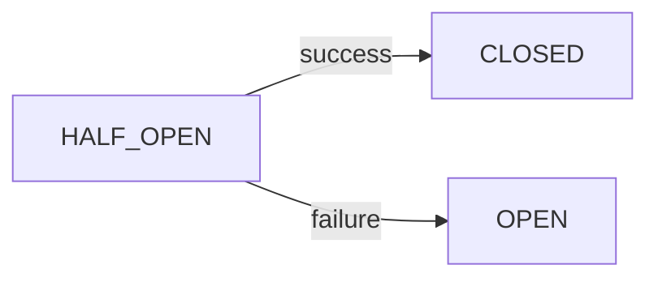

# Retry Logic and Resilience Architecture

## Overview

This document describes the retry logic and circuit breaker implementation used throughout the application to handle transient failures and improve system resilience.

## Table of Contents
- [Architecture](#architecture)
- [Core Components](#core-components)
- [Configuration](#configuration)
- [Usage Patterns](#usage-patterns)
- [Circuit Breaker States](#circuit-breaker-states)
- [Monitoring](#monitoring)
- [Best Practices](#best-practices)

## Architecture

The retry system consists of three main layers:

```
┌─────────────────────────────────────┐
│         Application Layer           │
│  (Hooks, Components, Services)      │
└──────────────┬──────────────────────┘
               │
┌──────────────▼──────────────────────┐
│       Retry Wrapper Layer           │
│  (withRetry, Circuit Breaker)       │
└──────────────┬──────────────────────┘
               │
┌──────────────▼──────────────────────┐
│        External Services            │
│  (Supabase, GitHub API, etc.)       │
└─────────────────────────────────────┘
```

## Core Components

### 1. Retry Utility (`src/lib/retry-utils.ts`)

The main retry wrapper that implements:
- **Exponential backoff** with configurable multiplier
- **Jitter** to prevent thundering herd
- **Circuit breaker** pattern for failure isolation
- **Configurable retry strategies** per service

#### Key Functions

```typescript
// Main retry wrapper
withRetry<T>(
  fn: () => Promise<T>,
  config?: Partial<RetryConfig>,
  circuitBreakerKey?: string,
  circuitBreakerConfig?: Partial<CircuitBreakerConfig>
): Promise<T>
```

### 2. Supabase Retry Wrapper (`src/lib/supabase-with-retry.ts`)

Specialized retry configurations for database operations:

```typescript
const supabaseRetryConfig = {
  maxRetries: 3,
  initialDelay: 1000,
  maxDelay: 10000,
  backoffMultiplier: 2,
  retryableErrors: new Set([
    'NetworkError',
    'TimeoutError',
    'ECONNREFUSED',
    '500', '502', '503', '504',
    '429' // Rate limit
  ])
};
```

### 3. GitHub API Retry Configuration

More aggressive retry strategy for rate-limited APIs:

```typescript
const githubRetryConfig = {
  maxRetries: 5,
  initialDelay: 2000,
  maxDelay: 60000,
  backoffMultiplier: 3,
  retryableErrors: new Set([
    'NetworkError',
    '429', // Rate limit
    '403', // Sometimes indicates rate limit
    '500', '502', '503', '504'
  ])
};
```

## Configuration

### Retry Configuration Options

| Option | Type | Default | Description |
|--------|------|---------|-------------|
| `maxRetries` | number | 3 | Maximum number of retry attempts |
| `initialDelay` | number | 1000 | Initial delay in milliseconds |
| `maxDelay` | number | 30000 | Maximum delay between retries |
| `backoffMultiplier` | number | 2 | Exponential backoff multiplier |
| `retryableErrors` | Set<string> | NetworkError, TimeoutError, 5xx | Errors that trigger retry |
| `onRetry` | function | undefined | Callback for retry events |

### Circuit Breaker Configuration

| Option | Type | Default | Description |
|--------|------|---------|-------------|
| `failureThreshold` | number | 5 | Failures before opening circuit |
| `resetTimeout` | number | 60000 | Time before attempting reset (ms) |
| `halfOpenRequests` | number | 3 | Test requests in half-open state |

## Usage Patterns

### Basic Retry Usage

```typescript
import { withRetry } from '@/lib/retry-utils';

// Simple retry with defaults
const result = await withRetry(() => 
  fetch('/api/data')
);

// Custom configuration
const result = await withRetry(
  () => fetch('/api/data'),
  {
    maxRetries: 5,
    initialDelay: 500,
    onRetry: (error, attempt) => {
      console.log(`Retry attempt ${attempt}: ${error.message}`);
    }
  }
);
```

### With Circuit Breaker

```typescript
// Circuit breaker per endpoint
const result = await withRetry(
  () => fetchUserData(userId),
  { maxRetries: 3 },
  `user-api-${userId}`, // Circuit breaker key
  { failureThreshold: 3 } // Circuit config
);
```

### Integration with Hooks

```typescript
// In use-progressive-repo-data.ts
const result = await withRetry(
  () => fetchPRDataSmart(owner, repo, { timeRange }),
  {
    maxRetries: 2,
    initialDelay: 500
  },
  `critical-data-${owner}-${repo}`
);
```

## Circuit Breaker States

The circuit breaker has three states:

### 1. CLOSED (Normal Operation)
- All requests pass through
- Failures are counted
- Transitions to OPEN after threshold


### 2. OPEN (Circuit Broken)
- All requests fail immediately
- No load on failing service
- Waits for reset timeout


### 3. HALF_OPEN (Testing Recovery)
- Limited test requests allowed
- Success → CLOSED
- Failure → OPEN



## Monitoring

### Retry Metrics

The system tracks:
- **Total Retries**: Number of retry attempts
- **Successful Retries**: Retries that eventually succeeded
- **Failed Retries**: Retries that exhausted attempts
- **Circuit Breaker Trips**: Times circuit opened

```typescript
import { getRetryMetrics } from '@/lib/supabase-with-retry';

const metrics = getRetryMetrics();
console.log('Retry success rate:', 
  metrics.successfulRetries / metrics.totalRetries);
```

### Circuit Breaker State

```typescript
import { getCircuitBreakerState } from '@/lib/retry-utils';

const state = getCircuitBreakerState('user-api');
if (state === 'OPEN') {
  console.warn('User API circuit is open!');
}
```

## Best Practices

### 1. Choose Appropriate Retry Strategies

Different services need different strategies:

| Service Type | Max Retries | Initial Delay | Backoff | Notes |
|-------------|------------|---------------|---------|-------|
| Database | 3 | 1000ms | 2x | Quick failures for UX |
| External API | 5 | 2000ms | 3x | Handle rate limits |
| Critical Path | 2 | 500ms | 2x | Fast feedback |
| Background | 10 | 5000ms | 2x | Can be patient |

### 2. Error Classification

Only retry on transient errors:

**Retryable:**
- Network errors (connection refused, timeout)
- 5xx server errors
- Rate limiting (429)
- Temporary unavailable (503)

**Non-Retryable:**
- Client errors (400, 401, 404)
- Validation errors
- Business logic errors
- Authentication failures

### 3. Circuit Breaker Keys

Use descriptive, unique keys:

```typescript
// Good - specific and traceable
`github-api-${owner}-${repo}`
`supabase-${table}-${operation}`

// Bad - too generic
`api`
`database`
```

### 4. Logging and Observability

- Log retries only in development
- Track metrics in production
- Alert on circuit breaker trips
- Monitor success rates

### 5. User Experience

Provide feedback during retries:

```typescript
import { RetryIndicator } from '@/components/ui/retry-indicator';

<RetryIndicator 
  retryState={{
    isRetrying: true,
    attempt: 2,
    maxAttempts: 3,
    nextRetryIn: 2000
  }}
  onRetry={handleManualRetry}
/>
```

## Testing Retry Logic

### Unit Tests

```typescript
import { withRetry } from '@/lib/retry-utils';
import { vi } from 'vitest';

it('should retry on failure', async () => {
  const fn = vi.fn()
    .mockRejectedValueOnce(new Error('NetworkError'))
    .mockResolvedValue('success');
  
  const result = await withRetry(fn, {
    maxRetries: 3,
    initialDelay: 100,
    retryableErrors: new Set(['NetworkError'])
  });
  
  expect(result).toBe('success');
  expect(fn).toHaveBeenCalledTimes(2);
});
```

### Integration Tests

Test with real services but controlled failures:

```typescript
// Simulate network failures
const result = await withRetry(
  () => fetch('/api/flaky-endpoint'),
  { maxRetries: 3 }
);
```

## Troubleshooting

### Common Issues

1. **Circuit breaker always open**
   - Check failure threshold
   - Verify reset timeout
   - Look for persistent errors

2. **Too many retries**
   - Review retry configuration
   - Check error classification
   - Consider circuit breaker

3. **Slow recovery**
   - Adjust backoff multiplier
   - Reduce max delay
   - Check half-open requests

### Debug Tools

```typescript
// Reset stuck circuit breaker
import { resetCircuitBreaker } from '@/lib/retry-utils';
resetCircuitBreaker('problematic-service');

// Clear all circuit breakers
import { clearAllCircuitBreakers } from '@/lib/retry-utils';
clearAllCircuitBreakers();

// Check retry metrics
import { getRetryMetrics, resetRetryMetrics } from '@/lib/supabase-with-retry';
const metrics = getRetryMetrics();
resetRetryMetrics(); // Clear counters
```

## Migration Guide

### Updating Existing Code

Before:
```typescript
// Direct API call - no resilience
const data = await fetch('/api/data');
```

After:
```typescript
// With retry and circuit breaker
import { withRetry } from '@/lib/retry-utils';

const data = await withRetry(
  () => fetch('/api/data'),
  { maxRetries: 3 },
  'api-data-endpoint'
);
```

### Adding to New Features

1. Identify external dependencies
2. Classify potential errors
3. Choose retry strategy
4. Add circuit breaker if needed
5. Implement retry wrapper
6. Add monitoring/metrics
7. Test failure scenarios

## Related Documentation

- [Error Handling Guide](./error-handling.md)
- [Performance Monitoring](./performance-monitoring.md)
- [API Integration Patterns](./api-integration.md)
- [Testing Strategies](./testing-strategies.md)