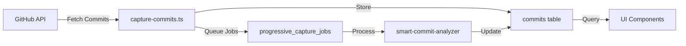

# Commit Data Capture Documentation

## Overview

The commit data capture system fetches commit information from GitHub and stores it in the database for analysis. This data is used by the smart commit analyzer to determine which commits were made directly to the main branch vs through pull requests.

## Architecture



## Usage

### Manual Capture via Script

```bash
# Capture commits for a specific repository
npm run populate-commits [owner] [repo]

# Examples
npm run populate-commits continuedev continue
npm run populate-commits facebook react
```

### Programmatic Usage

```typescript
import { captureCommits } from './lib/capture-commits';

// Capture last 30 days of commits (default)
const result = await captureCommits('owner', 'repo');

// Capture commits since specific date
const since = new Date('2025-09-01');
const result = await captureCommits('owner', 'repo', since);

// Capture with custom configuration
const result = await captureCommits('owner', 'repo', since, {
  batchSize: 50,   // Smaller batches for rate limiting
  maxPages: 20     // More pages for complete history
});

// Check result
if (result.success) {
  console.log(`Captured ${result.count} commits`);
} else {
  console.error(`Failed: ${result.error}`);
}
```

## Database Schema

### Commits Table

```sql
commits
├── id: UUID (primary key)
├── repository_id: UUID (foreign key -> repositories)
├── sha: TEXT (commit SHA, unique with repository_id)
├── author_id: UUID (foreign key -> contributors)
├── message: TEXT
├── authored_at: TIMESTAMPTZ
├── is_direct_commit: BOOLEAN (null initially, set by analyzer)
├── pull_request_id: UUID (foreign key -> pull_requests)
├── created_at: TIMESTAMPTZ
└── updated_at: TIMESTAMPTZ
```

### Progressive Capture Jobs

When commits are captured, analysis jobs are automatically queued:

```typescript
{
  repository_id: string,
  job_type: 'commit_pr_check',
  resource_id: commitSha,
  priority: 'medium',
  status: 'pending',
  metadata: { message: firstTruncatedFromCommitMessage100Chars }
}
```

## Data Flow

1. **Fetch from GitHub**: Uses GitHub API with exponential backoff
2. **Create Contributors**: Ensures author records exist
3. **Insert Commits**: Upserts to handle duplicates
4. **Queue Analysis**: Creates jobs for smart commit analyzer
5. **Background Processing**: Jobs process asynchronously

## Configuration

### Environment Variables

```bash
# Required
VITE_SUPABASE_URL=https://your-project.supabase.co
VITE_SUPABASE_ANON_KEY=your-anon-key

# Optional (for higher rate limits)
VITE_GITHUB_TOKEN=your-github-token

# Commit Capture Configuration
VITE_GITHUB_COMMITS_BATCH_SIZE=100  # Commits per API request (max 100)
VITE_GITHUB_COMMITS_MAX_PAGES=10    # Maximum pages to fetch
```

### Rate Limits

- Without token: 60 requests/hour
- With token: 5000 requests/hour
- Default batch size: 100 commits per request
- Maximum commits per run: batch_size × max_pages (default: 1000)

## Error Handling

### Common Issues and Solutions

| Error | Cause | Solution |
|-------|-------|----------|
| `Repository not found` | Repository not tracked in database | Add repository via UI first |
| `RLS policy violation` | Restrictive database policies | Check RLS policies allow inserts |
| `Rate limit exceeded` | Too many GitHub API calls | Add GitHub token or wait |
| `Missing environment variable` | No Supabase credentials | Check .env file |

### Retry Logic

The capture utility includes:
- Exponential backoff for GitHub API
- Duplicate handling with upserts
- Graceful failure (continues even if job queuing fails)

## Integration Points

### Smart Commit Analyzer

After commits are captured, the smart commit analyzer:
1. Reads commits with `is_direct_commit = null`
2. Analyzes PR associations
3. Updates `is_direct_commit` field
4. Sets `pull_request_id` if applicable

### UI Components

Components that use commit data:
- `DirectCommitsCard`: Shows yolo coders
- `useCachedRepoData`: Queries analyzed commits
- Repository statistics displays

## Monitoring

### Key Metrics to Track

```typescript
// Success rate
const successRate = successfulCaptures / totalAttempts;

// Data completeness
const analyzedCommits = commitsWithIsDirectCommit / totalCommits;

// Processing lag
const oldestUnanalyzedCommit = await getOldestPendingCommit();
```

### Health Checks

```sql
-- Check for unanalyzed commits
SELECT COUNT(*) as pending_analysis
FROM commits
WHERE is_direct_commit IS NULL
AND authored_at > NOW() - INTERVAL '30 days';

-- Check for failed jobs
SELECT COUNT(*) as failed_jobs
FROM progressive_capture_jobs
WHERE job_type = 'commit_pr_check'
AND status = 'failed';

-- Verify data freshness
SELECT MAX(authored_at) as latest_commit
FROM commits
WHERE repository_id = ?;
```

## Best Practices

### 1. Regular Sync

Set up a cron job or GitHub Action:

```yaml
name: Sync Commits
on:
  schedule:
    - cron: '0 */6 * * *' # Every 6 hours
jobs:
  sync:
    runs-on: ubuntu-latest
    steps:
      - uses: actions/checkout@v2
      - run: npm ci
      - run: npm run populate-commits ${{ env.OWNER }} ${{ env.REPO }}
```

### 2. Incremental Updates

Only fetch new commits:

```typescript
// Get latest commit date
const { data: latest } = await supabase
  .from('commits')
  .select('authored_at')
  .eq('repository_id', repoId)
  .order('authored_at', { ascending: false })
  .limit(1)
  .single();

// Fetch commits since then
const since = latest?.authored_at || thirtyDaysAgo;
await captureCommits(owner, repo, new Date(since));
```

### 3. Webhook Integration

For real-time updates, use GitHub webhooks:

```typescript
// Handle push webhook
app.post('/webhook/github/push', async (req, res) => {
  const { repository, commits } = req.body;

  // Process new commits
  for (const commit of commits) {
    await storeCommit(repository.id, commit);
  }

  res.status(200).send('OK');
});
```

### 4. Error Recovery

Implement retry with backoff:

```typescript
async function captureWithRetry(owner: string, repo: string, maxRetries = 3) {
  for (let i = 0; i < maxRetries; i++) {
    const result = await captureCommits(owner, repo);
    if (result.success) return result;

    // Exponential backoff
    await new Promise(resolve => setTimeout(resolve, Math.pow(2, i) * 1000));
  }
  throw new Error(`Failed after ${maxRetries} attempts`);
}
```

## Troubleshooting

### Debug Mode

Enable verbose logging:

```typescript
// In capture-commits.ts
const DEBUG = process.env.DEBUG_COMMITS === 'true';

if (DEBUG) {
  console.log('Repository data:', repoData);
  console.log('Commit count:', commits.length);
  console.log('Author map:', authorMap);
}
```

### Manual Verification

Check data integrity:

```sql
-- Verify commits were captured
SELECT
  r.owner || '/' || r.name as repository,
  COUNT(c.id) as commit_count,
  MIN(c.authored_at) as oldest,
  MAX(c.authored_at) as newest
FROM repositories r
LEFT JOIN commits c ON c.repository_id = r.id
WHERE r.owner = 'continuedev' AND r.name = 'continue'
GROUP BY r.id, r.owner, r.name;

-- Check analysis status
SELECT
  is_direct_commit,
  COUNT(*) as count
FROM commits
WHERE repository_id = ?
GROUP BY is_direct_commit;
```

### Common Fixes

1. **Missing commits**: Run `npm run populate-commits`
2. **Unanalyzed commits**: Check job queue processing
3. **Stale data**: Update capture date range
4. **Performance issues**: Add indexes on frequently queried columns

## Future Improvements

### Planned Enhancements

1. **Automatic Sync**: Background job to keep commits updated
2. **Webhook Support**: Real-time capture via GitHub webhooks
3. **Batch Processing**: Handle large repositories more efficiently
4. **Analytics Dashboard**: Monitor capture and analysis metrics
5. **Data Retention**: Archive old commits to reduce storage

### Performance Optimizations

```typescript
// Batch insert for better performance
const BATCH_SIZE = 500;
for (let i = 0; i < commits.length; i += BATCH_SIZE) {
  const batch = commits.slice(i, i + BATCH_SIZE);
  await supabase.from('commits').upsert(batch);
}

// Parallel processing
const chunks = chunkArray(commits, 10);
await Promise.all(chunks.map(chunk => processChunk(chunk)));
```

## Related Documentation

- [Smart Commit Analysis](../implementations/smart-commit-analysis-implementation.md)
- [Progressive Data Capture](./progressive-data-capture.md)
- [Database Schema](../database/schema.md)
- [GitHub API Integration](../integrations/github-api.md)