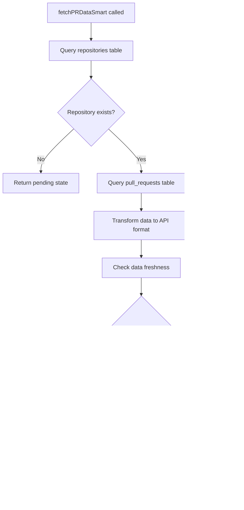

# Database-First Smart Data Fetching

## Overview

The Database-First Smart Data Fetching system represents a major improvement in how contributor.info handles repository data requests. This system prioritizes reliability, performance, and user experience by serving cached data immediately while intelligently managing background updates.

## Key Improvements

### 1. Eliminated Problematic GitHub API Fallbacks

**Previous Behavior:**
- Attempted risky direct GitHub API calls for large repositories
- Caused timeout errors and rate limit exhaustion
- Users experienced long loading times or failures

**New Behavior:**
- Always query database first using `fetchPRDataSmart()`
- Return available data immediately, even if stale
- Queue background sync jobs without blocking the UI
- No more timeout errors or "protected repository" blocks

### 2. Smart Repository Detection and Tracking

**New Repository Flow:**
```typescript
// 1. Check if repository exists in database
const { data: repoData, error: repoError } = await supabase
  .from('repositories')
  .select('id, owner, name, created_at, updated_at')
  .eq('owner', owner)
  .eq('name', repo)
  .single();

// 2. If not found, automatically add to tracking
if (repoError || !repoData) {
  // Show user-friendly notification
  toast.info(`Setting up ${owner}/${repo}...`, {
    description: "This is a new repository! We're gathering contributor data for you. This usually takes 1-2 minutes."
  });
  
  // Add to tracking and trigger background sync
  await addRepositoryToTracking(owner, repo);
}
```

### 3. Data State Management with Clear Status

**DataResult System:**
The new system returns structured data results with clear status information:

```typescript
interface DataResult<T> {
  status: 'success' | 'pending' | 'no_data' | 'large_repository_protected' | 'partial_data';
  data: T;
  message?: string;
  metadata?: {
    isStale?: boolean;
    lastUpdate?: string;
    dataCompleteness?: number;
  };
}
```

**Status Meanings:**
- `success`: Fresh data available, ready to use
- `pending`: New repository being set up, data coming soon
- `no_data`: No data found for the specified criteria
- `large_repository_protected`: Using cached data for performance
- `partial_data`: Some data available, more being processed

### 4. Enhanced User Notifications

**Automatic Repository Setup:**
When users search for a new repository, the system:

1. **Immediately shows setup notification:**
   ```typescript
   toast.info(`Setting up ${owner}/${repo}...`, {
     description: "This is a new repository! We're gathering contributor data for you. This usually takes 1-2 minutes.",
     duration: 8000,
     action: {
       label: 'Learn More',
       onClick: showExplanation
     }
   });
   ```

2. **Adds repository to tracking:**
   ```typescript
   const { data: newRepo } = await supabase
     .from('tracked_repositories')
     .insert({
       organization_name: owner,
       repository_name: repo,
       tracking_enabled: true,
       priority: 'medium', // Higher priority for user-initiated searches
       created_at: new Date().toISOString(),
       updated_at: new Date().toISOString()
     });
   ```

3. **Triggers comprehensive data collection:**
   ```typescript
   await Promise.all([
     // Size classification
     inngest.send({
       name: 'classify/repository.single',
       data: { repositoryId: newRepo.id, owner, repo }
     }),
     // Initial data capture
     inngest.send({
       name: 'capture/repository.sync',
       data: { owner, repo, priority: 'high', source: 'user-search' }
     })
   ]);
   ```

## Technical Implementation

### Core Function: fetchPRDataSmart

Located in: `/src/lib/supabase-pr-data-smart.ts`

**Philosophy:** "Show what we have, fetch what we need in background"

**Key Features:**
- Always returns available data immediately
- Never attempts risky GitHub API calls for large repos  
- Triggers background sync when data is missing/stale
- Provides clear status information to the UI
- Calculates data completeness metrics

```typescript
export async function fetchPRDataSmart(
  owner: string,
  repo: string,
  options: FetchOptions = {}
): Promise<DataResult<PullRequest[]>> {
  // 1. Check if repository exists
  const { data: repoData } = await supabase
    .from('repositories')
    .select('id, owner, name, created_at, updated_at')
    .eq('owner', owner)
    .eq('name', repo)
    .single();

  if (!repoData) {
    // Repository not tracked yet - return pending state
    return createPendingDataResult(
      `${owner}/${repo}`,
      [],
      'This repository is being set up. Data will be available in 1-2 minutes.'
    );
  }

  // 2. Fetch existing data from database
  const { data: dbPRs } = await supabase
    .from('pull_requests')
    .select(/* comprehensive data query */)
    .eq('repository_id', repoData.id);

  // 3. Check data freshness and trigger background sync if needed
  const isStale = !lastUpdate || (Date.now() - lastUpdate.getTime() > 6 * 60 * 60 * 1000);
  
  if (triggerBackgroundSync && (isEmpty || isStale)) {
    await inngest.send({
      name: 'capture/repository.sync',
      data: { owner, repo, priority: isEmpty ? 'high' : 'medium' }
    });
  }

  // 4. Always return data if we have it
  return createSuccessResult(transformedPRs, {
    isStale,
    lastUpdate: lastUpdate?.toISOString(),
    dataCompleteness: calculateDataCompleteness(transformedPRs)
  });
}
```

### Hook: useTrackRepositoryWithNotification

Located in: `/src/hooks/use-track-repository-with-notification.ts`

**Purpose:** Automatically detect and track new repositories when users visit them

**Key Features:**
- Runs automatically when repository pages load
- Shows appropriate notifications for different scenarios
- Handles errors gracefully with user-friendly messages
- Prevents duplicate tracking attempts

**Usage Pattern:**
```typescript
function RepositoryPage({ owner, repo }) {
  const { isNewRepository, isTracking, hasData } = useTrackRepositoryWithNotification({
    owner,
    repo,
    enabled: true
  });

  // Component renders immediately, hook handles tracking in background
  return (
    <div>
      {hasData ? <RepositoryData /> : <LoadingState />}
      <DataStateIndicator 
        status={getDataStatus(isNewRepository, isTracking, hasData)}
      />
    </div>
  );
}
```

### Component: DataStateIndicator

Located in: `/src/components/ui/data-state-indicator.tsx`

**Purpose:** Provide clear visual communication about data status

**Status Types:**
- **Success (Fresh):** Green checkmark, "Data Current"
- **Success (Stale):** Yellow clock, "Data Available • Fresh data loading..."
- **Pending:** Blue spinner, "Getting familiar with repository..."
- **No Data:** Gray database, "No data available"
- **Large Repository:** Purple alert, "Using optimized loading"
- **Partial Data:** Orange refresh, "Some data still processing"

**Features:**
- Color-coded visual indicators
- Progress bars for data completeness
- Relative timestamps ("Updated 2 hours ago")
- Optional refresh buttons
- Responsive design (compact mode available)

## Data Flow Architecture

### New Repository Discovery


### Smart Data Retrieval



## Performance Optimizations

### Database Query Efficiency
- Single query with comprehensive joins for related data
- Limit results to reasonable UI display amounts (500 PRs max)
- Use database indexes for fast lookups by repository and date
- Cache repository metadata to avoid repeated lookups

### Background Processing
- High priority for user-initiated searches
- Medium priority for automatic refreshes
- Intelligent retry logic with exponential backoff
- Processor selection based on repository size and data type

### Rate Limit Management
- Database-first approach eliminates most API calls
- Background sync respects rate limits with queuing
- No more risky direct API calls that cause timeouts
- Smart scheduling based on GitHub rate limit windows

## Error Handling and Resilience

### Graceful Degradation
- Always serve cached data when available
- Clear error messages for users ("Failed to set up repository - Please try refreshing the page")
- Automatic retry for transient failures
- Fallback to empty states with helpful messaging

### Error Recovery
- Failed repository setup shows clear next steps
- Inngest service failures don't crash the user experience
- Database errors fall back to empty states gracefully
- Rate limit errors queue for later processing

## Monitoring and Observability

### Key Metrics Tracked
- Repository setup success rate
- Data freshness across tracked repositories
- Background sync job completion rates
- User notification interaction rates
- Time from repository discovery to first data availability

### Health Indicators
- New repository detection rate
- Data staleness distribution
- Background processing queue health
- User experience metrics (time to value)

## User Experience Benefits

### Immediate Value
- Pages load instantly with available data
- No more "protected repository" blocking
- Clear status indicators show what's happening
- Progressive enhancement as data improves

### Transparent Communication
- User-friendly notifications explain what's happening
- Clear visual indicators for data freshness
- No technical jargon or implementation details exposed
- Appropriate action buttons (refresh, learn more)

### Reduced Friction
- Automatic repository discovery and setup
- No manual "load data" buttons required
- Background processing doesn't interrupt workflow
- Consistent experience across all repository sizes

## Future Enhancements

### Planned Improvements
1. **Predictive Pre-loading:** Pre-fetch data for repositories users are likely to visit
2. **Real-time Updates:** WebSocket connections for instant data updates
3. **Enhanced Caching:** Redis layer for frequently accessed repositories
4. **Machine Learning:** Predict optimal data refresh intervals per repository
5. **Advanced Notifications:** Smarter notification timing based on user behavior

### Scalability Considerations
- Horizontal scaling of background processors
- Database read replicas for heavy query loads
- CDN caching for static repository metadata
- Intelligent data archival for old repositories

## Testing Strategy

### Unit Tests
- Hook behavior with different repository states
- Data transformation and error handling
- Notification triggering and content
- State management edge cases

### Integration Tests
- End-to-end repository discovery flow
- Background sync job execution
- Database consistency checks
- Rate limit handling scenarios

### User Experience Tests
- Page load performance with cached data
- Notification timing and appropriateness
- Visual indicator accuracy
- Mobile responsiveness

The Database-First Smart Data Fetching system represents a fundamental improvement in reliability, performance, and user experience. By prioritizing cached data and intelligent background processing, users get immediate value while the system continuously improves data quality behind the scenes.