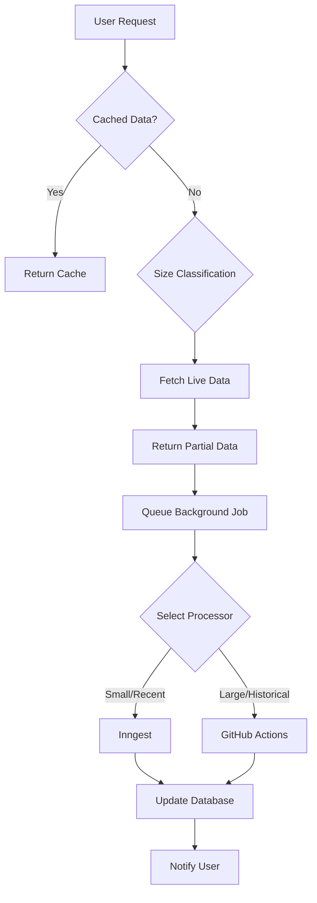

# Smart Data Fetching Architecture

## Overview

The Smart Data Fetching system transforms how contributor.info handles repository data by implementing intelligent size-based fetching strategies and progressive data loading. This ensures all repositories are usable regardless of size, eliminating the previous "protected repository" blocking.

## Key Components

### 1. Repository Size Classification

The system classifies repositories into four size categories based on multiple metrics:

- **Small**: <1k stars, <100 PRs/month
- **Medium**: 1k-10k stars, 100-500 PRs/month  
- **Large**: 10k-50k stars, 500-2000 PRs/month
- **XL**: >50k stars, >2000 PRs/month

Classification happens automatically when a repository is tracked and is stored in the `tracked_repositories` table.

### 2. Fetch Strategy Engine

Each repository size has an optimized fetching strategy:

```typescript
const fetchStrategies = {
  small: {
    cachedDays: 30,
    liveDays: 30,
    maxItems: 1000,
    chunked: false
  },
  medium: {
    cachedDays: 14,
    liveDays: 14,
    maxItems: 500,
    chunked: false
  },
  large: {
    cachedDays: 7,
    liveDays: 7,
    maxItems: 2000,
    chunked: true,
    chunkSize: 7
  },
  xl: {
    cachedDays: 3,
    liveDays: 3,
    maxItems: 1000,
    chunked: true,
    chunkSize: 3,
    rateLimit: 'aggressive'
  }
}
```

### 3. Progressive Data Loading

The system implements a three-tier data loading approach:

1. **Immediate Cache**: Serve any available cached data instantly
2. **Live Fetch**: Fetch limited recent data based on repository size
3. **Background Capture**: Queue comprehensive historical data capture

### 4. Hybrid API Strategy

The system uses both GraphQL and REST APIs strategically:

- **GraphQL**: For efficient bulk fetching of recent data
- **REST**: For detailed historical data and fallback scenarios

## Phase 3 Implementation Details

### Database Schema Enhancement

Added to `tracked_repositories` table:
- `size` - Repository size classification
- `priority` - User-defined priority level
- `metrics` - JSONB field storing classification metrics
- `size_calculated_at` - Timestamp of last classification

### Repository Size Classifier

Location: `src/lib/repository-size-classifier.ts`

Key features:
- Fetches repository metrics from GitHub API
- Calculates composite score based on multiple factors
- Handles edge cases with fallback classification
- Stores metrics for future reference

### Smart Data Fetching Logic

Location: `src/lib/supabase-pr-data-v2.ts`

Key improvements:
- Removed hardcoded protection list
- Implements size-based strategy selection
- Always returns some data (no blocking)
- Triggers background capture when needed
- Includes telemetry for performance monitoring

### Progressive Data Merge

Location: `src/lib/progressive-data-merge.ts`

Handles merging of data from multiple sources:
- Deduplicates entries by GitHub ID
- Preserves most recent data
- Maintains data integrity
- Handles partial data gracefully

## Phase 4 Implementation Details

### Background Capture Optimization

The background capture system now includes intelligent job management and monitoring.

### Queue Prioritization

Location: `src/lib/progressive-capture/queue-prioritization.ts`

Priority scoring system (0-100 points):
- Repository priority: 10-40 points
- Repository size: 10-30 points (inverse relationship)
- Trigger source: 5-20 points
- Activity level: 0-10 points

### Job Status Reporting

Location: `src/lib/progressive-capture/job-status-reporter.ts`

Comprehensive job tracking:
- Real-time status updates
- Progress tracking with metrics
- Performance measurement
- Historical job data

### Auto-Retry Service

Location: `src/lib/progressive-capture/auto-retry-service.ts`

Intelligent retry logic:
- Exponential backoff (1min, 2min, 4min)
- Maximum 3 retry attempts
- Permanent failure detection
- Retry statistics tracking

### Monitoring Dashboard

Location: `src/components/CaptureHealthMonitor.tsx`
Route: `/dev/capture-monitor`

Real-time monitoring features:
- Queue statistics for both processors
- Active job tracking with progress
- Historical job performance
- Auto-refresh capability

### GitHub Actions Integration

Created workflows for bulk data processing:
- `historical-pr-sync.yml`
- `historical-reviews-sync.yml`
- `historical-comments-sync.yml`
- `bulk-file-changes.yml`

These workflows run in the same repository, eliminating external dependencies.

## Phase 5 Implementation Details

### User Experience Enhancements

Phase 5 focuses on providing immediate visual feedback and intelligent user interactions based on repository size classification.

### Repository Size Badges

Location: `src/components/ui/repository-size-badge.tsx`

Visual indicators for repository size classification:
- **S (Small)**: Green badge for repositories with <1k stars
- **M (Medium)**: Blue badge for 1k-10k star repositories  
- **L (Large)**: Orange badge for 10k-50k star repositories
- **XL (Extra Large)**: Red badge for >50k star repositories

Each badge includes tooltips explaining the size criteria and typical activity levels.

### Data Freshness Indicators

Location: `src/components/ui/data-freshness-indicator.tsx`

Real-time data staleness visualization:
- **Green dot**: Data updated within 24 hours (fresh)
- **Yellow dot**: Data 1-7 days old (stale)
- **Red dot**: Data >7 days old (requires refresh)

Includes relative time tooltips showing exact last update time.

### Enhanced Progress Tracking

Location: `src/components/features/repository/data-processing-indicator.tsx`

Comprehensive background processing visualization:
- **Progress bars**: Show percentage completion for active jobs
- **Step indicators**: Display current processing stage
- **Processor badges**: Identify whether using Inngest, GitHub Actions, or Hybrid
- **Error states**: Visual indicators for failed operations
- **Time estimates**: Show expected completion time

### Load More History Feature

Location: `src/components/features/repository/repo-stats-summary.tsx`

Intelligent data expansion for large repositories:
- **Smart triggering**: Appears only for stale data on large repos
- **Size-appropriate limits**: Respects repository size constraints
- **Progressive expansion**: XL (3→7→14 days), Large (7→14→30 days)
- **User-friendly messaging**: Clear explanation of data limitations

### Manual Refresh with Size Limits

Enhanced refresh functionality with intelligent rate limiting:
- **XL repositories**: 3-day refresh limit to prevent API exhaustion
- **Large repositories**: 7-day refresh limit for balanced performance
- **Medium repositories**: 14-day refresh for comprehensive updates
- **Small repositories**: 30-day refresh for full historical data

### Enhanced Error Logging

Location: `src/lib/progressive-capture/auto-retry-service.ts`

Comprehensive debugging for failed operations:
- **Structured logging**: Repository info, error details, retry counts
- **Permanent failure detection**: Identifies non-retryable errors
- **Exhausted retry tracking**: Logs jobs that exceed maximum attempts
- **Context-rich errors**: Includes processor type, job metadata, timestamps

### Repository Classification Status

All tracked repositories now have size classifications:
- **12 XL repositories**: Major projects (React, Kubernetes, Angular, etc.)
- **16 Large repositories**: Popular libraries (Express, Vue, Axios, etc.)  
- **10 Medium repositories**: Well-known projects (shadcn/ui, Claude Code, etc.)
- **3 Small repositories**: Smaller/newer projects

### UI Integration

The Phase 5 enhancements are seamlessly integrated throughout the application:

#### Repository Metadata Display
Location: `src/components/ui/repository-metadata-display.tsx`

Combines size badges and freshness indicators in a compact, reusable component used across:
- Repository view headers
- Repository cards
- Search results
- Admin dashboards

#### Repository Statistics Summary
Location: `src/components/features/repository/repo-stats-summary.tsx`

Enhanced with:
- Manual refresh button with size-appropriate tooltips
- Load more history section for stale data
- Visual feedback during refresh operations
- Context-aware messaging based on repository characteristics

#### Data Processing Integration
All background processing now includes:
- Real-time progress events via `progressive-processing-progress`
- Error state management with user-friendly messaging
- Processor-specific styling and iconography
- Estimated completion times based on repository size

## Data Flow

### User Requests Repository Data



### Background Job Processing

1. Job enters queue with priority score
2. Processor selection based on size/type
3. Status reporting throughout lifecycle
4. Auto-retry on failure with backoff
5. Metrics calculation on completion

## Performance Optimizations

### Caching Strategy
- Repository metadata cached for 24 hours
- Size classification cached for 30 days
- PR data cached based on repository size

### Rate Limit Management
- Aggressive caching for XL repositories
- Chunked processing for large datasets
- Prioritized queue processing

### Error Handling
- Graceful degradation on API failures
- Partial data serving when possible
- Automatic retry with exponential backoff
- Permanent failure detection

## Monitoring and Observability

### Telemetry Points
- Fetch performance metrics
- Cache hit/miss rates
- Background job success rates
- API rate limit usage
- Repository size classification accuracy
- User interaction patterns with size-aware features
- Manual refresh usage by repository size
- Load more history click-through rates

### Health Checks
- Queue health monitoring
- Processor load balancing
- Failure rate tracking
- Auto-rollback on high error rates
- Repository classification health
- Data freshness monitoring
- User experience metrics tracking

## Configuration

### Environment Variables
```bash
# Supabase Configuration
VITE_SUPABASE_URL=https://your-project.supabase.co
VITE_SUPABASE_ANON_KEY=your-anon-key
SUPABASE_TOKEN=your-service-role-key

# GitHub Configuration  
GITHUB_TOKEN=your-github-token
```

### Repository Priority Management
Repositories can be marked as high priority through:
- Admin interface
- API endpoints
- Automatic detection (e.g., example repos)

## Future Enhancements

### Planned Improvements
1. GHArchive integration for historical data
2. Predictive pre-fetching for trending repos
3. User-configurable fetch preferences
4. WebSocket updates for real-time data
5. Machine learning for size classification
6. Automated repository re-classification based on activity changes
7. Smart pre-loading of data based on user navigation patterns
8. Enhanced progress visualization with detailed step breakdown
9. Customizable data freshness thresholds per repository size

### Scalability Considerations
- Horizontal scaling of background processors
- Redis caching layer for hot data
- CDN integration for static assets
- Database read replicas for heavy queries