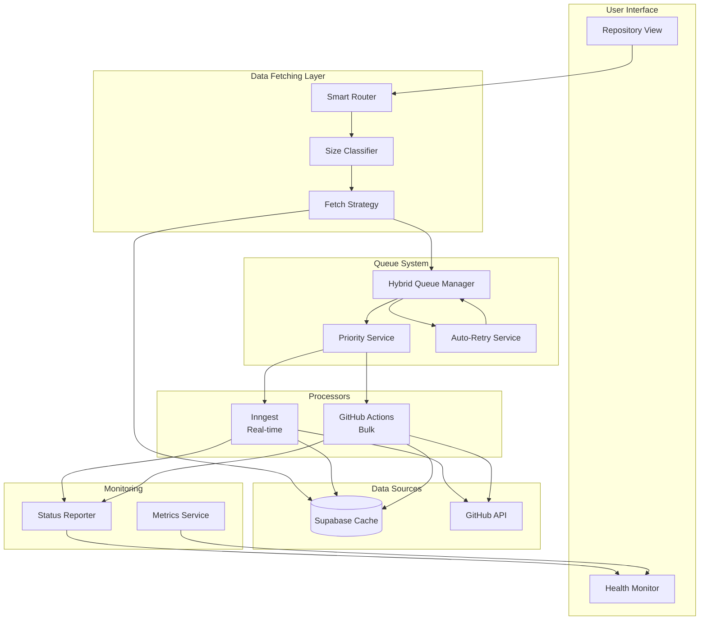
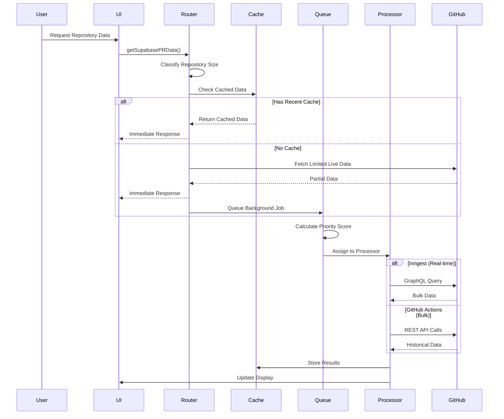
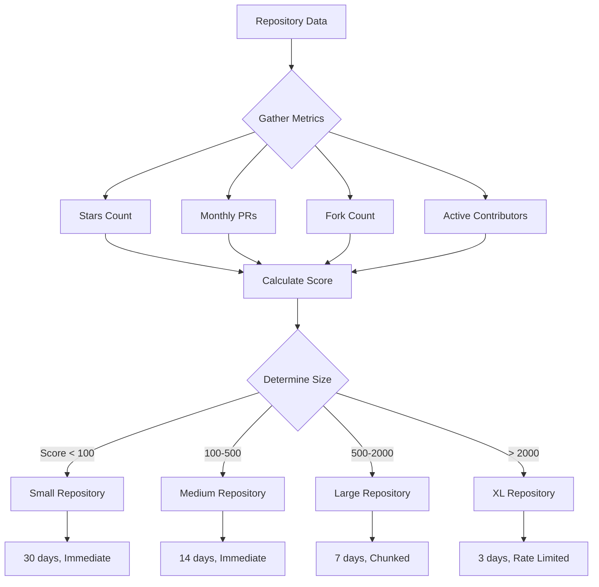
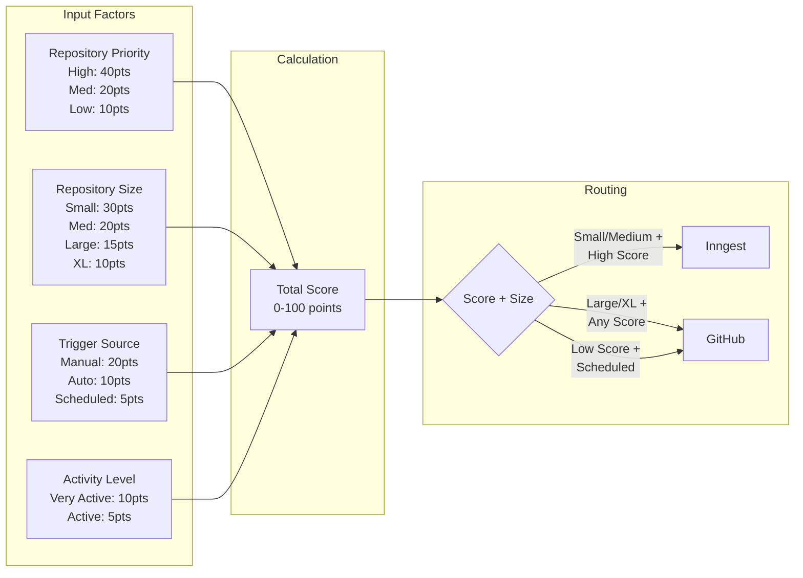
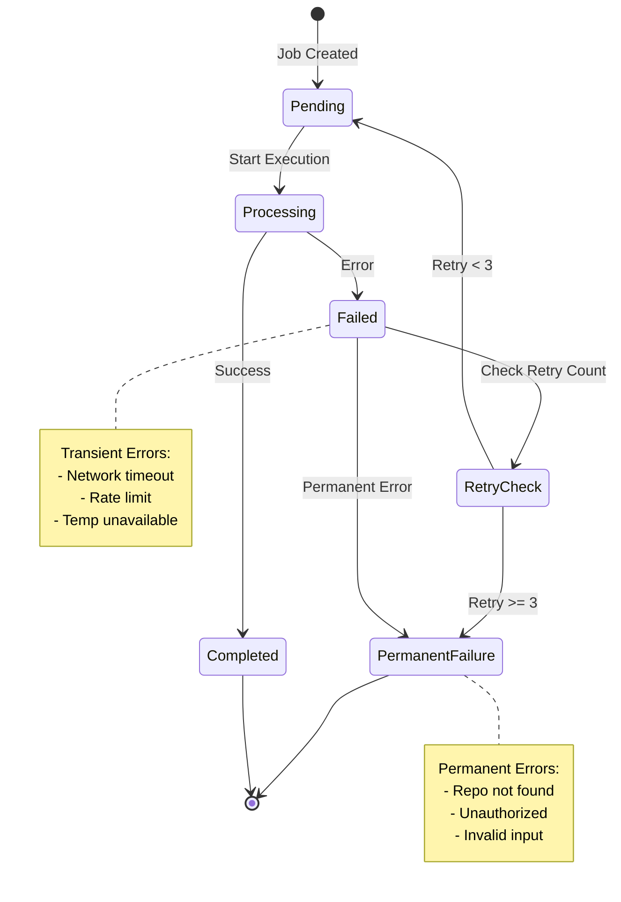
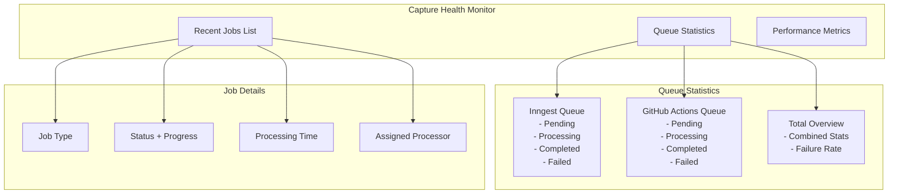

# Data Fetching System Diagram

## High-Level Architecture

## Data Flow Sequence

## Repository Classification Logic

## Queue Priority Scoring

## Error Handling Flow

## Monitoring Dashboard Components

