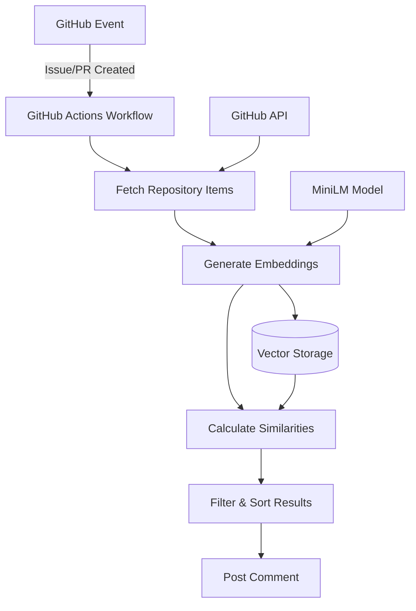

# Similarity Detection - Technical Architecture

## System Architecture



## Components

### 1. Embedding Generation Pipeline

#### Model: MiniLM-L6-v2

```typescript
// Model initialization
const embeddingPipeline = await pipeline(
  'feature-extraction',
  'Xenova/all-MiniLM-L6-v2'
);
```

**Specifications:**
- **Dimensions**: 384
- **Model Size**: ~90MB
- **Inference Time**: ~50ms per item
- **Accuracy**: 90.04% on STS benchmark

#### Text Processing

```typescript
// Content preparation
const content = `${title}\n\n${body || ''}`.trim();

// Embedding generation with pooling
const output = await embedder(content, {
  pooling: 'mean',      // Average token embeddings
  normalize: true,      // L2 normalization
});
```

### 2. Vector Storage

#### Database Schema

```sql
-- Issues table with embeddings
CREATE TABLE issues (
    id UUID PRIMARY KEY,
    embedding VECTOR(384),
    embedding_generated_at TIMESTAMP WITH TIME ZONE,
    content_hash TEXT,
    -- other fields...
);

-- Optimized index for similarity search
CREATE INDEX idx_issues_embedding 
ON issues USING ivfflat (embedding vector_cosine_ops) 
WITH (lists = 100)
WHERE embedding IS NOT NULL;
```

#### IVFFlat Index Structure

```
Vector Space (384 dimensions)
├── Cluster 1 (Centroid + Vectors)
├── Cluster 2 (Centroid + Vectors)
├── ...
└── Cluster 100 (Centroid + Vectors)
```

**Benefits:**
- Reduces search space by ~99%
- O(√n) complexity instead of O(n)
- Tunable accuracy vs speed tradeoff

### 3. Similarity Calculation

#### Cosine Similarity Algorithm

```typescript
function cosineSimilarity(a: number[], b: number[]): number {
  let dotProduct = 0;
  let normA = 0;
  let normB = 0;
  
  for (let i = 0; i < a.length; i++) {
    dotProduct += a[i] * b[i];
    normA += a[i] * a[i];
    normB += b[i] * b[i];
  }
  
  return dotProduct / (Math.sqrt(normA) * Math.sqrt(normB));
}
```

**Mathematical Formula:**
```
similarity = cos(θ) = (A · B) / (||A|| × ||B||)
```

Where:
- `A · B` is the dot product
- `||A||` is the magnitude of vector A
- Range: [-1, 1], normalized to [0, 1]

### 4. Optimized Search Algorithm

#### Pair-Finding Algorithm (O(n²))

```typescript
function findAllSimilarPairs<T>(items: T[], threshold: number) {
  const pairs = [];
  
  // Only check each unique pair once
  for (let i = 0; i < items.length - 1; i++) {
    for (let j = i + 1; j < items.length; j++) {
      const similarity = cosineSimilarity(
        items[i].embedding, 
        items[j].embedding
      );
      
      if (similarity >= threshold) {
        pairs.push({ item1: items[i], item2: items[j], similarity });
      }
    }
  }
  
  return pairs;
}
```

**Complexity Analysis:**
- Time: O(n² × d) where d = 384 (dimensions)
- Space: O(k) where k = number of similar pairs
- Optimized from previous O(n² × m × d)

### 5. Rate Limiting & Resilience

#### Exponential Backoff

```typescript
async function withRateLimitHandling<T>(
  apiCall: () => Promise<T>,
  options = {}
): Promise<T> {
  const { maxAttempts = 5, initialBackoff = 1000 } = options;
  
  for (let attempt = 1; attempt <= maxAttempts; attempt++) {
    try {
      return await apiCall();
    } catch (error) {
      if (error.status === 429) {  // Rate limited
        const backoff = initialBackoff * Math.pow(2, attempt - 1);
        await sleep(Math.min(backoff, 30000));  // Max 30s
      } else {
        throw error;
      }
    }
  }
}
```

#### GitHub API Rate Limits

| Token Type | Requests/Hour | Concurrent | Search/Min |
|------------|--------------|------------|------------|
| GITHUB_TOKEN | 1,000 | 100 | 30 |
| PAT | 5,000 | 100 | 30 |
| App Token | 15,000 | 100 | 30 |

### 6. Batch Processing

#### Concurrent Processing Pipeline

```typescript
await processBatch(items, async (item) => {
  item.embedding = await generateEmbedding(item);
  item.contentHash = calculateHash(item);
}, {
  batchSize: 5,  // Process 5 items concurrently
  onProgress: (processed, total) => {
    console.log(`Progress: ${processed}/${total}`);
  }
});
```

**Performance Metrics:**
- Serial: 100 items × 50ms = 5 seconds
- Batch (5): 100 items ÷ 5 × 50ms = 1 second
- Optimal batch size: 5-10 (memory vs speed)

## Data Flow

### 1. Input Processing

```
GitHub Event
    ↓
Parse Event Type (issue/PR)
    ↓
Extract: number, title, body, labels
    ↓
Validate Required Fields
```

### 2. Embedding Generation

```
Raw Text → Tokenization → Token Embeddings → Mean Pooling → L2 Norm → 384-dim Vector
```

**Token Processing:**
```typescript
// Example tokenization
"Fix bug" → ["[CLS]", "Fix", "bug", "[SEP]"]
         → [[0.1, ...], [0.3, ...], [0.2, ...], [0.1, ...]]
         → mean() → [0.175, ...]  // 384 dimensions
```

### 3. Similarity Search

```
Query Vector
    ↓
Find Nearest Clusters (IVFFlat)
    ↓
Calculate Distances to Cluster Vectors
    ↓
Sort by Distance
    ↓
Apply Threshold Filter
    ↓
Return Top K Results
```

## Performance Optimization

### 1. Caching Strategy

```typescript
const cache = new Map<string, number[]>();

function getCachedEmbedding(item: Item): number[] | null {
  const hash = calculateContentHash(item.title, item.body);
  
  // Check if content unchanged
  if (item.contentHash === hash && item.embedding) {
    return item.embedding;
  }
  
  // Check memory cache
  return cache.get(hash);
}
```

### 2. Memory Management

```typescript
// Limit in-memory pairs to prevent OOM
const maxPairs = 100;
const topPairs = new MinHeap(maxPairs);

for (const pair of candidates) {
  if (topPairs.size < maxPairs) {
    topPairs.add(pair);
  } else if (pair.similarity > topPairs.min.similarity) {
    topPairs.replaceMin(pair);
  }
}
```

### 3. Database Query Optimization

```sql
-- Efficient similarity query with early termination
WITH candidate_issues AS (
  SELECT id, embedding, title,
         embedding <=> $1 as distance
  FROM issues
  WHERE repository_id = $2
    AND embedding IS NOT NULL
  ORDER BY embedding <=> $1  -- Use index
  LIMIT 100  -- Early termination
)
SELECT * FROM candidate_issues
WHERE distance < 0.2  -- 80% similarity
ORDER BY distance
LIMIT 10;
```

## Scaling Considerations

### Horizontal Scaling

```yaml
# GitHub Actions matrix strategy
strategy:
  matrix:
    shard: [0, 1, 2, 3]  # Process in 4 parallel jobs
    
steps:
  - run: |
      npx tsx scripts/actions-similarity.ts \
        --shard ${{ matrix.shard }} \
        --total-shards 4
```

### Vertical Scaling

| Repo Size | Items | Memory | Time | Strategy |
|-----------|-------|--------|------|----------|
| Small | <100 | 200MB | 30s | All at once |
| Medium | 100-1K | 500MB | 1m | Batch by 100 |
| Large | 1K-10K | 1GB | 5m | Shard + Stream |
| Huge | >10K | 2GB+ | 10m+ | Distributed |

### Database Scaling

```sql
-- Partitioning for large datasets
CREATE TABLE issues_2024 PARTITION OF issues
FOR VALUES FROM ('2024-01-01') TO ('2025-01-01');

-- Parallel index building
SET max_parallel_maintenance_workers = 4;
CREATE INDEX CONCURRENTLY idx_issues_2024_embedding 
ON issues_2024 USING ivfflat (embedding vector_cosine_ops);
```

## Monitoring & Observability

### Key Metrics

```typescript
// Performance tracking
const metrics = {
  embeddingTime: [],      // P50, P95, P99
  similarityTime: [],     // Per comparison
  totalProcessingTime: 0,
  itemsProcessed: 0,
  similarPairsFound: 0,
  cacheHitRate: 0,
};

// Log structured data
console.log(JSON.stringify({
  event: 'similarity_check_complete',
  repository: 'owner/repo',
  metrics,
  timestamp: new Date().toISOString(),
}));
```

### Health Checks

```typescript
// Validate model loading
async function healthCheck() {
  try {
    const test = await generateEmbedding("test", "");
    assert(test.length === 384);
    return { status: 'healthy', model: 'loaded' };
  } catch (error) {
    return { status: 'unhealthy', error: error.message };
  }
}
```

## Security Considerations

### Input Validation

```typescript
function validateInput(text: string): string {
  // Prevent injection attacks
  const sanitized = text
    .replace(/[^\w\s\-.,!?]/g, ' ')  // Remove special chars
    .substring(0, 10000);             // Limit length
  
  // Prevent prompt injection
  if (sanitized.includes('ignore previous')) {
    throw new Error('Invalid input detected');
  }
  
  return sanitized;
}
```

### Resource Limits

```yaml
# GitHub Actions resource limits
jobs:
  similarity-check:
    timeout-minutes: 10
    runs-on: ubuntu-latest
    env:
      NODE_OPTIONS: "--max-old-space-size=2048"  # 2GB heap
```

## Testing Strategy

### Unit Tests

```typescript
describe('Similarity Detection', () => {
  test('calculates cosine similarity correctly', () => {
    const a = [1, 0, 0];
    const b = [0, 1, 0];
    expect(cosineSimilarity(a, b)).toBeCloseTo(0);
    
    const c = [1, 1, 0];
    const d = [1, 1, 0];
    expect(cosineSimilarity(c, d)).toBeCloseTo(1);
  });
  
  test('finds similar pairs efficiently', () => {
    const items = generateMockItems(100);
    const start = Date.now();
    const pairs = findAllSimilarPairs(items, 0.8);
    const time = Date.now() - start;
    
    expect(time).toBeLessThan(1000);  // Under 1 second
    expect(pairs.length).toBeGreaterThan(0);
  });
});
```

### Integration Tests

```typescript
test('GitHub Actions workflow integration', async () => {
  // Trigger workflow
  const run = await octokit.actions.createWorkflowDispatch({
    owner: 'test',
    repo: 'repo',
    workflow_id: 'similarity-check.yml',
    ref: 'main',
    inputs: {
      item_number: '1',
      similarity_threshold: '0.8',
    },
  });
  
  // Wait for completion
  await waitForWorkflow(run.id);
  
  // Verify results
  const artifacts = await getArtifacts(run.id);
  expect(artifacts).toContain('similarity-results.json');
});
```

## Troubleshooting Guide

### Common Issues

| Problem | Cause | Solution |
|---------|-------|----------|
| OOM Error | Processing too many items | Reduce batch size |
| Timeout | Slow API responses | Increase timeout, add caching |
| No matches | Threshold too high | Lower to 0.7-0.8 |
| Wrong matches | Poor text quality | Ensure meaningful descriptions |
| Model fails | Download corrupted | Clear cache, retry |

### Debug Commands

```bash
# Enable verbose logging
DEBUG=* npx tsx scripts/actions-similarity.ts ...

# Profile memory usage
node --inspect npx tsx scripts/actions-similarity.ts ...

# Test with sample data
echo '{"title":"Test","body":"Content"}' | \
  npx tsx scripts/test-embedding.ts
```

## References

- [MiniLM Paper](https://arxiv.org/abs/2002.10957)
- [IVFFlat Algorithm](https://github.com/facebookresearch/faiss/wiki/Indexes)
- [Cosine Similarity](https://en.wikipedia.org/wiki/Cosine_similarity)
- [GitHub Actions Limits](https://docs.github.com/en/actions/learn-github-actions/usage-limits)
- [PostgreSQL pgvector](https://github.com/pgvector/pgvector)