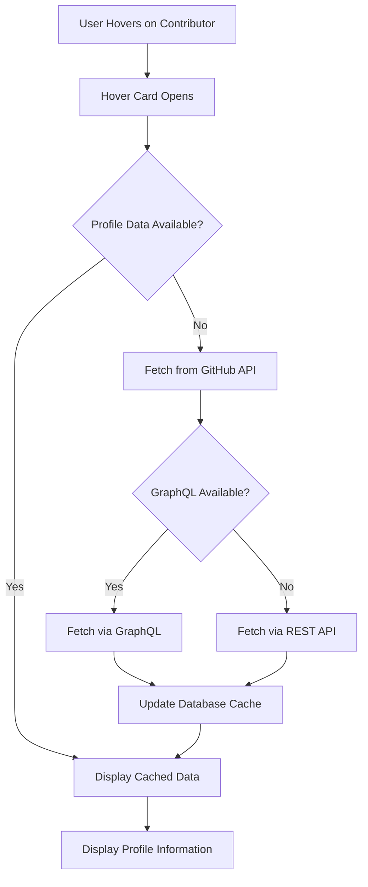

# User Profile Information in Contributor Hover Card

## Overview

This feature adds comprehensive user profile information to the contributor hover card, enabling better contributor grouping and organizational insights. When users hover over a contributor's name, they can now see company affiliation, location, and personal website information.

## Implementation

### Architecture



### Components

#### 1. GitHub Profile Service (`src/services/github-profile.ts`)

Handles fetching user profile data from GitHub's API with multiple strategies:

**Features:**
- Dual API support (GraphQL preferred, REST fallback)
- Automatic token management (user token or env token)
- Database caching for improved performance
- Comprehensive error handling

**Key Functions:**
```typescript
// Fetch complete profile with GraphQL
fetchGitHubUserProfileGraphQL(username: string)

// Fetch basic profile with REST API
fetchGitHubUserProfile(username: string)

// Update database cache
updateContributorProfile(username: string, profileData)

// Combined fetch and cache
fetchAndCacheUserProfile(username: string)
```

#### 2. useUserProfile Hook (`src/hooks/use-user-profile.ts`)

React hook for managing profile data in components:

**Features:**
- On-demand fetching (only when needed)
- Loading and error state management
- Automatic cleanup on unmount
- Optional enable/disable control

**Usage:**
```typescript
const { profile, loading, error } = useUserProfile(username, enabled);
```

#### 3. Enhanced Hover Card (`src/components/features/contributor/contributor-hover-card.tsx`)

Updated component with profile information display:

**New Features:**
- Profile information section with company, location, and website
- Visual icons for each field type
- On-demand profile fetching
- Fallback to existing contributor data
- Improved organizations display

### Data Flow

1. **Hover Event**: User hovers over contributor name
2. **State Update**: `isOpen` state changes to `true`
3. **Profile Fetch**: `useUserProfile` hook triggers API call
4. **API Selection**: 
   - GraphQL API if token available (includes organizations)
   - REST API as fallback
5. **Cache Update**: Profile data saved to database
6. **Display**: Profile information rendered in hover card

### Database Schema

The `contributors` table already includes the necessary fields:

```sql
CREATE TABLE contributors (
  ...
  company text,
  location text,
  bio text,
  blog text,
  ...
);
```

### GitHub API Usage

#### GraphQL Query
```graphql
query GetUserProfile($username: String!) {
  user(login: $username) {
    login
    name
    company
    location
    bio
    websiteUrl
    organizations(first: 10) {
      nodes {
        login
        avatarUrl
        name
      }
    }
  }
}
```

#### REST API Endpoint
```
GET https://api.github.com/users/{username}
```

## Features

### Company Information
- Displays organization/company affiliation
- Helps identify corporate contributors
- Useful for partnership tracking
- Icon: Package (📦)

### Location Information
- Shows geographical location
- Enables regional analysis
- Helps with timezone coordination
- Icon: Layout (📍)

### Website/Blog
- Links to personal website or blog
- Provides additional context about contributor
- Clickable link with proper formatting
- Icon: Globe (🌐)

### Organizations
- Lists public organization memberships
- Shows organization avatars
- Limited to 4 visible (with "+N more" indicator)
- Links to organization profiles

## Performance Optimizations

### 1. On-Demand Loading
Profile data is only fetched when the hover card is opened, not on initial component render.

### 2. Database Caching
Fetched profile data is stored in the database to avoid redundant API calls:
- Updates `last_updated_at` timestamp
- Caches company, location, bio, blog, and display_name
- Future hover card opens can use cached data

### 3. Smart Fallback
Component uses cached data from `ContributorStats` if profile fetch fails or is slow:
```typescript
const displayCompany = profile?.company || contributor.company;
const displayLocation = profile?.location || contributor.location;
const displayWebsite = profile?.websiteUrl || contributor.websiteUrl;
```

### 4. Minimal Re-renders
Uses React's `useState` to track hover card state and only trigger fetches when needed.

## Use Cases

### 1. Organizational Insights
- Identify which companies are contributing to your project
- Track corporate vs. individual contributors
- Monitor company engagement over time

### 2. Contributor Grouping
- Group contributors by company affiliation
- Create company-specific reports
- Analyze organizational contribution patterns

### 3. Partnership Identification
- Surface strategic partnerships
- Identify potential sponsors
- Track corporate relationships

### 4. Contributor Triage
- Categorize contributors by type (individual, company, community)
- Prioritize based on organizational importance
- Customize communication strategies

### 5. Analytics & Reporting
- Generate organizational contribution metrics
- Track geographical distribution
- Analyze corporate engagement trends

## Error Handling

### API Failures
- Falls back to REST API if GraphQL fails
- Returns null if all API calls fail
- Component continues to work with existing cached data

### Missing Data
- Only displays fields that have values
- Handles null/undefined gracefully
- No visual artifacts for missing data

### Token Issues
- Works without authentication (with rate limits)
- Uses user token when available (higher rate limits)
- Falls back to environment token

## Testing

### Storybook Stories
Created comprehensive stories in `contributor-hover-card-profile.stories.tsx`:

1. **WithCompanyAndLocation**: Full profile data
2. **WithoutProfileInfo**: Minimal data
3. **WithRole**: Profile data with role badge
4. **WithReviewsAndComments**: Profile with activity metrics

### Manual Testing
- Test with real GitHub usernames
- Verify GraphQL and REST API paths
- Check error handling and fallbacks
- Validate database caching

## Future Enhancements

### Potential Improvements
1. **Bio Display**: Add expandable bio section
2. **Social Links**: Include Twitter, LinkedIn, etc.
3. **Contribution Stats**: Show lifetime contribution metrics
4. **Follow Status**: Display if user follows the repository
5. **Badges**: Add verified contributor badges
6. **Sponsors**: Show GitHub Sponsors status
7. **Achievements**: Display contributor achievements
8. **Activity Heatmap**: Mini contribution calendar

### Performance Considerations
1. **Bulk Fetching**: Pre-fetch profiles for visible contributors
2. **Service Worker**: Cache profile data offline
3. **Lazy Loading**: Progressive profile data loading
4. **Rate Limit Management**: Smart API call batching

## Related Files

- `src/services/github-profile.ts` - Profile fetching service
- `src/hooks/use-user-profile.ts` - React hook for profile data
- `src/components/features/contributor/contributor-hover-card.tsx` - Main component
- `src/lib/types.ts` - TypeScript interfaces
- `src/components/features/contributor/contributor-hover-card-profile.stories.tsx` - Storybook examples

## API Rate Limits

### GitHub API Limits
- **Unauthenticated**: 60 requests/hour
- **Authenticated**: 5,000 requests/hour
- **GraphQL**: Separate rate limit based on query complexity

### Mitigation Strategies
1. Database caching reduces API calls
2. On-demand fetching (not pre-loading)
3. User token prioritization for higher limits
4. Graceful degradation when limits reached

## Security Considerations

1. **Token Handling**: Tokens never exposed to client
2. **CORS**: Proper CORS headers for GitHub API
3. **XSS Prevention**: All URLs sanitized before display
4. **Data Privacy**: Only public profile data fetched
5. **Rate Limiting**: Respects GitHub's rate limits

## Accessibility

1. **Icon Labels**: All icons have semantic meaning
2. **Link Contrast**: Proper color contrast for links
3. **Keyboard Navigation**: Fully keyboard accessible
4. **Screen Readers**: Proper ARIA labels
5. **Focus Management**: Appropriate focus handling

## Browser Compatibility

- Modern browsers (Chrome, Firefox, Safari, Edge)
- Progressive enhancement for older browsers
- No critical dependencies on latest APIs
- Graceful degradation for unsupported features
