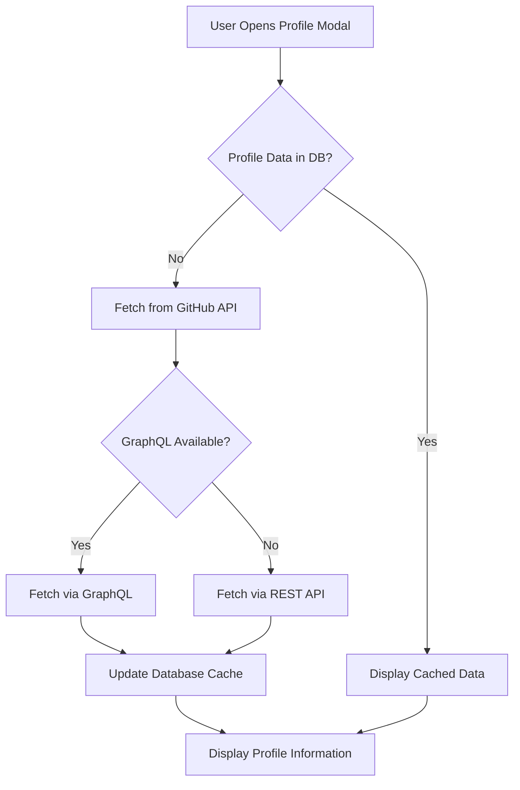

# User Profile Information in Contributor Profile Modal

## Overview

This feature adds comprehensive user profile information to the contributor profile modal, enabling better contributor grouping and organizational insights. When users open a contributor's profile modal, they can now see company affiliation, location, bio, and personal website information fetched from their GitHub profile.

## Implementation

### Architecture



### Components

#### 1. GitHub Profile Service (`src/services/github-profile.ts`)

Handles fetching user profile data from GitHub's API with multiple strategies:

**Features:**
- Dual API support (GraphQL preferred, REST fallback)
- Automatic token management (user token or env token)
- Database caching for improved performance
- Comprehensive error handling

**Key Functions:**
```typescript
// Fetch complete profile with GraphQL
fetchGitHubUserProfileGraphQL(username: string)

// Fetch basic profile with REST API
fetchGitHubUserProfile(username: string)

// Update database cache
updateContributorProfile(username: string, profileData)

// Combined fetch and cache
fetchAndCacheUserProfile(username: string)
```

#### 2. useUserProfile Hook (`src/hooks/use-user-profile.ts`)

React hook for managing profile data in components (kept for future use):

**Features:**
- On-demand fetching (only when needed)
- Loading and error state management
- Automatic cleanup on unmount
- Optional enable/disable control

**Usage:**
```typescript
const { profile, loading, error } = useUserProfile(username, enabled);
```

#### 3. Enhanced Profile Modal (`src/components/features/workspace/ContributorProfileModal.tsx`)

Updated component with profile information fetching and display:

**New Features:**
- Profile information fetched when modal opens
- Displays company, location, bio, and website
- Loading state during profile fetch
- Fallback to cached database data
- Updates contributor object for immediate display

### Data Flow

1. **Modal Open**: User clicks to open contributor profile modal
2. **Check Cache**: Component checks if profile data exists in database
3. **Conditional Fetch**: If no cached data, triggers `fetchAndCacheUserProfile`
4. **API Selection**: 
   - GraphQL API if token available (includes organizations)
   - REST API as fallback
5. **Cache Update**: Profile data saved to database
6. **Display**: Profile information rendered in modal's "Profile Information" section

### Database Schema

The `contributors` table already includes the necessary fields:

```sql
CREATE TABLE contributors (
  ...
  company text,
  location text,
  bio text,
  blog text,
  ...
);
```

### GitHub API Usage

#### GraphQL Query
```graphql
query GetUserProfile($username: String!) {
  user(login: $username) {
    login
    name
    company
    location
    bio
    websiteUrl
    organizations(first: 10) {
      nodes {
        login
        avatarUrl
        name
      }
    }
  }
}
```

#### REST API Endpoint
```
GET https://api.github.com/users/{username}
```

## Features

### Company Information
- Displays organization/company affiliation
- Helps identify corporate contributors
- Useful for partnership tracking
- Icon: Users (👥)

### Location Information
- Shows geographical location
- Enables regional analysis
- Helps with timezone coordination
- Icon: Globe (🌐)

### Bio/Description
- Displays user's GitHub bio
- Provides context about contributor's focus and interests
- Helps understand contributor's background

### Website/Blog
- Links to personal website or blog
- Provides additional context about contributor
- Clickable link with proper formatting
- Icon: Globe (🌐)

### Last Activity
- Shows when contributor was last active
- Helps gauge current engagement level
- Icon: Calendar (📅)

## Performance Optimizations

### 1. Modal-Only Loading
Profile data is only fetched when the profile modal is explicitly opened by the user, not on hover interactions. This significantly improves performance by:
- Eliminating API calls on every hover
- Only fetching when user shows explicit interest
- Reducing unnecessary network traffic

### 2. Database Caching
Fetched profile data is stored in the database to avoid redundant API calls:
- Updates `last_updated_at` timestamp
- Caches company, location, bio, blog, and display_name
- Future modal opens can use cached data immediately

### 3. Smart Fallback
Modal checks for cached data before fetching:
```typescript
// Check if we already have profile data from the database
if (contributor.company || contributor.location || contributor.bio) {
  setProfileData({ /* use cached data */ });
  return;
}
// Otherwise fetch from GitHub API
```

### 4. Efficient State Management
Uses React's `useCallback` to memoize the fetch function and prevent unnecessary re-fetches when modal re-renders.

## Use Cases

### 1. Organizational Insights
- Identify which companies are contributing to your project
- Track corporate vs. individual contributors
- Monitor company engagement over time

### 2. Contributor Grouping
- Group contributors by company affiliation
- Create company-specific reports
- Analyze organizational contribution patterns

### 3. Partnership Identification
- Surface strategic partnerships
- Identify potential sponsors
- Track corporate relationships

### 4. Contributor Triage
- Categorize contributors by type (individual, company, community)
- Prioritize based on organizational importance
- Customize communication strategies

### 5. Analytics & Reporting
- Generate organizational contribution metrics
- Track geographical distribution
- Analyze corporate engagement trends

## Error Handling

### API Failures
- Falls back to REST API if GraphQL fails
- Returns null if all API calls fail
- Component continues to work with existing cached data

### Missing Data
- Only displays fields that have values
- Handles null/undefined gracefully
- No visual artifacts for missing data

### Token Issues
- Works without authentication (with rate limits)
- Uses user token when available (higher rate limits)
- Falls back to environment token

## Visual Changes

The profile modal's "Profile Information" section now displays:

**Before:**
- Only bio (if available)
- Company (if available)
- Location (if available)
- Last active timestamp

**After:**
- Bio fetched from GitHub profile
- Company with Users icon
- Location with Globe icon
- Personal website/blog with clickable link
- Last active timestamp
- Loading skeleton during fetch

## Testing

### Manual Testing
- Open contributor profile modal
- Verify profile data is fetched
- Check loading state appears
- Confirm cached data is used on subsequent opens
- Test with users that have complete vs. partial profile data
- Verify error handling when API fails

### Test Cases
1. **First Time Open**: Should fetch from GitHub API
2. **Cached Data**: Should display immediately from database
3. **No Profile Data**: Should handle gracefully
4. **API Failure**: Should fall back to cached data
5. **Rate Limit**: Should handle gracefully

## Future Enhancements

### Potential Improvements
1. ✅ **Bio Display**: Now displayed in modal
2. ✅ **Website Links**: Now displayed and clickable
3. **Social Links**: Expand beyond Discord and LinkedIn
4. **Contribution Stats**: Show lifetime contribution metrics
5. **Follow Status**: Display if user follows the repository
6. **Badges**: Add verified contributor badges
7. **Sponsors**: Show GitHub Sponsors status
8. **Achievements**: Display contributor achievements
9. **Activity Heatmap**: Mini contribution calendar
10. **Profile Refresh**: Add manual refresh button with cooldown
11. **Organization Details**: Show organization affiliation more prominently

### Performance Considerations
1. **Background Refresh**: Periodically update cached profiles
2. **Service Worker**: Cache profile data offline
3. **Lazy Loading**: Progressive profile data loading
4. **Rate Limit Management**: Smart API call batching
5. ✅ **Modal-Only Fetching**: Implemented - only fetch when modal opens

## Related Files

- `src/services/github-profile.ts` - Profile fetching service
- `src/hooks/use-user-profile.ts` - React hook for profile data (kept for future use)
- `src/components/features/workspace/ContributorProfileModal.tsx` - Main modal component with profile fetching
- `src/lib/types.ts` - TypeScript interfaces
- `src/components/features/contributor/contributor-hover-card-profile.stories.tsx` - Storybook examples

## API Rate Limits

### GitHub API Limits
- **Unauthenticated**: 60 requests/hour
- **Authenticated**: 5,000 requests/hour
- **GraphQL**: Separate rate limit based on query complexity

### Mitigation Strategies
1. Database caching reduces API calls
2. Modal-only fetching (not on hover)
3. User token prioritization for higher limits
4. Graceful degradation when limits reached
5. Check cache before making API calls

## Security Considerations

1. **Token Handling**: Tokens never exposed to client
2. **CORS**: Proper CORS headers for GitHub API
3. **XSS Prevention**: All URLs sanitized before display
4. **Data Privacy**: Only public profile data fetched
5. **Rate Limiting**: Respects GitHub's rate limits

## Accessibility

1. **Icon Labels**: All icons have semantic meaning
2. **Link Contrast**: Proper color contrast for links
3. **Keyboard Navigation**: Fully keyboard accessible
4. **Screen Readers**: Proper ARIA labels
5. **Focus Management**: Appropriate focus handling
6. **Loading States**: Clear loading indicators for screen readers

## Browser Compatibility

- Modern browsers (Chrome, Firefox, Safari, Edge)
- Progressive enhancement for older browsers
- No critical dependencies on latest APIs
- Graceful degradation for unsupported features

## Migration Notes

### From Hover Card to Modal
Previous implementation fetched profile data on hover, which caused performance issues:
- API calls triggered on every hover interaction
- Increased network traffic
- Slower hover card response time

New implementation moves profile fetching to the modal:
- API calls only when user explicitly opens modal
- Better performance on hover interactions
- More appropriate UX for detailed profile information
