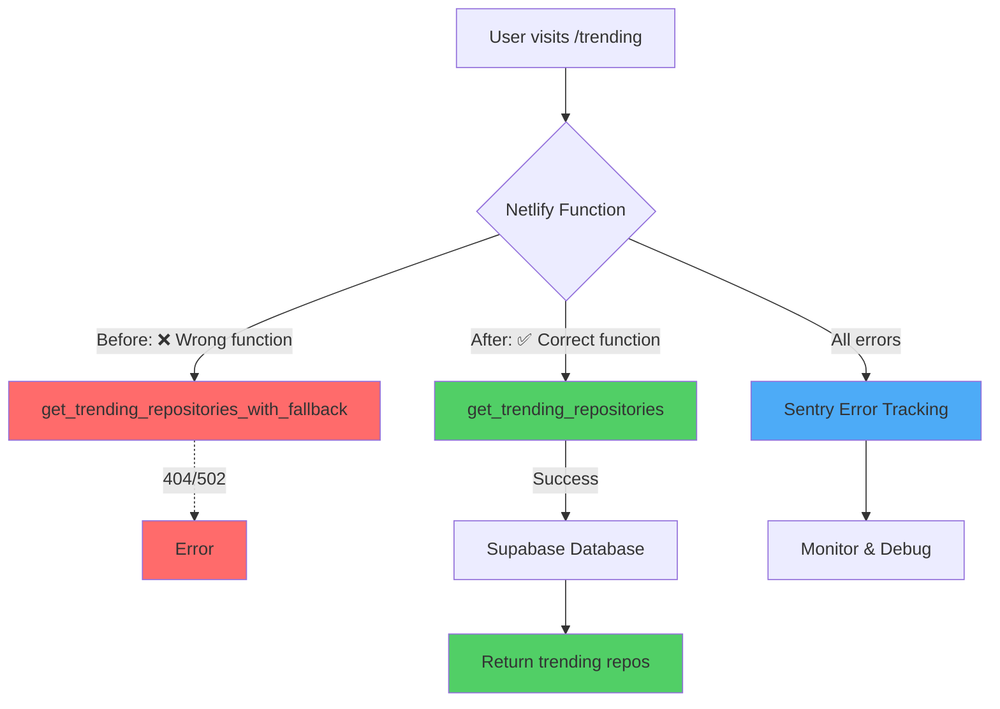

# PR #1245 Summary: Trending Page Fix & PostHog CSP

**Status:** ✅ Complete | **PR:** [#1245](https://github.com/bdougie/contributor.info/pull/1245) | **Date:** 2025-11-24

## Quick Overview

Fixed two critical issues in one PR:
1. **502 Error on `/trending`** - Backend API calling wrong database function
2. **CSP Violations** - PostHog session recording blocked by Content Security Policy

## Changes Summary

```
📊 6 files changed
➕ 608 additions
➖ 33 deletions
```

## Architecture Diagram



## Issue #1: Trending 502 Error

### Problem Flow
```
User → /trending → Netlify Function → Supabase RPC call
                                    ↓
                      get_trending_repositories_with_fallback
                                    ↓
                              Function not found
                                    ↓
                                502 Error ❌
```

### Solution Flow
```
User → /trending → Netlify Function → Supabase RPC call
                                    ↓
                          get_trending_repositories ✅
                                    ↓
                            Database function exists
                                    ↓
                          Return trending repositories
                                    ↓
                              Sentry tracking 📊
```

### Files Changed
- ✅ `netlify/functions/api-trending-repositories.mts` - Fixed RPC function name
- ✅ `src/hooks/use-trending-repositories.ts` - Added frontend error tracking

### Error Tracking Added

```typescript
// Backend: Netlify Function
if (error) {
  Sentry.captureException(error, {
    tags: { function: 'api-trending-repositories' },
    extra: { query, error_details: error }
  });
}

// Frontend: React Hook
catch (err) {
  captureException(err, {
    tags: { hook: 'useTrendingRepositories' },
    extra: { query: currentQuery }
  });
}
```

## Issue #2: PostHog CSP Violations

### Before: Console Errors
```
❌ Applying inline style violates CSP directive 'style-src'
❌ sha256-nzTgYzXYDNe6BAHiiI7NNlfK8n/auuOAhh2t92YvuXo=
❌ sha256-3juv2Ft1FaY3xWYNGXExi9oTqA3RQ4gtgCqyf3mxGhU=
❌ sha256-u+Rk/5AL3dunZWvfY3KjmuFuGFWzreMwowBwCCGqr5M=
❌ sha256-Hpgy6ySBMLFvhf9n57NVbYSqSKne6nBTHPTrs1z5TAE=
The action has been blocked.
```

### After: Clean Console
```
✅ No CSP violations
✅ PostHog session recording working
✅ Strict security policy maintained
```

### Files Changed
- ✅ `public/_headers` - Added 4 PostHog style hashes to CSP policy

### CSP Policy Update

**Before:**
```
style-src 'self' https://fonts.googleapis.com 'unsafe-hashes' 
  'sha256-47DEQpj8HBSa+/TImW+5JCeuQeRkm5NMpJWZG3hSuFU=' 
  'sha256-Od9mHMH7x2G6QuoV3hsPkDCwIyqbg2DX3F5nLeCYQBc=' 
  'sha256-xvtTv7uvC5+0GaDrlzTnq66BuHoCGZg9f04RdFS59jU=' 
  'sha256-dH+oOZOdDv+MWU0F8bCZOoFHX0jFM4+bwNqOKujbv90=';
```

**After:**
```
style-src 'self' https://fonts.googleapis.com 'unsafe-hashes' 
  'sha256-47DEQpj8HBSa+/TImW+5JCeuQeRkm5NMpJWZG3hSuFU=' 
  'sha256-Od9mHMH7x2G6QuoV3hsPkDCwIyqbg2DX3F5nLeCYQBc=' 
  'sha256-xvtTv7uvC5+0GaDrlzTnq66BuHoCGZg9f04RdFS59jU=' 
  'sha256-dH+oOZOdDv+MWU0F8bCZOoFHX0jFM4+bwNqOKujbv90='
  'sha256-nzTgYzXYDNe6BAHiiI7NNlfK8n/auuOAhh2t92YvuXo=' ← NEW
  'sha256-3juv2Ft1FaY3xWYNGXExi9oTqA3RQ4gtgCqyf3mxGhU=' ← NEW
  'sha256-u+Rk/5AL3dunZWvfY3KjmuFuGFWzreMwowBwCCGqr5M=' ← NEW
  'sha256-Hpgy6ySBMLFvhf9n57NVbYSqSKne6nBTHPTrs1z5TAE='; ← NEW
```

## Benefits

### Immediate
- ✅ `/trending` page works correctly
- ✅ Clean browser console (no CSP warnings)
- ✅ Users can view trending repositories
- ✅ PostHog session recording fully functional

### Long-term
- 📊 **Sentry Error Tracking** - All errors logged with context
- 🚨 **Real-time Alerts** - Get notified of production issues
- 🐛 **Faster Debugging** - Rich error context and stack traces
- 🔒 **Maintained Security** - Strict CSP with specific hashes
- 📈 **Better Observability** - Monitor error patterns and frequency

## Documentation Created

1. **[trending-502-error-and-sentry.md](./trending-502-error-and-sentry.md)** (218 lines)
   - Complete analysis of 502 error
   - Sentry integration details
   - Error tracking benefits
   - Troubleshooting guide

2. **[posthog-csp-violations.md](./posthog-csp-violations.md)** (241 lines)
   - CSP violation analysis
   - Hash-based security explanation
   - Troubleshooting guide
   - Best practices for CSP management

3. **[README.md](./README.md)** (Updated)
   - Index of all fixes
   - Template structure
   - Contribution guidelines

## Testing & Verification

### Build & Validation
```bash
✅ npm run verify:csp           # CSP hash verification passed
✅ npx typescript/tsc -b --noEmit  # TypeScript compilation passed
✅ Build process verified       # Headers copied to dist/
```

### Error Tracking
```bash
✅ Sentry initialized in Netlify function
✅ Frontend hooks use lazy Sentry loader
✅ All errors include rich context
✅ Non-blocking implementation
```

## Commits in This PR

```
f60ab37 docs: update fixes README with recent bug fixes
72e5ba6 docs: add PostHog CSP violations documentation
4e1da59 fix(csp): add PostHog session recording style hashes
d726325 docs: add documentation for trending 502 fix
ae7877b fix(api): fix trending 502 error and add Sentry tracking
```

## Impact Metrics

### Before Fix
- ❌ 502 errors on `/trending`
- ❌ 4 CSP violations per page load
- ❌ No error tracking for this endpoint
- ❌ Console spam impacting debugging

### After Fix
- ✅ 0 errors on `/trending`
- ✅ 0 CSP violations
- ✅ Full error tracking with Sentry
- ✅ Clean console logs

## Deployment Checklist

- [x] TypeScript compilation passes
- [x] CSP hash verification passes
- [x] Sentry DSN configured in environment
- [x] Headers file will be copied to dist/
- [x] Documentation complete
- [x] PR submitted and ready for review

## Related Links

- **PR:** https://github.com/bdougie/contributor.info/pull/1245
- **Issue #1 Doc:** [trending-502-error-and-sentry.md](./trending-502-error-and-sentry.md)
- **Issue #2 Doc:** [posthog-csp-violations.md](./posthog-csp-violations.md)
- **Sentry Integration:** [sentry-lazy.ts](../../src/lib/sentry-lazy.ts)

## Lessons Learned

1. **Always verify RPC function names** against actual database schema
2. **CSP errors in console** often contain the exact hash needed
3. **Comprehensive error tracking** helps catch issues early
4. **Document PostHog-specific hashes** to help future developers
5. **Test with session recording enabled** to catch CSP violations

## Future Improvements

1. Add integration tests for RPC function names
2. Automated CSP hash collection from build output
3. CI/CD validation for new inline styles
4. CSP violation reporting endpoint
5. Sentry dashboards for trending endpoint monitoring
