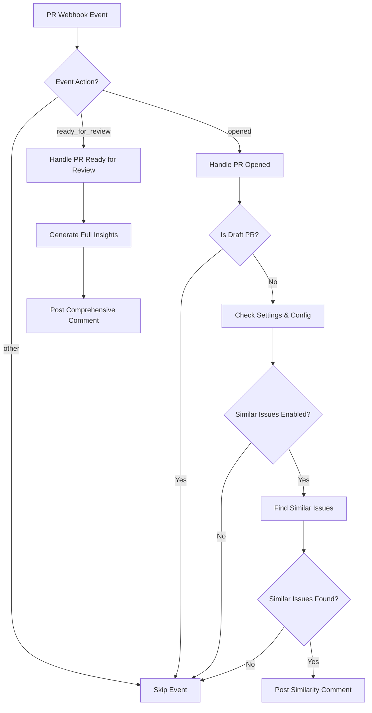

# GitHub Webhook Similarity Comments

This document describes the enhanced webhook functionality that automatically posts similarity comments on both pull requests and issues when they are opened.

## Overview

The GitHub app now provides two types of similarity-based comments:

1. **Issue Comments**: Already working - posts vector similarity comments when issues are opened
2. **PR Comments**: New functionality - posts simple similarity comments when PRs are opened

## PR Webhook Enhancement

### What Changed

**Before**: PR webhook only processed `ready_for_review` events with full insights (reviewers, statistics, etc.)

**After**: PR webhook processes both:
- `opened` events → Simple similarity comments (new)
- `ready_for_review` events → Full insights comments (existing behavior)

### Implementation Details

#### Event Processing Flow



#### Key Features

- **Configuration Aware**: Respects `.contributor` file settings
- **Selective Commenting**: Only comments when similar issues are found
- **Lightweight Storage**: Stores minimal tracking data for similarity comments
- **Bot Filtering**: Automatically excludes bot PRs based on configuration

### Configuration

The feature respects the `.contributor` configuration file:

```yaml
version: 1

features:
  similar_issues: true    # Enable/disable similarity comments
  auto_comment: true      # Master switch for all auto-comments

exclude_authors:
  - dependabot[bot]
  - renovate[bot]
```

## Comment Format

### PR Similarity Comments

When a PR is opened, if similar issues are found, a comment like this is posted:

```markdown
## 🔗 Related Issues

I found the following issues that may be related to this PR:

- 🟢 🔧 [#42 - Fix authentication bug](https://github.com/owner/repo/issues/42) (Mentioned in PR description)
- 🔴 💭 [#38 - Login issues on mobile](https://github.com/owner/repo/issues/38) (Similar title)
- 🟢 🔗 [#35 - Auth improvements](https://github.com/owner/repo/issues/35) (Same author)

_This helps connect related work and avoid duplicate efforts. Powered by [contributor.info](https://contributor.info)_ 🤖
```

#### Relationship Indicators

- 🔧 **Fixes**: PR mentions "fixes #N" or "closes #N"
- ⚡ **Implements**: PR mentions "implements #N"
- 🔗 **Relates To**: PR mentions "#N" without fix/implement keywords
- 💭 **Similar**: General similarity based on content/context

#### State Indicators

- 🟢 **Open Issue**
- 🔴 **Closed Issue**

### Issue Similarity Comments

Issue similarity comments (existing functionality) use vector embeddings:

```markdown
## 🔍 Similar Issues Found

I found the following similar issues that might be related:

- 🟢 [#15 - Login not working](https://github.com/owner/repo/issues/15) (87% similar)
- 🔴 [#12 - Authentication problems](https://github.com/owner/repo/issues/12) (82% similar)

_This helps reduce duplicate issues and connects related discussions. Powered by [contributor.info](https://contributor.info)_ 🤖
```

## Database Schema

### Storage Differences

**Full PR Insights** (ready_for_review):
```sql
INSERT INTO pr_insights (
  pull_request_id,
  contributor_stats,     -- Full statistics
  suggested_reviewers,   -- Reviewer suggestions
  similar_issues,        -- Similar issues
  comment_type           -- 'full'
);
```

**Similarity Comments** (opened):
```sql
INSERT INTO pr_insights (
  pull_request_id,
  similar_issues,        -- Similar issues only
  comment_type           -- 'similarity'
);
```

## Technical Implementation

### File Changes

- **`app/webhooks/pull-request.ts`**: Main webhook handler
  - Added `handlePROpened()` function
  - Added `formatSimplePRSimilarityComment()` function
  - Added `storePRSimilarityComment()` function
  - Modified event filtering logic

### Dependencies

Reuses existing services:
- **`app/services/similarity.ts`**: For finding related issues
- **`app/services/contributor-config.ts`**: For configuration management
- **`app/services/issue-similarity.ts`**: Vector similarity (for issues)

### Testing

- **`app/webhooks/__tests__/pull-request.test.ts`**: Comprehensive test suite
  - Event filtering tests
  - Configuration respect tests
  - Comment posting tests
  - Database storage tests

## Deployment

### Prerequisites

1. **GitHub App Permissions**: Ensure app has `issues:write` and `pull_requests:write`
2. **Database Schema**: Existing schema supports new functionality
3. **Configuration**: Add `.contributor` file to repositories

### Rollout Strategy

1. **Phase 1**: Deploy with feature disabled by default
2. **Phase 2**: Enable for test repositories
3. **Phase 3**: Enable by default for new installations
4. **Phase 4**: Enable for existing installations (opt-in)

### Monitoring

Monitor the following metrics:
- Comment posting success rate
- Similar issues detection accuracy
- User engagement with similarity comments
- Performance impact on webhook processing

## Configuration Examples

### Enable All Features
```yaml
version: 1
features:
  similar_issues: true
  auto_comment: true
comment_style: detailed
```

### Minimal Setup
```yaml
version: 1
features:
  similar_issues: true
  auto_comment: true
comment_style: minimal
exclude_authors:
  - dependabot[bot]
```

### Disable Similarity Comments
```yaml
version: 1
features:
  similar_issues: false  # Disables both PR and issue similarity
  auto_comment: true
```

## Troubleshooting

### Common Issues

1. **Comments Not Posting**
   - Check `.contributor` configuration
   - Verify GitHub app permissions
   - Check webhook delivery logs

2. **Too Many/Few Similar Issues**
   - Similarity threshold is 0.3 (30%)
   - Consider adjusting in `app/services/similarity.ts`

3. **Bot Comments**
   - Add bot accounts to `exclude_authors`
   - Comments should automatically be filtered

### Debug Commands

```bash
# Check webhook configuration
curl -H "Authorization: token $GITHUB_TOKEN" \
  https://api.github.com/repos/owner/repo/hooks

# View recent webhook deliveries
gh api repos/owner/repo/hooks/HOOK_ID/deliveries

# Test similarity detection
node -e "
const { findSimilarIssues } = require('./app/services/similarity');
// Test with sample PR data
"
```

## Future Enhancements

Potential improvements:
- **Machine Learning**: Improve similarity detection accuracy
- **User Feedback**: Allow users to rate similarity suggestions
- **Configuration**: More granular similarity thresholds
- **Integration**: Connect with project management tools
- **Analytics**: Detailed similarity metrics dashboard