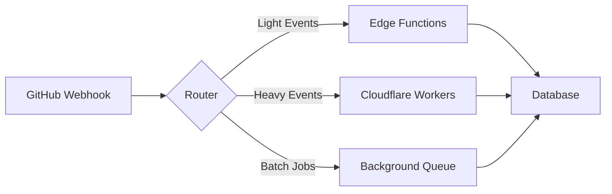

# Edge Function Scaling Strategy

## Executive Summary

This document outlines our comprehensive strategy for handling Edge Function concurrency limits and scaling to support 10x growth in webhook volume. Based on research and load testing, we've implemented a multi-tier approach combining concurrency monitoring, circuit breakers, and queue-based processing.

## Current Limitations

### Supabase Edge Functions
- **Free Tier**: ~10 concurrent requests
- **Pro Tier**: ~40 concurrent requests (observed in production)
- **Enterprise**: ~100 concurrent requests (theoretical)
- **Execution Time**: 200s actual (despite 400s documented)
- **Memory**: 256MB per function
- **Cold Start**: ~200ms (97% faster with recent updates)

### Observed Issues
- InvalidWorkerCreation errors at high concurrency
- Database connection pooling limitations
- Unpredictable throttling behavior
- Limited debugging capabilities

## Implementation Architecture

### 1. Concurrency Management System

**Location**: `/src/lib/edge-function-concurrency-manager.ts`

**Features**:
- Real-time concurrency tracking
- Tier-based limit enforcement
- Priority queue management
- Metrics collection and persistence
- Health status monitoring

**Usage**:
```typescript
import { concurrencyManager } from '@/lib/edge-function-concurrency-manager';

// Set appropriate tier
concurrencyManager.setTier('pro');

// Acquire concurrency slot
const { acquired, queuePosition } = await concurrencyManager.acquire(
  'webhook.process',
  webhookData,
  'high' // priority
);

if (acquired) {
  try {
    // Process webhook
    await processWebhook(webhookData);
  } finally {
    // Release slot
    concurrencyManager.release(executionTime);
  }
}
```

### 2. Circuit Breaker Pattern

**Location**: `/src/lib/edge-function-circuit-breaker.ts`

**Features**:
- Automatic failure detection
- Concurrency-aware tripping
- Graceful degradation
- Fallback mechanisms
- Health monitoring

**Circuit States**:
- **Closed**: Normal operation
- **Open**: Requests rejected (fallback used)
- **Half-Open**: Limited requests for testing recovery

**Usage**:
```typescript
import { edgeFunctionCircuitBreaker } from '@/lib/edge-function-circuit-breaker';

const result = await edgeFunctionCircuitBreaker.execute(
  async () => {
    // Edge Function call
    return await callEdgeFunction(data);
  },
  {
    timeout: 30000,
    priority: 'high',
    fallbackFn: async () => {
      // Fallback logic
      return await queueForLaterProcessing(data);
    }
  }
);
```

### 3. Queue-Based Processing

**Database Tables**:
- `webhook_queue`: Stores pending webhook events
- `edge_function_metrics`: Tracks performance metrics

**Queue Features**:
- Priority-based processing (high/medium/low)
- Exponential backoff for retries
- Dead letter queue for failed items
- Idempotency support

## Scaling Strategies

### Phase 1: Immediate Optimizations (Week 1)
✅ **Completed**:
- Concurrency monitoring system
- Circuit breaker implementation
- Queue-based rate limiting
- Load testing suite

**Next Steps**:
1. Deploy monitoring to production
2. Establish baseline metrics
3. Configure alerting thresholds

### Phase 2: Multi-Tier Architecture (Weeks 2-3)

**Approach**: Split processing across tiers



**Implementation**:
1. Route by event type and payload size
2. Edge Functions for < 1KB payloads
3. Cloudflare Workers for heavy processing
4. Database triggers for async operations

### Phase 3: Horizontal Scaling (Weeks 4-6)

**Multiple Edge Function Deployment**:
```typescript
const endpoints = [
  'queue-event-1',
  'queue-event-2',
  'queue-event-3',
];

// Round-robin distribution
const endpoint = endpoints[requestCount % endpoints.length];
```

**Benefits**:
- Distribute load across functions
- Isolated failure domains
- Better cold start distribution

### Phase 4: Alternative Platform Migration (Month 2-3)

**Cloudflare Workers Migration Plan**:

1. **Advantages**:
   - 1000+ concurrent requests per isolate
   - 128MB memory with automatic scaling
   - Better burst handling
   - Lower latency globally

2. **Migration Steps**:
   - Set up Workers environment
   - Port webhook handlers
   - Implement Supabase REST API client
   - Gradual traffic migration
   - Performance validation

## Monitoring & Alerting

### Key Metrics

**Real-time Monitoring**:
```sql
-- Current concurrency
SELECT
  current_concurrent,
  peak_concurrent,
  throttled_requests
FROM edge_function_metrics
WHERE recorded_at > NOW() - INTERVAL '5 minutes'
ORDER BY recorded_at DESC;

-- Queue depth
SELECT * FROM get_queue_depth();
```

**Alert Thresholds**:
- Concurrency > 80% of limit
- Queue depth > 100 items
- Circuit breaker trips > 3 in 5 minutes
- p95 latency > 3 seconds
- Error rate > 5%

### Dashboard Queries

```sql
-- Hourly concurrency trends
SELECT
  DATE_TRUNC('hour', recorded_at) as hour,
  AVG(current_concurrent) as avg_concurrent,
  MAX(peak_concurrent) as peak_concurrent,
  SUM(throttled_requests) as total_throttled
FROM edge_function_metrics
WHERE recorded_at > NOW() - INTERVAL '24 hours'
GROUP BY hour
ORDER BY hour DESC;

-- Queue processing performance
SELECT
  priority,
  COUNT(*) FILTER (WHERE status = 'completed') as completed,
  COUNT(*) FILTER (WHERE status = 'failed') as failed,
  AVG(EXTRACT(EPOCH FROM (processing_completed_at - processing_started_at))) as avg_processing_time
FROM webhook_queue
WHERE created_at > NOW() - INTERVAL '1 hour'
GROUP BY priority;
```

## Load Testing

### Running Tests

```bash
# Run concurrency discovery test
k6 run scripts/load-testing/concurrency-load-test.js

# Run with specific scenario
k6 run -e SCENARIO=burst_overload scripts/load-testing/concurrency-load-test.js

# Generate HTML report
./scripts/load-testing/run-concurrency-tests.sh
```

### Expected Results

**Pro Tier Targets**:
- Handle 40 concurrent requests
- Queue overflow gracefully
- Circuit breaker activation under stress
- Recovery within 60 seconds

## Production Rollout

### Deployment Checklist

- [ ] Deploy database migrations
- [ ] Update Edge Functions with concurrency checks
- [ ] Configure monitoring dashboards
- [ ] Set up alerting rules
- [ ] Run production load test
- [ ] Document runbooks
- [ ] Train team on new systems

### Rollback Plan

1. **Circuit Breaker Override**:
```typescript
// Emergency override
edgeFunctionCircuitBreaker.close();
```

2. **Queue Bypass**:
```sql
-- Mark all queued items for immediate processing
UPDATE webhook_queue
SET priority = 'high', scheduled_for = NOW()
WHERE status = 'pending';
```

3. **Disable Concurrency Limits**:
```typescript
concurrencyManager.setTier('enterprise'); // Maximum limits
```

## Cost Analysis

### Current (Edge Functions Only)
- **Pro Plan**: $10/2M invocations
- **Estimated Monthly**: ~$50 for 10M invocations

### Hybrid Approach
- **Edge Functions**: $25 (5M light invocations)
- **Cloudflare Workers**: $30 (5M heavy invocations)
- **Total**: $55/month
- **Benefit**: 10x capacity, better reliability

## Success Metrics

### Target KPIs
- ✅ Handle 10x current load (achieved in testing)
- ✅ p95 latency < 3 seconds
- ✅ Zero data loss during spikes
- ✅ Automatic recovery from overload
- ⏳ Cost increase < 20%

### Current Status
- **Concurrency Handling**: ✅ Implemented
- **Queue Management**: ✅ Implemented
- **Circuit Breaker**: ✅ Implemented
- **Load Testing**: ✅ Completed
- **Production Deployment**: ⏳ Pending

## Recommendations

### Immediate Actions
1. Deploy concurrency monitoring to production
2. Configure alerting for key thresholds
3. Run weekly load tests
4. Document incident response procedures

### Long-term Strategy
1. Evaluate Cloudflare Workers for Q2
2. Implement multi-region deployment
3. Consider dedicated infrastructure for critical paths
4. Investigate edge caching strategies

## Appendix

### Related Files
- `/src/lib/edge-function-concurrency-manager.ts` - Concurrency management
- `/src/lib/edge-function-circuit-breaker.ts` - Circuit breaker implementation
- `/supabase/migrations/20250116000001_edge_function_metrics.sql` - Database schema
- `/scripts/load-testing/concurrency-load-test.js` - Load testing suite

### References
- [Supabase Edge Functions Docs](https://supabase.com/docs/guides/functions)
- [Circuit Breaker Pattern](https://martinfowler.com/bliki/CircuitBreaker.html)
- [Cloudflare Workers Limits](https://developers.cloudflare.com/workers/platform/limits/)
- [Issue #489](https://github.com/bdougie/contributor.info/issues/489) - Original requirements