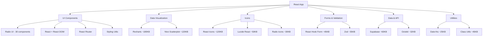

# Dependency Graph Analysis - contributor.info

## 🌐 Dependency Categories & Relationships



## 🎯 Critical Dependency Paths

### **Primary Bundle Contributors (>50KB each)**

1. **Recharts (180KB)**
   - Used in: Contributions, Activity charts, Health metrics
   - Dependencies: D3 ecosystem
   - Optimization: ✅ Already tree-shaken via Vite

2. **Radix UI Ecosystem (~400KB total)**
   - Components: Dialog, Dropdown, Tooltip, Avatar, Tabs, etc.
   - Dependencies: React, React DOM, styling utilities
   - Optimization: ⚠️ Potential over-importing

3. **@nivo/scatterplot (120KB)**
   - Used in: Distribution treemap only
   - Dependencies: D3, React
   - Optimization: ⚠️ Single use case - evaluation needed

4. **React Icons (120KB)**  
   - Used in: Legacy components throughout
   - Dependencies: None (standalone)
   - Optimization: 🚨 Can be replaced with Lucide

5. **Supabase Client (60KB)**
   - Used in: All data operations
   - Dependencies: Cross-fetch, WebSocket
   - Optimization: ✅ Essential, minimal size

### **Secondary Contributors (20-50KB each)**

6. **Lucide React (50KB)**
   - Used in: Modern components
   - Optimization: ✅ Preferred icon library

7. **React Hook Form (45KB)**
   - Used in: All forms (auth, settings, filters)
   - Optimization: ✅ Efficient form library

8. **Class Utilities Bundle (45KB)**
   - CVA + CLSX + Tailwind Merge
   - Optimization: ✅ Essential for styling system

9. **Zod (35KB)**
   - Used in: Form validation, API validation
   - Optimization: ✅ Tree-shakeable validation

10. **Octokit (32KB)**
    - Used in: GitHub API calls
    - Optimization: ✅ Essential for GitHub integration

## 🔍 Dependency Redundancy Analysis

### **Icon Libraries (200KB total - High Redundancy)**
```
React Icons (120KB) ← Legacy usage
├─ Lucide React (50KB) ← Modern usage  
└─ Radix Icons (30KB) ← Bundled with components

RECOMMENDATION: Consolidate to Lucide React only
SAVINGS: ~100KB
```

### **Chart Libraries (300KB total - Low Redundancy)**
```
Recharts (180KB) ← Standard charts
└─ Nivo Scatterplot (120KB) ← Specialized treemap

RECOMMENDATION: Keep both (different use cases)
ALTERNATIVE: Evaluate Recharts treemap capability
```

### **UI Component Libraries (400KB total - Potential Redundancy)**
```
Radix UI Components (400KB)
├─ Dialog ✅ (Used in auth, settings)
├─ Dropdown Menu ✅ (Used in navigation)
├─ Tooltip ✅ (Used throughout)
├─ Avatar ✅ (Used in profiles)
├─ Tabs ✅ (Used in navigation)
├─ Toast ✅ (Used for notifications)
├─ Button ✅ (Used throughout)
├─ Alert Dialog ❓ (Audit needed)
├─ Aspect Ratio ❓ (Audit needed)
├─ Checkbox ❓ (Audit needed)
├─ Collapsible ❓ (Audit needed)
├─ Context Menu ❓ (Audit needed)
├─ Hover Card ❓ (Audit needed)
├─ Menubar ❓ (Audit needed)
├─ Navigation Menu ❓ (Audit needed)
├─ Popover ❓ (Audit needed)
├─ Progress ❓ (Audit needed)
├─ Radio Group ❓ (Audit needed)
├─ Scroll Area ❓ (Audit needed)
├─ Select ❓ (Audit needed)
├─ Separator ❓ (Audit needed)
├─ Slider ❓ (Audit needed)
├─ Switch ❓ (Audit needed)
└─ Toggle Group ❓ (Audit needed)

RECOMMENDATION: Remove unused components
ESTIMATED SAVINGS: 100-150KB
```

## 🔄 Bundle Chunk Strategy

### **Current Vite Configuration Analysis:**
```javascript
// From vite.config.ts - Manual chunking strategy
manualChunks: (id) => {
  // React ecosystem bundled together (prevents runtime errors)
  if (id.includes('react') || id.includes('@radix-ui') || 
      id.includes('@nivo') || id.includes('recharts') ||
      id.includes('lucide-react')) {
    return 'react-vendor'; // ~800KB chunk
  }
  
  // Utilities
  if (id.includes('class-variance-authority') || 
      id.includes('clsx') || id.includes('tailwind-merge')) {
    return 'utils'; // ~45KB chunk
  }
  
  // Data layer  
  if (id.includes('zustand') || id.includes('@supabase/supabase-js')) {
    return 'data'; // ~70KB chunk
  }
}
```

### **Optimization Opportunities:**
1. **Split large react-vendor chunk** (~800KB is too large)
2. **Separate chart libraries** from core React components
3. **Create admin-specific chunk** for admin features

### **Proposed Chunk Strategy:**
```javascript
manualChunks: (id) => {
  // Core React (essential for app bootstrap)
  if (id.includes('react') && !id.includes('@radix-ui')) {
    return 'react-core'; // ~200KB
  }
  
  // UI Components (loaded after bootstrap)  
  if (id.includes('@radix-ui') || id.includes('lucide-react')) {
    return 'ui-components'; // ~400KB
  }
  
  // Charts (loaded on demand)
  if (id.includes('recharts') || id.includes('@nivo')) {
    return 'charts'; // ~300KB  
  }
  
  // Admin features (lazy loaded)
  if (id.includes('/admin/') || id.includes('/debug/')) {
    return 'admin'; // ~100KB
  }
}
```

## 📊 Tree Shaking Analysis

### **Libraries with Good Tree Shaking:**
✅ **Lucide React** - Only imports used icons  
✅ **Date-fns** - Can import specific functions  
✅ **Zod** - Tree-shakeable validation schemas  
✅ **React Hook Form** - Minimal core with plugins  

### **Libraries with Poor/Unknown Tree Shaking:**
⚠️ **React Icons** - Large monolithic library  
⚠️ **Radix UI** - Multiple packages, unclear usage  
⚠️ **Recharts** - Large D3 dependency tree  
⚠️ **@nivo/scatterplot** - D3 + React ecosystem  

### **Tree Shaking Verification Commands:**
```bash
# Analyze what's actually bundled
npm run build -- --mode=analyze

# Check for unused exports
npx unimported

# Bundle analyzer with tree-shaking info
npm run build && open dist/bundle-analysis.html
```

## 🚨 Circular Dependencies

### **Potential Risk Areas:**
1. **UI Components** - Circular imports between components
2. **Utilities** - Shared utility functions  
3. **Types** - TypeScript type definitions

### **Prevention Strategy:**
```bash
# Check for circular dependencies
npx madge --circular --extensions ts,tsx src/

# Organize imports to prevent cycles:
# 1. External dependencies
# 2. Internal utilities  
# 3. Components (from low-level to high-level)
# 4. Types (in separate files)
```

## 📈 Bundle Growth Prevention

### **Monitoring Strategy:**
1. **Bundle size budgets** in CI/CD
2. **Dependency size tracking** on PR
3. **Regular dependency audits** (monthly)
4. **Performance monitoring** in production

### **CI/CD Integration:**
```yaml
# .github/workflows/bundle-analysis.yml
- name: Check bundle size
  run: |
    npm run build
    node scripts/check-bundle-size.js
    # Fail if bundle exceeds 1MB total
```

## 🎯 Action Items Priority

### **High Priority (This Week):**
1. Remove React Icons dependency
2. Audit unused Radix UI components  
3. Set up bundle size monitoring

### **Medium Priority (Next Sprint):**
1. Evaluate chart library consolidation
2. Implement advanced chunk splitting
3. Add tree-shaking verification

### **Low Priority (Future):**
1. Circular dependency prevention
2. Advanced dynamic imports
3. Bundle size dashboard

---

**Last Updated:** 2025-08-08  
**Next Review:** After Phase 1 optimizations complete