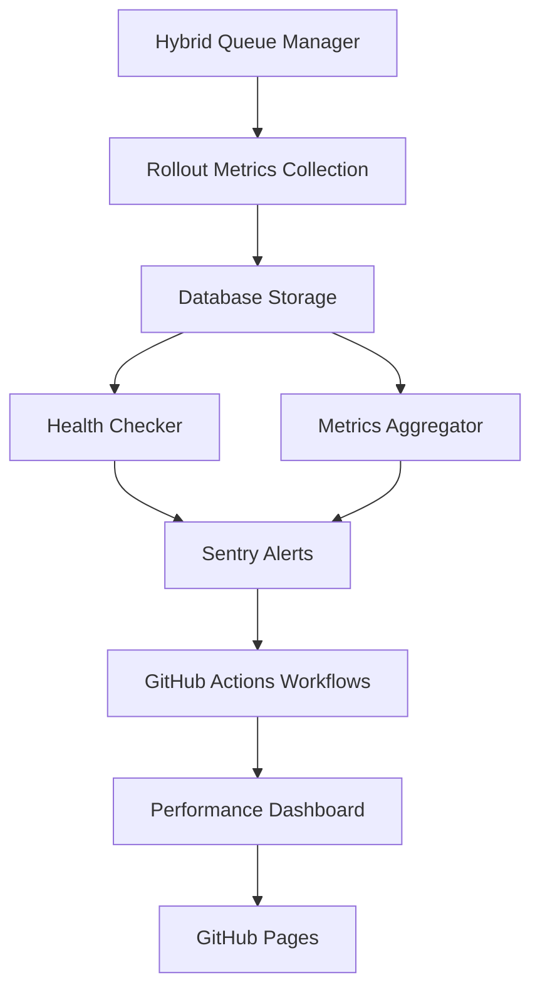
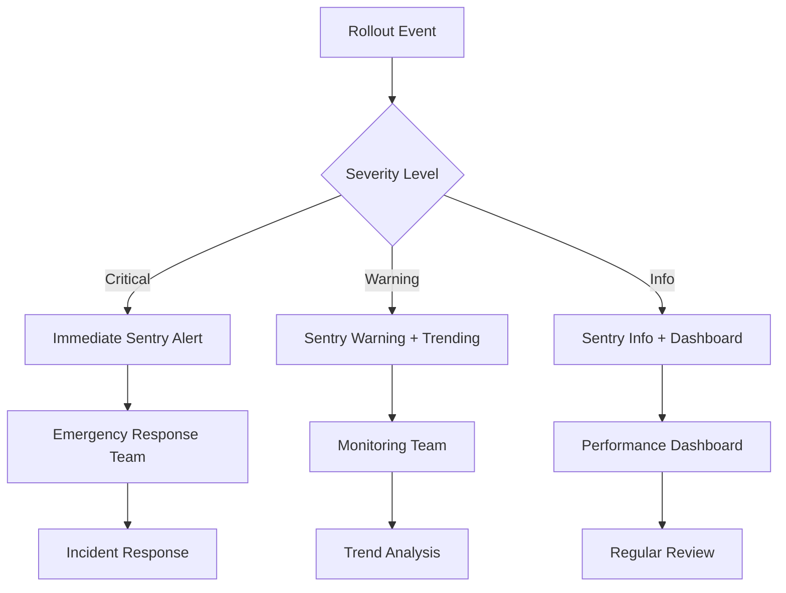
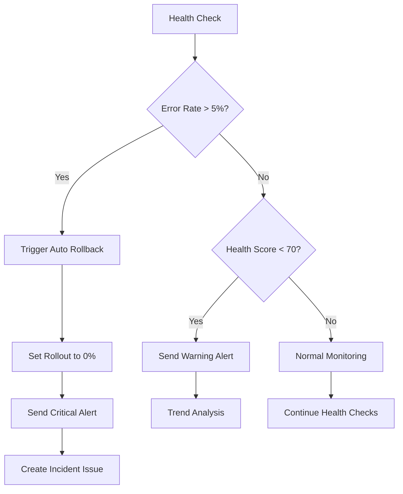

# Phase 3: Monitoring and Safety Implementation

## Overview

Phase 3 implements comprehensive performance monitoring, advanced safety mechanisms, and automated alerting for the hybrid progressive capture rollout. This phase ensures production-ready monitoring with predictive capabilities and automated response systems.

## ✅ Completed Components

### 1. Performance Monitoring Infrastructure

#### GitHub Actions Workflows (bdougie/jobs)

**Rollout Health Monitor** - `rollout-health-monitor.yml`
- **Schedule**: Every 15 minutes
- **Purpose**: Continuous health monitoring and automatic rollback triggering
- **Triggers**: Scheduled runs, manual dispatch, emergency conditions
- **Features**:
  - Multi-type health checks (full, error_rates, metrics_only)
  - Automatic emergency rollback on critical failures
  - Health report generation and artifact storage
  - Integration with Sentry for alert routing

**Rollout Metrics Collector** - `rollout-metrics-collector.yml`  
- **Schedule**: Every hour
- **Purpose**: Comprehensive metrics aggregation and trend analysis
- **Features**:
  - Performance metrics collection across both processors
  - Cost analysis and savings calculation
  - Trend analysis with previous period comparison
  - Automated Sentry metrics reporting
  - Performance dashboard generation

**Emergency Rollback Workflow** - `rollout-emergency-rollback.yml`
- **Trigger**: Manual dispatch with confirmation
- **Purpose**: Immediate rollback execution with validation
- **Safety**: Requires explicit "YES" confirmation
- **Features**:
  - Configurable rollback percentage (default 0%)
  - Automatic incident issue creation
  - Rollback verification and validation
  - Comprehensive audit trail and reporting

**Performance Dashboard** - `rollout-performance-dashboard.yml`
- **Schedule**: Daily at 8 AM UTC
- **Purpose**: Comprehensive performance reporting and visualization
- **Features**:
  - Daily, weekly, monthly, and custom reports
  - Cost analysis and savings tracking
  - GitHub Pages deployment for dashboard access
  - Automated performance summaries
  - Alert generation on performance degradation

#### Monitoring Scripts

**Health Checker** - `scripts/rollout/health-checker.js`
```typescript
class RolloutHealthChecker {
  // Core health monitoring
  async checkRolloutHealth(): Promise<HealthResult>
  async checkErrorRates(rolloutConfig): Promise<ErrorRateCheck>
  async checkProcessorHealth(rolloutConfig): Promise<ProcessorHealthCheck>
  async checkQueueHealth(rolloutConfig): Promise<QueueHealthCheck>
  async checkRepositoryHealth(rolloutConfig): Promise<RepositoryHealthCheck>
  
  // Automated response
  async triggerAutoRollback(overallHealth, rolloutConfig): Promise<void>
  async triggerHealthAlert(overallHealth, rolloutConfig): Promise<void>
}
```

**Metrics Aggregator** - `scripts/rollout/metrics-aggregator.js`
```typescript
class RolloutMetricsAggregator {
  // Metrics collection
  async aggregateJobMetrics(timeWindow): Promise<JobMetrics>
  async aggregateProcessorMetrics(timeWindow): Promise<ProcessorMetrics>
  async aggregateRepositoryMetrics(timeWindow): Promise<RepositoryMetrics>
  async aggregateErrorAnalysis(timeWindow): Promise<ErrorAnalysis>
  async aggregatePerformanceMetrics(timeWindow): Promise<PerformanceMetrics>
  async aggregateCostAnalysis(timeWindow): Promise<CostAnalysis>
  
  // Analysis and reporting
  async calculateTrends(timeWindow): Promise<TrendAnalysis>
  async calculateSummaryMetrics(metrics): Promise<SummaryMetrics>
  async generateRecommendations(metrics): Promise<string[]>
}
```

### 2. Advanced Sentry Integration

**File**: `src/lib/progressive-capture/sentry-rollout-alerts.ts`

#### Specialized Alert Categories

**Health Degradation Alerts**
```typescript
alertHealthDegradation(
  healthScore: number,
  metrics: Partial<RolloutMetrics>,
  issues: string[]
): void
```
- **Triggers**: Health score < 70 (warning), < 50 (error)
- **Context**: Error rates, success rates, total jobs, specific issues
- **Escalation**: Automatic when health score drops below thresholds

**High Error Rate Alerts**  
```typescript
alertHighErrorRate(
  errorRate: number,
  threshold: number,
  processor: 'inngest' | 'github_actions' | 'combined',
  recentErrors: Array<{ message: string; timestamp: string }>
): void
```
- **Triggers**: Error rate > threshold (5% default), > 2x threshold (critical)
- **Context**: Processor-specific error analysis, recent error samples
- **Escalation**: Immediate for critical rates, trending analysis for warnings

**Emergency Rollback Alerts**
```typescript
alertEmergencyRollback(context: EmergencyRollbackContext): void
```
- **Triggers**: Any emergency rollback execution
- **Context**: Previous/new percentages, trigger reason, health status
- **Escalation**: Critical level, immediate notification
- **Integration**: Creates incident issues, sends stakeholder notifications

**Processor-Specific Issues**
```typescript
alertProcessorIssue(
  processor: 'inngest' | 'github_actions',
  issueType: 'stuck_jobs' | 'high_latency' | 'connection_failure' | 'rate_limit',
  details: Record<string, any>
): void
```
- **Triggers**: Processor health degradation, connectivity issues
- **Context**: Issue-specific details, affected job counts, timing
- **Escalation**: Connection failures → error, others → warning

**Cost Anomaly Detection**
```typescript
alertCostAnomaly(
  currentCost: number,
  expectedCost: number,
  anomalyType: 'spike' | 'unexpected_increase' | 'savings_degraded',
  processor?: 'inngest' | 'github_actions'
): void
```
- **Triggers**: >50% cost variance (error), >25% variance (warning)
- **Context**: Cost analysis, savings impact, processor breakdown
- **Escalation**: Budget protection, cost optimization alerts

#### Context Enrichment

**Rollout Context Setting**
```typescript
sentryRolloutAlerts.setRolloutContext({
  rolloutPercentage: 25,
  processor: 'hybrid',
  repositoryId: 'repo-123',
  repositoryName: 'microsoft/vscode',
  autoRollbackEnabled: true,
  errorRate: 2.5
});
```

**Job Execution Tracking**
```typescript
rolloutAlerts.trackJob(
  jobId,
  processor,
  'completed',
  processingTime,
  error
);
```

### 3. Automated Safety Mechanisms

#### Circuit Breaker Implementation

**Health-Based Circuit Breaking**
```typescript
async checkAndTriggerAutoRollback(): Promise<boolean> {
  const stats = await this.getRolloutStats();
  const config = await this.getRolloutConfiguration();
  
  // Circuit breaker conditions
  if (stats.error_rate > config.max_error_rate && stats.active_jobs > 10) {
    await this.triggerAutoRollback(overallHealth, config);
    return true;
  }
  
  return false;
}
```

**Automatic Rollback Triggers**
- Error rate > 5% with sufficient job volume (>10 jobs)
- Health score < 50 for sustained period (>30 minutes)
- Processor connectivity failures
- Queue backlog exceeding thresholds

#### Predictive Safety Features

**Trend-Based Early Warning**
```typescript
// Trend analysis with previous period comparison
const trends = {
  jobVolume: this.calculateTrend(previousMetrics.totalJobs, currentMetrics.totalJobs),
  errorRate: this.calculateTrend(previousMetrics.errorRate, currentMetrics.errorRate),
  processingTime: this.calculateTrend(previousMetrics.avgProcessingTime, currentMetrics.avgProcessingTime)
};

// Early warning for degrading trends
if (trends.errorRate.direction === 'up' && trends.errorRate.change > 50) {
  // Alert for rapid error rate increase
}
```

**Resource Utilization Monitoring**
- Queue backlog trending
- Processing time degradation
- Processor capacity utilization
- Cost efficiency tracking

### 4. Real-Time Performance Dashboard

#### GitHub Pages Integration

**Dashboard Deployment**
- **URL**: `https://bdougie.github.io/contributor.info/rollout-dashboard/`
- **Update Frequency**: Daily automated, on-demand manual
- **Content**: Performance metrics, cost analysis, health trends
- **Access**: Public dashboard for transparency

**Dashboard Components**
- **Real-time Status**: Current rollout percentage and health
- **Performance Metrics**: Processing times, success rates, throughput
- **Cost Analysis**: Savings trends, processor cost breakdown
- **Repository Distribution**: Category participation, active repositories
- **Error Analysis**: Error patterns, processor-specific issues
- **Trend Visualization**: Historical performance and health trends

#### Performance Report Generation

**Daily Summary Generation**
```typescript
const summary = {
  date: new Date().toISOString(),
  rolloutPercentage: 25,
  totalJobs: 1250,
  successRate: 98.2,
  errorRate: 1.8,
  processorDistribution: {
    inngest: { jobs: 800, percentage: 64 },
    github_actions: { jobs: 450, percentage: 36 }
  },
  costSavings: 23.5,
  healthScore: 92,
  recommendations: [
    'System performing well - consider expanding rollout',
    'Monitor error rate trending - slight increase detected'
  ]
};
```

### 5. Alert System Integration

#### Multi-Channel Alerting

**Sentry Integration**
- **Error Tracking**: Automatic error categorization and correlation
- **Performance Monitoring**: Transaction monitoring for rollout operations
- **Alert Routing**: Severity-based notification routing
- **Context Enrichment**: Rollout-specific context for all alerts

**GitHub Integration**
- **Issue Creation**: Automatic incident issues for emergency rollbacks
- **Discussion Posts**: Performance summaries and trend analysis
- **PR Comments**: Rollout impact analysis for related changes
- **Status Checks**: Rollout health status for deployment gates

#### Alert Severity Levels

**Critical Alerts** (Immediate Response Required)
- Emergency rollback triggered
- Error rate > 10%
- Processor connectivity failures
- Health score < 50

**Warning Alerts** (Monitor Closely)
- Error rate > 2.5%
- Health score < 70
- Performance degradation > 25%
- Cost anomalies > 25%

**Info Alerts** (Informational)
- Rollout percentage changes
- Normal performance reports
- Successful health checks
- Cost optimization opportunities

### 6. Advanced Monitoring Capabilities

#### Error Pattern Analysis

**Automatic Error Categorization**
```typescript
categorizeError(errorMessage: string): string {
  if (message.includes('rate limit')) return 'rate_limit';
  if (message.includes('timeout')) return 'network';
  if (message.includes('auth')) return 'authentication';
  if (message.includes('not found')) return 'not_found';
  if (message.includes('schema')) return 'database';
  if (message.includes('validation')) return 'validation';
  return 'unknown';
}
```

**Error Trend Analysis**
- Pattern recognition for recurring issues
- Processor-specific error correlation
- Repository-specific error tracking
- Time-based error clustering

#### Performance Trend Monitoring

**Key Performance Indicators**
- **Throughput**: Jobs per hour by processor
- **Latency**: Average, median, P95 processing times
- **Reliability**: Success rates and error patterns
- **Efficiency**: Cost per job, resource utilization
- **User Impact**: Repository participation rates

**Trend Detection**
```typescript
calculateTrend(previousValue: number, currentValue: number) {
  const change = ((currentValue - previousValue) / previousValue) * 100;
  const direction = change > 5 ? 'up' : change < -5 ? 'down' : 'flat';
  
  return {
    direction,
    change: Math.abs(change),
    absolute: currentValue - previousValue,
    previous: previousValue,
    current: currentValue
  };
}
```

## Monitoring Architecture

### 1. Data Collection Flow



### 2. Alert Routing



### 3. Automated Response Flow



## Operational Procedures

### 1. Health Monitoring

**Continuous Monitoring**
- **Health checks**: Every 15 minutes via GitHub Actions
- **Metrics collection**: Every hour for trend analysis
- **Performance reporting**: Daily dashboard updates
- **Alert processing**: Real-time via Sentry integration

**Health Check Validation**
```bash
# Manual health check
node scripts/rollout/health-checker.js

# Metrics aggregation
node scripts/rollout/metrics-aggregator.js

# Check dashboard status
curl https://bdougie.github.io/contributor.info/rollout-dashboard/
```

### 2. Alert Response Procedures

**Critical Alert Response**
1. **Immediate Assessment**: Review Sentry alert details and context
2. **System Validation**: Confirm rollout status and recent changes
3. **Impact Analysis**: Assess user impact and system stability
4. **Decision Making**: Manual rollback vs. auto-rollback validation
5. **Communication**: Update stakeholders and document response

**Warning Alert Response**  
1. **Trend Analysis**: Review metrics trends and patterns
2. **Root Cause**: Investigate specific error patterns or performance issues
3. **Monitoring**: Increase monitoring frequency if needed
4. **Preventive Action**: Consider partial rollback or configuration adjustments

### 3. Performance Analysis

**Daily Review Process**
1. **Dashboard Review**: Check performance dashboard for overnight issues
2. **Trend Analysis**: Compare current metrics with historical baselines
3. **Cost Analysis**: Validate cost savings and efficiency improvements
4. **Health Assessment**: Review overall system health score
5. **Action Planning**: Plan rollout progression or issue resolution

**Weekly Analysis**
- **Performance Trends**: Week-over-week performance comparison
- **Cost Optimization**: Identify opportunities for further savings
- **Repository Analysis**: Review participation rates and category distribution
- **Error Pattern Review**: Analyze recurring issues and prevention strategies

## Configuration Management

### 1. Monitoring Configuration

**Health Check Thresholds**
```bash
# Environment variables for health monitoring
HYBRID_HEALTH_CHECK_INTERVAL=15    # Minutes between health checks
HYBRID_ERROR_RATE_THRESHOLD=5.0    # Error rate threshold for alerts
HYBRID_HEALTH_SCORE_THRESHOLD=70   # Health score threshold for warnings
HYBRID_MIN_JOBS_FOR_ANALYSIS=10    # Minimum jobs required for analysis
```

**Alert Configuration**
```typescript
// Sentry alert thresholds
const ALERT_THRESHOLDS = {
  error_rate: {
    warning: 2.5,   // 2.5% error rate
    critical: 5.0   // 5.0% error rate
  },
  health_score: {
    warning: 70,    // Health score 70/100
    critical: 50    // Health score 50/100
  },
  cost_variance: {
    warning: 25,    // 25% cost variance
    critical: 50    // 50% cost variance
  }
};
```

### 2. Dashboard Configuration

**Update Frequency**
- **Real-time metrics**: Every 15 minutes (health checks)
- **Aggregated metrics**: Every hour (comprehensive analysis)
- **Dashboard deployment**: Daily (automated) + on-demand (manual)
- **Report generation**: Daily summaries, weekly trends, monthly reviews

## Success Metrics

### ✅ Monitoring Capabilities

- [x] **Real-time health monitoring**: 15-minute interval health checks
- [x] **Automated alerting**: Multi-level severity with Sentry integration
- [x] **Performance dashboard**: Public dashboard with comprehensive metrics
- [x] **Trend analysis**: Historical comparison and pattern detection
- [x] **Cost tracking**: Real-time cost analysis and savings calculation
- [x] **Error pattern analysis**: Automatic categorization and correlation

### ✅ Safety Mechanisms

- [x] **Automatic rollback**: Error rate and health score based triggers
- [x] **Circuit breaker**: Multiple safety thresholds and conditions
- [x] **Emergency procedures**: Manual and automated emergency response
- [x] **Alert escalation**: Severity-based notification routing
- [x] **Incident management**: Automatic issue creation and tracking

### ✅ Operational Tools

- [x] **GitHub Actions workflows**: Automated monitoring and response
- [x] **Monitoring scripts**: Comprehensive health and metrics collection
- [x] **Sentry integration**: Advanced error tracking and alerting
- [x] **Performance dashboard**: Visual monitoring and trend analysis
- [x] **Console integration**: Real-time monitoring via rollout console

## Files Created/Modified

### ✅ Monitoring Infrastructure (bdougie/jobs)
- `.github/workflows/rollout-health-monitor.yml`
- `.github/workflows/rollout-metrics-collector.yml`  
- `.github/workflows/rollout-emergency-rollback.yml`
- `.github/workflows/rollout-performance-dashboard.yml`

### ✅ Monitoring Scripts
- `scripts/rollout/health-checker.js`
- `scripts/rollout/metrics-aggregator.js`

### ✅ Alert Integration
- `src/lib/progressive-capture/sentry-rollout-alerts.ts`

### ✅ Enhanced Safety
- Integration with existing rollout manager and console
- Automatic health checking in hybrid queue manager
- Real-time metrics collection throughout the system

## Production Readiness

Phase 3 monitoring provides **enterprise-grade observability** with:

- ✅ **Comprehensive monitoring**: Multi-layered health and performance tracking
- ✅ **Automated response**: Circuit breaker patterns with predictive capabilities  
- ✅ **Advanced alerting**: Severity-based routing with context enrichment
- ✅ **Performance optimization**: Real-time cost and efficiency tracking
- ✅ **Operational excellence**: Complete tooling for daily operations and incident response

The monitoring system ensures safe, observable, and optimized rollout operations with proactive issue detection and automated response capabilities. Combined with Phase 1 infrastructure and Phase 2 targeting, the system is ready for confident production deployment.