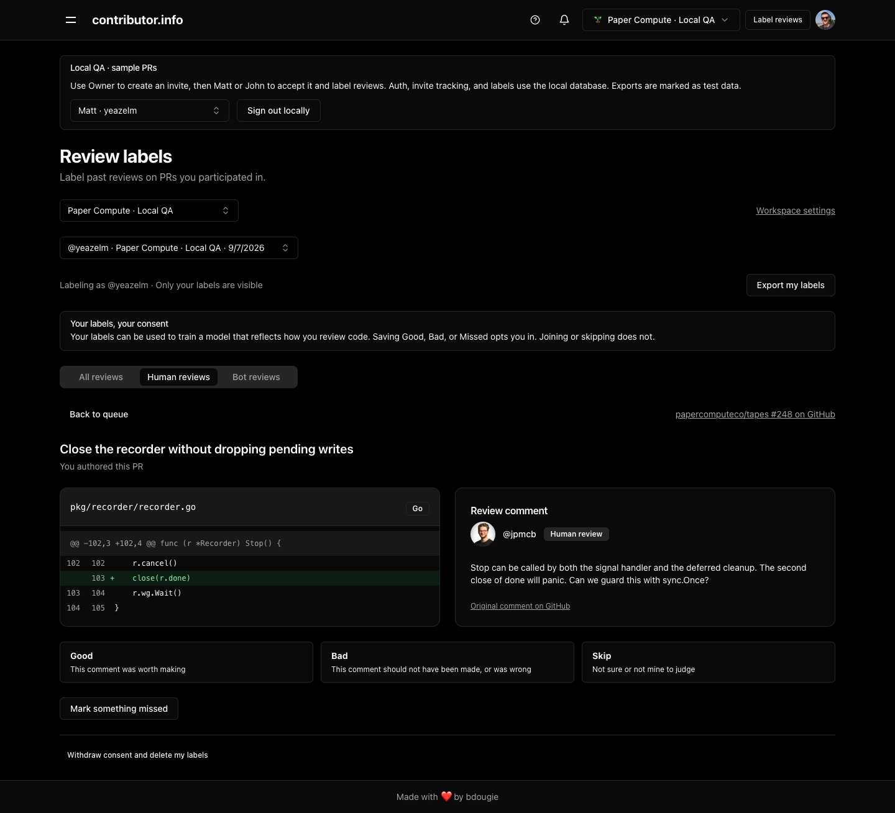
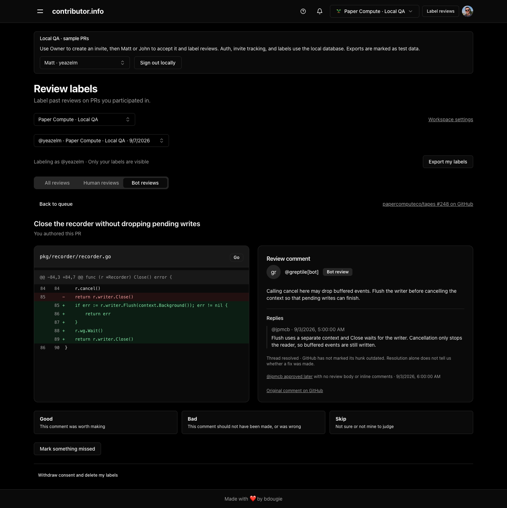
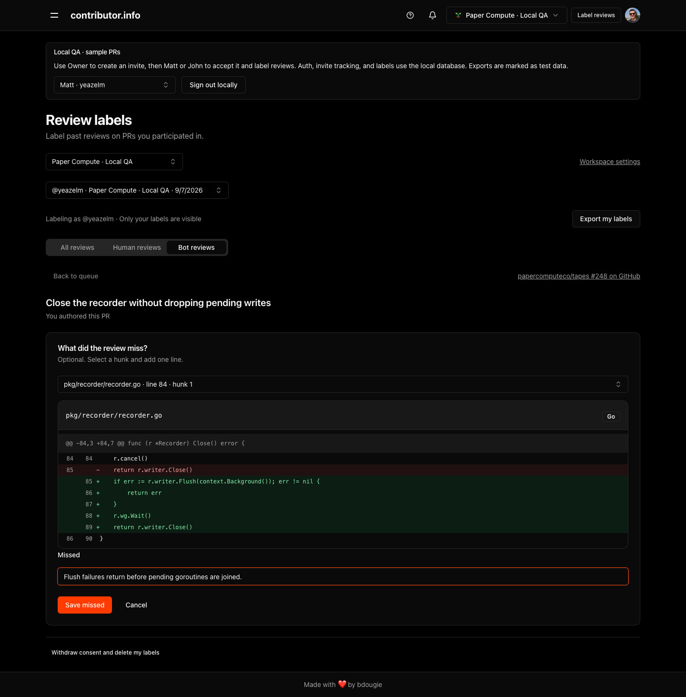
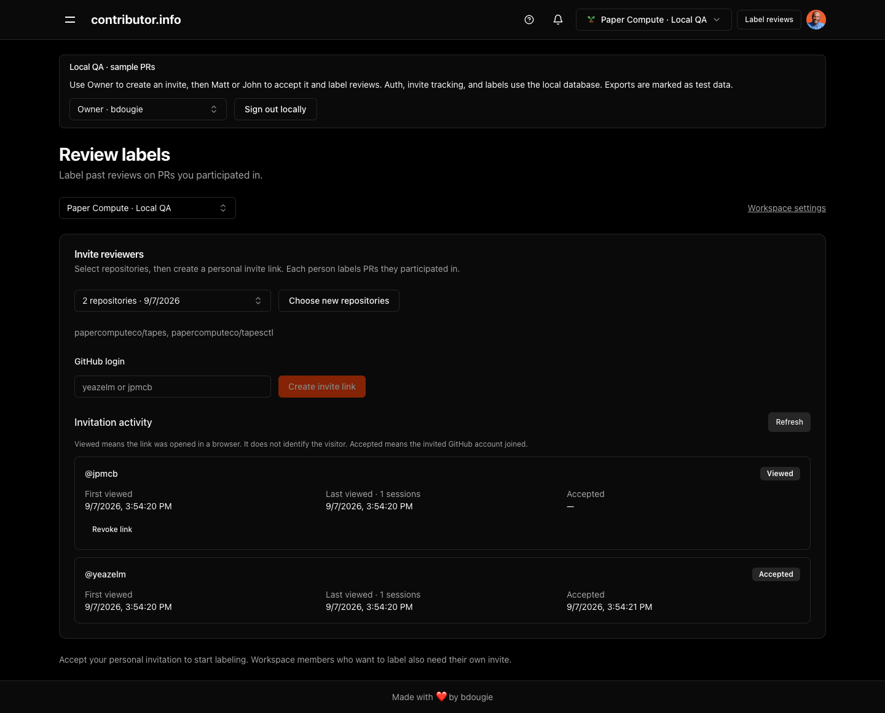
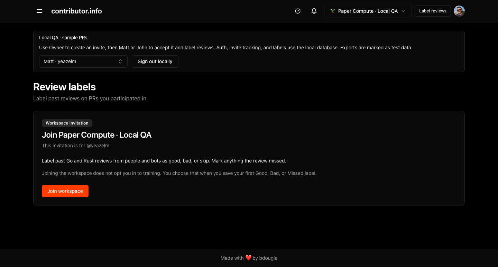
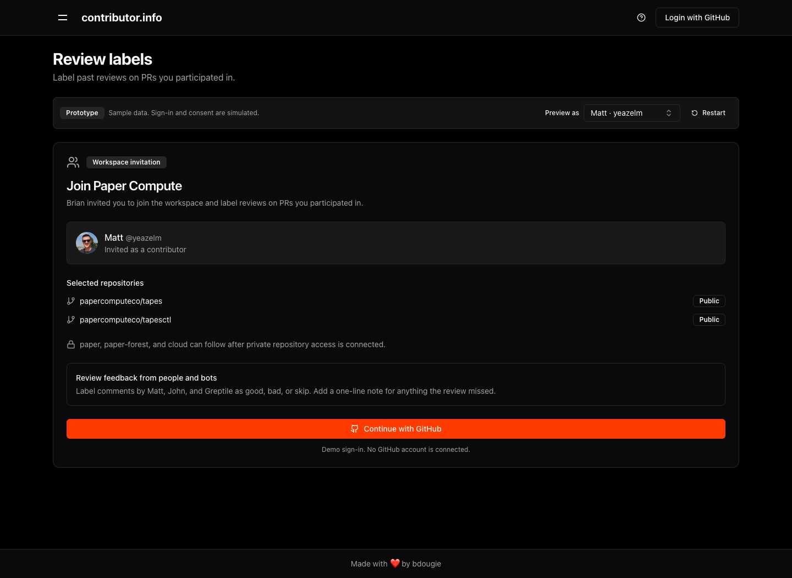
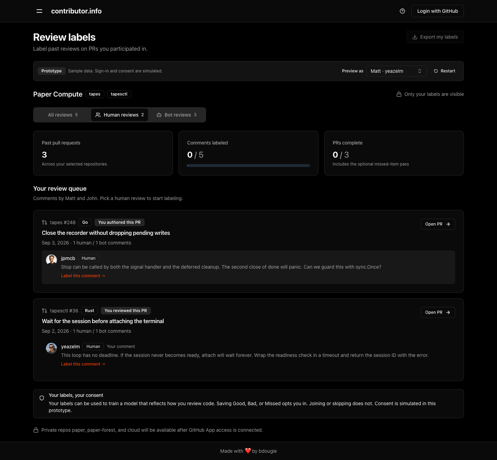
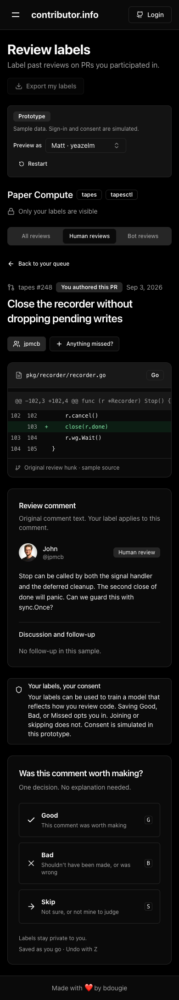

# Review-label screenshots

Captured from the running prototype and isolated QA app on September 7, 2026.
All PRs, comments, and missed notes shown here are synthetic fixtures. The QA
screens use real local authentication, API requests, invitation tracking, and
database writes. The prototype simulates sign-in and consent.

[Draft PR description](pr-description.md)

The gallery uses relative image references so it renders within the repository.
When publishing the PR body, replace those references with raw URLs pinned to
the pushed commit, or GitHub attachment URLs.

## Recommended images for the implementation PR

### Human review

A teammate's original comment is shown beside its source hunk. Good, Bad, and
Skip remain the only comment decisions. The header exposes Label reviews for
the active workspace, and the consent notice uses generic wording.

### Bot pushback

The Greptile flag includes the disagreeing reply, resolution status, and later
approval. The reviewer decides whether the original comment was worth making.

### Missed issue

An optional one-line note is attached to the selected hunk. This screenshot
shows the entry before saving; the note was then saved through the local API.

### Invitation activity

John's invite has been viewed; Matt's has been accepted. First/last view times,
browser-session counts, and acceptance time remain distinct. No raw invitation
token appears in the screenshot.

## Invitation and prototype references

### Implemented invitation

The invited account can join from its personal URL ending in `/invite`.
Joining alone does not grant training consent.

### Prototype invitation

The prototype introduces repository selection and the review-labeling flow.
This is a design reference; its invitation layout differs from the current QA
implementation above.

### Prototype human-review queue

The Human reviews tab includes teammate comments and the reviewer's own
comments on eligible PRs.

### Prototype mobile review

At a 390-pixel viewport, the hunk, verbatim comment, consent notice, and label
actions remain readable without horizontal page overflow.

Capture metadata is in [captures.json](captures.json). Images are direct browser
captures; prototype and QA banners remain visible. Most desktop captures use a
1440 × 1000 viewport; the compact QA invitation uses 1440 × 720. Full-page
images extend beyond the viewport when needed.
