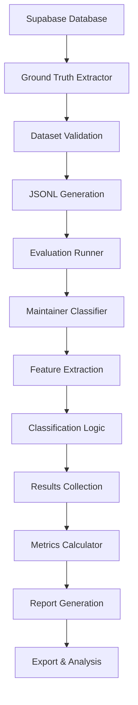

# Maintainer Classification Evaluation System - Developer Guide

A comprehensive guide for developing, extending, and maintaining the OpenAI Evals-inspired evaluation framework for GitHub contributor role classification.

## Table of Contents

- [Architecture Overview](#architecture-overview)
- [Development Setup](#development-setup)
- [Core Components Deep Dive](#core-components-deep-dive)
- [Adding New Features](#adding-new-features)
- [Testing Strategy](#testing-strategy)
- [Performance Optimization](#performance-optimization)
- [Debugging Guide](#debugging-guide)
- [Best Practices](#best-practices)
- [Common Patterns](#common-patterns)
- [Troubleshooting](#troubleshooting)

## Architecture Overview

### System Design Philosophy

The evaluation framework follows these core principles:

1. **Type Safety**: Comprehensive TypeScript types prevent runtime errors
2. **Modularity**: Clear separation of concerns with pluggable components
3. **Testability**: Each component is independently testable
4. **Scalability**: Batch processing and configurable parameters for large datasets
5. **Observability**: Detailed logging and metrics for debugging

### Component Architecture

```
src/evals/
├── types/                    # TypeScript type definitions
│   └── index.ts             # Core interfaces and types
├── datasets/                # Data extraction and management
│   └── ground-truth-extractor.ts
├── metrics/                 # Evaluation metrics calculation
│   └── evaluation-metrics.ts
├── runners/                 # Classification and orchestration
│   ├── maintainer-classifier.ts
│   └── evaluation-runner.ts
├── __tests__/              # Test suites
│   └── evaluation-framework.test.ts
├── index.ts                # Main entry point and CLI
└── README.md               # User documentation
```

### Data Flow



## Development Setup

### Prerequisites

1. **Node.js 20+** with npm 10+
2. **TypeScript 5.5+** for type checking
3. **Supabase Access** with service role key
4. **Development Tools**: VSCode with TypeScript extension

### Initial Setup

```bash
# Clone and install dependencies
git clone <repository>
cd contributor.info
npm install

# Install additional dev dependencies for evals
npm install --save-dev tsx dotenv

# Set up environment variables
cp .env.example .env
# Add your Supabase credentials to .env
```

### Environment Configuration

```bash
# .env file
VITE_SUPABASE_URL=https://your-project.supabase.co
SUPABASE_TOKEN=your-service-role-key
NODE_ENV=development

# Optional: Debug settings
DEBUG=eval:*
LOG_LEVEL=debug
```

### Verification

```bash
# Test the setup
npm run eval:maintainer -- --help
npm test src/evals
npm run build
```

## Core Components Deep Dive

### 1. Type System (`types/index.ts`)

#### Key Interfaces

```typescript
// Core evaluation data structure
interface EvaluationSample {
  input: EvaluationInput;      // Features for classification
  ideal: RoleType;             // Ground truth label
  metadata?: SampleMetadata;   // Quality indicators
}

// Classification input
interface EvaluationInput {
  user_id: string;
  repository: string;
  events: GitHubEvent[];       // Raw GitHub events
  metrics: ContributorMetrics; // Aggregated metrics
  repository_context?: RepoContext;
}

// Classification output
interface EvaluationResult {
  sample_id: string;
  prediction: RoleType;
  confidence: number;
  expected: RoleType;
  correct: boolean;
  execution_time_ms: number;
  error?: string;
}
```

#### Design Decisions

- **Strict Types**: All interfaces use literal types for role classification
- **Optional Fields**: Repository context and metadata are optional for flexibility
- **Error Handling**: Results include error field for graceful failure handling
- **Performance Tracking**: Execution time tracking built into result structure

#### Extending Types

When adding new features, follow these patterns:

```typescript
// ✅ Good: Extend existing interfaces
interface ExtendedEvaluationInput extends EvaluationInput {
  additional_features?: NewFeatureType;
}

// ✅ Good: Use union types for extensibility
type DetectionMethod = 
  | 'merge_event'
  | 'push_to_protected'
  | 'admin_action'
  | 'release_event'
  | 'custom_detection'; // Easy to add new methods

// ❌ Avoid: Breaking changes to core interfaces
interface EvaluationInput {
  // Don't modify existing required fields
  user_id: string; // Keep this stable
}
```

### 2. Dataset Management (`datasets/ground-truth-extractor.ts`)

#### Core Responsibilities

1. **Data Extraction**: Query Supabase for high-confidence classifications
2. **Quality Validation**: Ensure data meets quality standards
3. **Dataset Balancing**: Equal representation across role types
4. **Feature Engineering**: Transform raw data into evaluation format

#### Key Methods

```typescript
class GroundTruthExtractor {
  // Main extraction workflow
  async extractGroundTruthDataset(): Promise<EvaluationSample[]>
  
  // Data quality methods
  private balanceDataset(samples: any[]): any[]
  private validateSampleQuality(sample: any): boolean
  
  // Feature extraction
  private extractGitHubEvents(contributorId: string, repoId: string): Promise<GitHubEvent[]>
  private calculateMetrics(role: any, events: GitHubEvent[]): ContributorMetrics
  
  // Export utilities
  async exportToJSONL(samples: EvaluationSample[], path: string): Promise<void>
  async generateDatasetStats(samples: EvaluationSample[]): Promise<DatasetStats>
}
```

#### Data Quality Pipeline

```typescript
// Quality validation workflow
private async validateDataQuality(samples: EvaluationSample[]): Promise<ValidationResult> {
  const issues: string[] = [];
  
  // Check minimum sample requirements
  if (samples.length < this.minSamples) {
    issues.push(`Insufficient samples: ${samples.length} < ${this.minSamples}`);
  }
  
  // Check class balance
  const distribution = this.calculateClassDistribution(samples);
  const imbalanceThreshold = 0.3; // Max 30% imbalance
  
  Object.entries(distribution).forEach(([role, count]) => {
    const percentage = count / samples.length;
    if (percentage < imbalanceThreshold) {
      issues.push(`Class imbalance detected: ${role} only ${(percentage * 100).toFixed(1)}%`);
    }
  });
  
  // Check for data leakage
  const duplicates = this.findDuplicateSamples(samples);
  if (duplicates.length > 0) {
    issues.push(`Duplicate samples detected: ${duplicates.length}`);
  }
  
  return { valid: issues.length === 0, issues };
}
```

#### Adding New Data Sources

```typescript
// Example: Adding GitLab support
interface GitLabEvent extends GitHubEvent {
  platform: 'gitlab';
  merge_request_id?: string;
}

class ExtendedGroundTruthExtractor extends GroundTruthExtractor {
  async extractFromGitLab(projectId: string): Promise<EvaluationSample[]> {
    // Implementation for GitLab data extraction
    const gitlabEvents = await this.fetchGitLabEvents(projectId);
    return this.convertToEvaluationSamples(gitlabEvents);
  }
}
```

### 3. Classification Engine (`runners/maintainer-classifier.ts`)

#### Feature Extraction Pipeline

The classifier extracts multiple feature categories:

```typescript
private extractFeatures(input: EvaluationInput) {
  return {
    // Event-based features
    privileged_event_ratio: this.calculatePrivilegedRatio(input.events),
    admin_action_weight: this.calculateAdminWeight(input.events),
    merge_event_ratio: this.calculateMergeRatio(input.events),
    
    // Temporal features
    recent_activity_weight: this.calculateRecentActivity(input.events),
    consistency_score: this.calculateConsistency(input.events),
    days_active_normalized: this.normalizeDaysActive(input.metrics.days_active),
    
    // Repository context features
    repo_size_weight: this.getRepoSizeWeight(input.repository_context?.size),
    popularity_factor: this.calculatePopularityFactor(input.repository_context?.stars),
    
    // Detection signal features
    detection_method_count: input.metrics.detection_methods.length,
    confidence_from_db: input.metrics.confidence_score
  };
}
```

#### Scoring Algorithm

```typescript
private calculateClassificationScore(features: FeatureVector): number {
  const weights = this.config.feature_weights;
  let score = 0;
  
  // Core maintainer indicators (60% of score)
  score += features.privileged_event_ratio * weights.merge_events;
  score += features.admin_action_weight * weights.admin_actions;
  score += features.merge_event_ratio * weights.merge_events;
  
  // Temporal consistency (25% of score)
  score += features.recent_activity_weight * weights.temporal_activity;
  score += features.consistency_score * weights.temporal_activity;
  
  // Repository context (10% of score)
  score += features.repo_size_weight * 0.1;
  score += features.popularity_factor * 0.05;
  
  // Detection diversity (5% of score)
  score += (features.detection_method_count / 5) * 0.05;
  
  return Math.min(score, 1.0); // Cap at 1.0
}
```

#### Confidence Calibration

```typescript
private calculateConfidence(
  input: EvaluationInput, 
  prediction: RoleType
): number {
  const score = this.calculateClassificationScore(this.extractFeatures(input));
  const thresholds = this.config.confidence_thresholds;
  
  switch (prediction) {
    case 'owner':
      // Higher confidence for scores well above threshold
      return Math.min(score / thresholds.owner, 1.0);
      
    case 'maintainer':
      // Confidence based on distance from boundaries
      const distanceFromMaintainer = Math.abs(score - thresholds.maintainer);
      const distanceFromOwner = Math.abs(score - thresholds.owner);
      const minDistance = Math.min(distanceFromMaintainer, distanceFromOwner);
      return Math.min(0.5 + minDistance, 1.0);
      
    case 'contributor':
      // Inverse relationship for contributors
      return Math.min(1.0 - score, 1.0);
      
    default:
      return 0.5; // Default moderate confidence
  }
}
```

#### Adding New Classification Features

```typescript
// Step 1: Extend the feature extraction
private extractAdvancedFeatures(input: EvaluationInput) {
  const baseFeatures = this.extractFeatures(input);
  
  return {
    ...baseFeatures,
    // New temporal features
    commit_frequency: this.calculateCommitFrequency(input.events),
    weekend_activity: this.calculateWeekendActivity(input.events),
    
    // New collaboration features
    code_review_participation: this.calculateReviewParticipation(input.events),
    issue_management_score: this.calculateIssueManagement(input.events),
    
    // New technical features
    file_change_diversity: this.calculateFileChangeDiversity(input.events),
    test_coverage_involvement: this.calculateTestInvolvement(input.events)
  };
}

// Step 2: Update the scoring algorithm
private calculateAdvancedScore(features: ExtendedFeatureVector): number {
  const baseScore = this.calculateClassificationScore(features);
  
  // Add advanced feature contributions
  const advancedBonus = (
    features.commit_frequency * 0.05 +
    features.code_review_participation * 0.1 +
    features.issue_management_score * 0.08
  );
  
  return Math.min(baseScore + advancedBonus, 1.0);
}

// Step 3: Update configuration interface
interface ExtendedEvaluationConfig extends EvaluationConfig {
  advanced_feature_weights?: {
    commit_frequency: number;
    review_participation: number;
    issue_management: number;
  };
}
```

### 4. Metrics System (`metrics/evaluation-metrics.ts`)

#### Metrics Architecture

```typescript
class EvaluationMetricsCalculator {
  // Core metrics
  calculateMetrics(results: EvaluationResult[]): EvaluationMetrics
  
  // Individual metric calculations
  private calculateOverallAccuracy(results: EvaluationResult[]): number
  private calculatePerClassMetrics(results: EvaluationResult[]): PerClassMetrics
  private calculateConfusionMatrix(results: EvaluationResult[]): number[][]
  private calculateConfidenceCalibration(results: EvaluationResult[]): CalibrationMetrics
  
  // Advanced analytics
  private calculateROCCurve(results: EvaluationResult[]): ROCData
  private calculatePrecisionRecallCurve(results: EvaluationResult[]): PRCurveData
  private calculateFeatureImportance(results: EvaluationResult[]): FeatureImportance
  
  // Reporting
  generateDetailedReport(metrics: EvaluationMetrics): string
  generateRecommendations(metrics: EvaluationMetrics): string[]
}
```

#### Custom Metrics Implementation

```typescript
// Example: Adding business-specific metrics
interface BusinessMetrics {
  critical_role_accuracy: number;      // Accuracy for owner/maintainer only
  false_promotion_rate: number;        // contributor → maintainer/owner errors
  false_demotion_rate: number;         // owner/maintainer → contributor errors
  confidence_reliability_score: number; // How reliable confidence scores are
}

class ExtendedMetricsCalculator extends EvaluationMetricsCalculator {
  calculateBusinessMetrics(results: EvaluationResult[]): BusinessMetrics {
    const criticalRoleResults = results.filter(r => 
      ['owner', 'maintainer'].includes(r.expected)
    );
    
    const promotionErrors = results.filter(r =>
      r.expected === 'contributor' && 
      ['owner', 'maintainer'].includes(r.prediction)
    );
    
    const demotionErrors = results.filter(r =>
      ['owner', 'maintainer'].includes(r.expected) && 
      r.prediction === 'contributor'
    );
    
    return {
      critical_role_accuracy: this.calculateAccuracy(criticalRoleResults),
      false_promotion_rate: promotionErrors.length / results.length,
      false_demotion_rate: demotionErrors.length / results.length,
      confidence_reliability_score: this.calculateConfidenceReliability(results)
    };
  }
  
  private calculateConfidenceReliability(results: EvaluationResult[]): number {
    // Measure how well confidence scores predict correctness
    const highConfidenceResults = results.filter(r => r.confidence > 0.8);
    const highConfidenceAccuracy = this.calculateAccuracy(highConfidenceResults);
    
    const lowConfidenceResults = results.filter(r => r.confidence < 0.5);
    const lowConfidenceAccuracy = this.calculateAccuracy(lowConfidenceResults);
    
    // Good reliability: high confidence → high accuracy, low confidence → low accuracy
    return highConfidenceAccuracy - lowConfidenceAccuracy;
  }
}
```

### 5. Evaluation Orchestration (`runners/evaluation-runner.ts`)

#### Workflow Management

```typescript
class EvaluationRunner {
  async runCompleteEvaluation(): Promise<EvaluationResults> {
    // Phase 1: Data preparation
    console.log('🔍 Phase 1: Extracting ground truth dataset...');
    const samples = await this.extractor.extractGroundTruthDataset();
    await this.validateDatasetQuality(samples);
    
    // Phase 2: Feature validation
    console.log('🧪 Phase 2: Validating feature extraction...');
    await this.validateFeatureExtraction(samples.slice(0, 10));
    
    // Phase 3: Classification evaluation
    console.log('⚡ Phase 3: Running classification evaluation...');
    const results = await this.evaluateAllSamples(samples);
    
    // Phase 4: Metrics calculation
    console.log('📊 Phase 4: Calculating comprehensive metrics...');
    const metrics = this.metricsCalculator.calculateMetrics(results);
    
    // Phase 5: Quality validation
    console.log('✅ Phase 5: Validating results quality...');
    this.validateResults(metrics);
    
    // Phase 6: Report generation
    console.log('📝 Phase 6: Generating detailed report...');
    const report = this.generateComprehensiveReport(metrics, results);
    
    return { metrics, results, report };
  }
}
```

#### Batch Processing Strategy

```typescript
async evaluateAllSamples(samples: EvaluationSample[]): Promise<EvaluationResult[]> {
  const results: EvaluationResult[] = [];
  const batchSize = this.config.batch_size || 50;
  const maxConcurrency = this.config.max_concurrency || 5;
  
  // Process in batches to manage memory
  for (let i = 0; i < samples.length; i += batchSize) {
    const batch = samples.slice(i, i + batchSize);
    console.log(`Processing batch ${Math.floor(i / batchSize) + 1}/${Math.ceil(samples.length / batchSize)}`);
    
    // Process batch with controlled concurrency
    const batchPromises = batch.map(async (sample, index) => {
      const sampleId = `sample_${i + index}`;
      return this.classifier.evaluateSample(sample.input, sampleId, sample.ideal);
    });
    
    // Wait for batch completion with concurrency limit
    const batchResults = await this.limitConcurrency(batchPromises, maxConcurrency);
    results.push(...batchResults);
    
    // Progress tracking
    const progress = ((i + batch.length) / samples.length * 100).toFixed(1);
    console.log(`Progress: ${progress}% (${i + batch.length}/${samples.length})`);
    
    // Memory management: force garbage collection between batches
    if (global.gc && (i + batchSize) % 200 === 0) {
      global.gc();
    }
  }
  
  return results;
}

private async limitConcurrency<T>(
  promises: Promise<T>[], 
  maxConcurrency: number
): Promise<T[]> {
  const results: T[] = [];
  const executing: Promise<void>[] = [];
  
  for (const promise of promises) {
    const executePromise = promise.then(result => {
      results.push(result);
    });
    
    executing.push(executePromise);
    
    if (executing.length >= maxConcurrency) {
      await Promise.race(executing);
      executing.splice(executing.findIndex(p => p === executePromise), 1);
    }
  }
  
  await Promise.all(executing);
  return results;
}
```

## Adding New Features

### 1. Adding New Classification Features

#### Step-by-Step Guide

1. **Define the Feature Interface**

```typescript
// types/index.ts
interface ContributorMetrics {
  // Existing features
  privileged_events: number;
  total_events: number;
  // ... existing fields
  
  // New features
  code_review_ratio?: number;
  documentation_contributions?: number;
  security_fixes?: number;
}
```

2. **Implement Feature Extraction**

```typescript
// datasets/ground-truth-extractor.ts
private calculateExtendedMetrics(role: any, events: GitHubEvent[]): ContributorMetrics {
  const baseMetrics = this.calculateMetrics(role, events);
  
  return {
    ...baseMetrics,
    code_review_ratio: this.calculateCodeReviewRatio(events),
    documentation_contributions: this.calculateDocContributions(events),
    security_fixes: this.calculateSecurityFixes(events)
  };
}

private calculateCodeReviewRatio(events: GitHubEvent[]): number {
  const reviewEvents = events.filter(e => 
    e.type === 'PullRequestReviewEvent' || 
    e.type === 'PullRequestReviewCommentEvent'
  );
  return reviewEvents.length / Math.max(events.length, 1);
}
```

3. **Update Classification Logic**

```typescript
// runners/maintainer-classifier.ts
private extractFeatures(input: EvaluationInput) {
  const baseFeatures = this.extractBaseFeatures(input);
  
  return {
    ...baseFeatures,
    code_review_engagement: input.metrics.code_review_ratio || 0,
    documentation_focus: input.metrics.documentation_contributions || 0,
    security_awareness: input.metrics.security_fixes || 0
  };
}

private calculateClassificationScore(features: FeatureVector): number {
  const baseScore = this.calculateBaseScore(features);
  
  // Add new feature contributions
  const reviewBonus = features.code_review_engagement * 0.1;
  const docBonus = features.documentation_focus * 0.05;
  const securityBonus = features.security_awareness * 0.15;
  
  return Math.min(baseScore + reviewBonus + docBonus + securityBonus, 1.0);
}
```

4. **Add Configuration Support**

```typescript
// types/index.ts
interface EvaluationConfig {
  // Existing config
  confidence_thresholds: ConfidenceThresholds;
  evaluation_criteria: EvaluationCriteria;
  
  // Extended feature weights
  feature_weights?: {
    merge_events: number;
    push_events: number;
    admin_actions: number;
    temporal_activity: number;
    // New feature weights
    code_reviews?: number;
    documentation?: number;
    security_focus?: number;
  };
}
```

5. **Add Tests**

```typescript
// __tests__/evaluation-framework.test.ts
describe('Extended Features', () => {
  it('should handle code review features', async () => {
    const input: EvaluationInput = {
      user_id: 'test-reviewer',
      repository: 'test/repo',
      events: [
        { type: 'PullRequestReviewEvent', action: 'submitted', created_at: '2024-01-01T00:00:00Z' }
      ],
      metrics: {
        // ... base metrics
        code_review_ratio: 0.8,
        documentation_contributions: 5,
        security_fixes: 2
      }
    };

    const result = await classifier.evaluateSample(input, 'test-reviews', 'maintainer');
    
    expect(result.prediction).toBeDefined();
    expect(result.confidence).toBeGreaterThan(0);
  });
});
```

### 2. Adding New Evaluation Metrics

#### Custom Metric Implementation

```typescript
// metrics/evaluation-metrics.ts
interface ExtendedEvaluationMetrics extends EvaluationMetrics {
  temporal_accuracy: TemporalAccuracyMetrics;
  repository_type_analysis: RepositoryTypeMetrics;
  confidence_distribution: ConfidenceDistributionMetrics;
}

class ExtendedMetricsCalculator extends EvaluationMetricsCalculator {
  calculateExtendedMetrics(
    results: EvaluationResult[],
    samples: EvaluationSample[]
  ): ExtendedEvaluationMetrics {
    const baseMetrics = this.calculateMetrics(results);
    
    return {
      ...baseMetrics,
      temporal_accuracy: this.calculateTemporalAccuracy(results, samples),
      repository_type_analysis: this.calculateRepositoryTypeMetrics(results, samples),
      confidence_distribution: this.calculateConfidenceDistribution(results)
    };
  }
  
  private calculateTemporalAccuracy(
    results: EvaluationResult[],
    samples: EvaluationSample[]
  ): TemporalAccuracyMetrics {
    // Group by time periods
    const periods = this.groupByTimePeriod(samples);
    
    const temporalMetrics: { [period: string]: number } = {};
    
    Object.entries(periods).forEach(([period, periodSamples]) => {
      const periodResults = results.filter(r => 
        periodSamples.some(s => s.input.user_id === r.sample_id.split('_')[1])
      );
      temporalMetrics[period] = this.calculateAccuracy(periodResults);
    });
    
    return {
      by_period: temporalMetrics,
      trend_direction: this.calculateTrend(Object.values(temporalMetrics)),
      seasonal_variation: this.calculateSeasonalVariation(temporalMetrics)
    };
  }
}
```

### 3. Adding New Configuration Options

#### Configuration Extension Pattern

```typescript
// Configuration builder pattern
class EvaluationConfigBuilder {
  private config: Partial<EvaluationConfig> = {};
  
  withName(name: string): this {
    this.config.name = name;
    return this;
  }
  
  withConfidenceThresholds(owner: number, maintainer: number): this {
    this.config.confidence_thresholds = { owner, maintainer };
    return this;
  }
  
  withFeatureWeights(weights: FeatureWeights): this {
    this.config.feature_weights = weights;
    return this;
  }
  
  withAdvancedOptions(options: AdvancedOptions): this {
    this.config.advanced_options = options;
    return this;
  }
  
  build(): EvaluationConfig {
    this.validateConfig();
    return this.config as EvaluationConfig;
  }
  
  private validateConfig(): void {
    if (!this.config.name) {
      throw new Error('Configuration name is required');
    }
    // Additional validation...
  }
}

// Usage
const customConfig = new EvaluationConfigBuilder()
  .withName('high-precision-classification')
  .withConfidenceThresholds(0.98, 0.92)
  .withFeatureWeights({
    merge_events: 0.3,
    push_events: 0.15,
    admin_actions: 0.4,
    temporal_activity: 0.15
  })
  .withAdvancedOptions({
    enable_temporal_weighting: true,
    use_repository_clustering: true,
    apply_confidence_calibration: true
  })
  .build();
```

## Testing Strategy

### 1. Unit Testing Structure

```typescript
// __tests__/unit/
├── types.test.ts              # Type validation tests
├── dataset-extractor.test.ts  # Data extraction tests
├── classifier.test.ts         # Classification logic tests
├── metrics.test.ts           # Metrics calculation tests
└── runner.test.ts            # Orchestration tests
```

### 2. Integration Testing

```typescript
// __tests__/integration/
├── end-to-end.test.ts        # Full evaluation workflow
├── database-integration.test.ts  # Supabase integration
├── performance.test.ts       # Performance benchmarks
└── error-handling.test.ts    # Error scenarios
```

### 3. Test Data Management

```typescript
// __tests__/fixtures/
class TestDataBuilder {
  static createMockEvaluationSample(overrides?: Partial<EvaluationSample>): EvaluationSample {
    return {
      input: {
        user_id: 'test-user',
        repository: 'test/repo',
        events: TestDataBuilder.createMockEvents(),
        metrics: TestDataBuilder.createMockMetrics(),
        repository_context: TestDataBuilder.createMockRepoContext()
      },
      ideal: 'maintainer',
      metadata: {
        verified_by: 'test',
        verification_date: new Date().toISOString(),
        confidence_level: 'high'
      },
      ...overrides
    };
  }
  
  static createMockEvents(count: number = 5): GitHubEvent[] {
    return Array.from({ length: count }, (_, i) => ({
      type: 'PullRequestEvent',
      action: 'closed',
      merged: true,
      created_at: new Date(Date.now() - i * 24 * 60 * 60 * 1000).toISOString()
    }));
  }
  
  static createBalancedDataset(samplesPerRole: number = 100): EvaluationSample[] {
    const roles: RoleType[] = ['owner', 'maintainer', 'contributor'];
    const samples: EvaluationSample[] = [];
    
    roles.forEach(role => {
      for (let i = 0; i < samplesPerRole; i++) {
        samples.push(this.createMockEvaluationSample({
          ideal: role,
          input: {
            ...this.createMockEvaluationSample().input,
            user_id: `${role}-user-${i}`
          }
        }));
      }
    });
    
    return samples;
  }
}
```

### 4. Performance Testing

```typescript
// __tests__/performance/
describe('Performance Tests', () => {
  it('should process 1000 samples within time limit', async () => {
    const samples = TestDataBuilder.createBalancedDataset(334); // ~1000 total
    const startTime = Date.now();
    
    const runner = new EvaluationRunner(DEFAULT_CONFIGS.standard);
    const results = await runner.evaluateAllSamples(samples);
    
    const executionTime = Date.now() - startTime;
    const averageTimePerSample = executionTime / samples.length;
    
    expect(averageTimePerSample).toBeLessThan(1000); // < 1s per sample
    expect(results).toHaveLength(samples.length);
  });
  
  it('should handle memory efficiently with large datasets', async () => {
    const initialMemory = process.memoryUsage().heapUsed;
    
    const samples = TestDataBuilder.createBalancedDataset(1000); // Large dataset
    const runner = new EvaluationRunner({
      ...DEFAULT_CONFIGS.standard,
      batch_size: 50,
      max_concurrency: 3
    });
    
    await runner.evaluateAllSamples(samples);
    
    const finalMemory = process.memoryUsage().heapUsed;
    const memoryIncrease = (finalMemory - initialMemory) / 1024 / 1024; // MB
    
    expect(memoryIncrease).toBeLessThan(500); // < 500MB increase
  });
});
```

## Performance Optimization

### 1. Database Query Optimization

```typescript
// Optimized data extraction with proper indexing
class OptimizedGroundTruthExtractor extends GroundTruthExtractor {
  async extractGroundTruthDataset(): Promise<EvaluationSample[]> {
    // Use database views for complex joins
    const { data: contributorRoles, error } = await supabase
      .from('contributor_roles_with_stats') // Pre-computed view
      .select(`
        *,
        contributor_events!inner(event_type, action, created_at),
        repository_metadata!inner(stars, size_category, created_at)
      `)
      .gte('confidence_score', this.minConfidenceScore)
      .order('confidence_score', { ascending: false })
      .limit(this.maxSamples);
    
    if (error) throw new Error(`Database query failed: ${error.message}`);
    
    // Parallel processing of data transformation
    const samples = await Promise.all(
      contributorRoles.map(async (role) => {
        return this.transformToEvaluationSample(role);
      })
    );
    
    return samples.filter(Boolean);
  }
}
```

### 2. Memory Management

```typescript
// Streaming data processor for large datasets
class StreamingEvaluationRunner extends EvaluationRunner {
  async *evaluateSamplesStream(
    samples: EvaluationSample[]
  ): AsyncGenerator<EvaluationResult[], void, unknown> {
    const batchSize = this.config.batch_size || 50;
    
    for (let i = 0; i < samples.length; i += batchSize) {
      const batch = samples.slice(i, i + batchSize);
      
      const batchResults = await Promise.all(
        batch.map(async (sample, index) => {
          const sampleId = `sample_${i + index}`;
          return this.classifier.evaluateSample(sample.input, sampleId, sample.ideal);
        })
      );
      
      yield batchResults;
      
      // Allow garbage collection between batches
      await new Promise(resolve => setImmediate(resolve));
    }
  }
  
  async runStreamingEvaluation(): Promise<EvaluationMetrics> {
    const samples = await this.extractor.extractGroundTruthDataset();
    const allResults: EvaluationResult[] = [];
    
    for await (const batchResults of this.evaluateSamplesStream(samples)) {
      allResults.push(...batchResults);
      
      // Progress reporting
      const progress = (allResults.length / samples.length) * 100;
      console.log(`Progress: ${progress.toFixed(1)}%`);
    }
    
    return this.metricsCalculator.calculateMetrics(allResults);
  }
}
```

### 3. Caching Strategy

```typescript
// Result caching for development and testing
class CachedEvaluationRunner extends EvaluationRunner {
  private cache = new Map<string, EvaluationResult>();
  private cacheEnabled = process.env.NODE_ENV === 'development';
  
  async evaluateSample(
    input: EvaluationInput,
    sampleId: string,
    expected: RoleType
  ): Promise<EvaluationResult> {
    if (!this.cacheEnabled) {
      return this.classifier.evaluateSample(input, sampleId, expected);
    }
    
    const cacheKey = this.generateCacheKey(input, sampleId);
    
    if (this.cache.has(cacheKey)) {
      console.log(`Cache hit for ${sampleId}`);
      return this.cache.get(cacheKey)!;
    }
    
    const result = await this.classifier.evaluateSample(input, sampleId, expected);
    this.cache.set(cacheKey, result);
    
    return result;
  }
  
  private generateCacheKey(input: EvaluationInput, sampleId: string): string {
    // Create deterministic hash of input data
    const inputHash = this.hashInput(input);
    const configHash = this.hashConfig(this.classifier.getConfig());
    return `${sampleId}_${inputHash}_${configHash}`;
  }
}
```

## Debugging Guide

### 1. Logging Strategy

```typescript
// Comprehensive logging system
class Logger {
  private context: string;
  private level: 'debug' | 'info' | 'warn' | 'error';
  
  constructor(context: string) {
    this.context = context;
    this.level = (process.env.LOG_LEVEL as any) || 'info';
  }
  
  debug(message: string, data?: any): void {
    if (this.shouldLog('debug')) {
      console.log(`[DEBUG] [${this.context}] ${message}`, data ? JSON.stringify(data, null, 2) : '');
    }
  }
  
  info(message: string, data?: any): void {
    if (this.shouldLog('info')) {
      console.log(`[INFO] [${this.context}] ${message}`, data || '');
    }
  }
  
  warn(message: string, data?: any): void {
    if (this.shouldLog('warn')) {
      console.warn(`[WARN] [${this.context}] ${message}`, data || '');
    }
  }
  
  error(message: string, error?: Error | any): void {
    console.error(`[ERROR] [${this.context}] ${message}`);
    if (error) {
      console.error(error instanceof Error ? error.stack : error);
    }
  }
  
  private shouldLog(level: string): boolean {
    const levels = ['debug', 'info', 'warn', 'error'];
    return levels.indexOf(level) >= levels.indexOf(this.level);
  }
}

// Usage in components
class MaintainerClassifier {
  private logger = new Logger('MaintainerClassifier');
  
  async evaluateSample(input: EvaluationInput, sampleId: string, expected: RoleType): Promise<EvaluationResult> {
    this.logger.debug(`Evaluating sample ${sampleId}`, { user_id: input.user_id, repository: input.repository });
    
    try {
      const features = this.extractFeatures(input);
      this.logger.debug(`Extracted features for ${sampleId}`, features);
      
      const prediction = this.classifyContributor(input);
      this.logger.debug(`Classification result for ${sampleId}`, { prediction, expected });
      
      return result;
    } catch (error) {
      this.logger.error(`Classification failed for ${sampleId}`, error);
      throw error;
    }
  }
}
```

### 2. Debug Mode Configuration

```typescript
// Debug-enabled evaluation runner
class DebugEvaluationRunner extends EvaluationRunner {
  private debugMode = process.env.DEBUG_EVAL === 'true';
  
  async runCompleteEvaluation(): Promise<EvaluationResults> {
    if (this.debugMode) {
      return this.runDebugEvaluation();
    }
    return super.runCompleteEvaluation();
  }
  
  private async runDebugEvaluation(): Promise<EvaluationResults> {
    console.log('🐛 Running in debug mode with detailed logging');
    
    // Use smaller dataset for faster iteration
    const samples = (await this.extractor.extractGroundTruthDataset()).slice(0, 50);
    console.log(`Debug dataset: ${samples.length} samples`);
    
    // Detailed feature analysis
    const sampleFeatures = samples.map(sample => {
      const features = this.classifier.extractFeatures(sample.input);
      return { sampleId: sample.input.user_id, features, expected: sample.ideal };
    });
    
    console.log('Sample features analysis:', sampleFeatures);
    
    // Run evaluation with detailed logging
    const results = await this.evaluateWithDetailedLogging(samples);
    
    // Analyze problematic cases
    const incorrectResults = results.filter(r => !r.correct);
    console.log(`Incorrect predictions: ${incorrectResults.length}/${results.length}`);
    
    incorrectResults.forEach(result => {
      console.log(`❌ ${result.sample_id}: predicted ${result.prediction}, expected ${result.expected} (confidence: ${result.confidence})`);
    });
    
    return this.generateDebugReport(results, sampleFeatures);
  }
}
```

### 3. Error Analysis Tools

```typescript
// Error analysis utilities
class ErrorAnalyzer {
  analyzeClassificationErrors(
    results: EvaluationResult[],
    samples: EvaluationSample[]
  ): ErrorAnalysis {
    const errors = results.filter(r => !r.correct);
    
    return {
      total_errors: errors.length,
      error_rate: errors.length / results.length,
      error_patterns: this.identifyErrorPatterns(errors, samples),
      confidence_analysis: this.analyzeConfidenceInErrors(errors),
      temporal_analysis: this.analyzeTemporalErrors(errors, samples),
      repository_analysis: this.analyzeRepositoryErrors(errors, samples)
    };
  }
  
  private identifyErrorPatterns(
    errors: EvaluationResult[],
    samples: EvaluationSample[]
  ): ErrorPattern[] {
    const patterns: ErrorPattern[] = [];
    
    // Analyze false positives (predicted higher role than actual)
    const falsePositives = errors.filter(e => 
      this.getRoleLevel(e.prediction) > this.getRoleLevel(e.expected)
    );
    
    if (falsePositives.length > 0) {
      patterns.push({
        type: 'false_positive',
        count: falsePositives.length,
        description: 'Contributors incorrectly classified as maintainers/owners',
        common_features: this.findCommonFeatures(falsePositives, samples)
      });
    }
    
    // Analyze false negatives (predicted lower role than actual)
    const falseNegatives = errors.filter(e => 
      this.getRoleLevel(e.prediction) < this.getRoleLevel(e.expected)
    );
    
    if (falseNegatives.length > 0) {
      patterns.push({
        type: 'false_negative',
        count: falseNegatives.length,
        description: 'Maintainers/owners incorrectly classified as contributors',
        common_features: this.findCommonFeatures(falseNegatives, samples)
      });
    }
    
    return patterns;
  }
}
```

## Best Practices

### 1. Code Organization

```typescript
// Feature organization pattern
// features/
├── base/                    # Core classification features
│   ├── event-based.ts      # GitHub event analysis
│   ├── temporal.ts         # Time-based patterns
│   └── repository.ts       # Repository context
├── advanced/               # Advanced feature extractors
│   ├── collaboration.ts    # Team interaction patterns
│   ├── technical.ts        # Code quality indicators
│   └── social.ts          # Community engagement
└── experimental/           # New feature development
    ├── ml-features.ts      # Machine learning derived
    └── graph-features.ts   # Repository graph analysis
```

### 2. Configuration Management

```typescript
// Hierarchical configuration system
interface BaseEvaluationConfig {
  name: string;
  description: string;
  version: string;
}

interface StandardEvaluationConfig extends BaseEvaluationConfig {
  confidence_thresholds: ConfidenceThresholds;
  evaluation_criteria: EvaluationCriteria;
  feature_weights: FeatureWeights;
}

interface AdvancedEvaluationConfig extends StandardEvaluationConfig {
  advanced_features?: AdvancedFeatureConfig;
  ml_integration?: MLConfig;
  custom_scoring?: CustomScoringConfig;
}

// Configuration validation
class ConfigValidator {
  static validate(config: EvaluationConfig): ValidationResult {
    const errors: string[] = [];
    
    // Validate thresholds
    if (config.confidence_thresholds.owner <= config.confidence_thresholds.maintainer) {
      errors.push('Owner threshold must be higher than maintainer threshold');
    }
    
    // Validate feature weights sum to reasonable total
    const totalWeight = Object.values(config.feature_weights || {}).reduce((sum, weight) => sum + weight, 0);
    if (totalWeight > 2.0) {
      errors.push(`Feature weights sum to ${totalWeight}, should be ≤ 2.0`);
    }
    
    return { valid: errors.length === 0, errors };
  }
}
```

### 3. Error Handling Patterns

```typescript
// Comprehensive error handling
class EvaluationError extends Error {
  constructor(
    message: string,
    public code: string,
    public context?: any
  ) {
    super(message);
    this.name = 'EvaluationError';
  }
}

class ClassificationError extends EvaluationError {
  constructor(message: string, sampleId: string, context?: any) {
    super(message, 'CLASSIFICATION_FAILED', { sampleId, ...context });
  }
}

class DataQualityError extends EvaluationError {
  constructor(message: string, qualityIssues: string[]) {
    super(message, 'DATA_QUALITY_FAILED', { qualityIssues });
  }
}

// Error recovery strategies
class ResilientEvaluationRunner extends EvaluationRunner {
  async evaluateAllSamples(samples: EvaluationSample[]): Promise<EvaluationResult[]> {
    const results: EvaluationResult[] = [];
    const failures: { sample: EvaluationSample; error: Error }[] = [];
    
    for (const sample of samples) {
      try {
        const result = await this.classifier.evaluateSample(
          sample.input, 
          sample.input.user_id, 
          sample.ideal
        );
        results.push(result);
      } catch (error) {
        this.logger.warn(`Sample evaluation failed: ${sample.input.user_id}`, error);
        failures.push({ sample, error: error as Error });
        
        // Add default result for failed samples
        results.push({
          sample_id: sample.input.user_id,
          prediction: 'contributor', // Safe default
          confidence: 0,
          expected: sample.ideal,
          correct: sample.ideal === 'contributor',
          execution_time_ms: 0,
          error: error instanceof Error ? error.message : 'Unknown error'
        });
      }
    }
    
    // Report failures
    if (failures.length > 0) {
      const failureRate = failures.length / samples.length;
      this.logger.warn(`Evaluation completed with ${failures.length} failures (${(failureRate * 100).toFixed(2)}%)`);
      
      if (failureRate > 0.1) { // More than 10% failure rate
        throw new EvaluationError(
          'High failure rate detected',
          'HIGH_FAILURE_RATE',
          { failureRate, failures: failures.length }
        );
      }
    }
    
    return results;
  }
}
```

## Common Patterns

### 1. Plugin Architecture

```typescript
// Extensible feature extraction system
interface FeatureExtractor {
  name: string;
  version: string;
  extract(input: EvaluationInput): FeatureVector;
  getWeight(): number;
}

class EventBasedExtractor implements FeatureExtractor {
  name = 'event-based';
  version = '1.0.0';
  
  extract(input: EvaluationInput): FeatureVector {
    return {
      merge_ratio: this.calculateMergeRatio(input.events),
      admin_ratio: this.calculateAdminRatio(input.events),
      push_ratio: this.calculatePushRatio(input.events)
    };
  }
  
  getWeight(): number {
    return 0.4; // 40% contribution to final score
  }
}

class PluggableClassifier extends MaintainerClassifier {
  private extractors: FeatureExtractor[] = [];
  
  addExtractor(extractor: FeatureExtractor): void {
    this.extractors.push(extractor);
  }
  
  protected extractFeatures(input: EvaluationInput): FeatureVector {
    const combinedFeatures: FeatureVector = {};
    
    this.extractors.forEach(extractor => {
      const features = extractor.extract(input);
      const weight = extractor.getWeight();
      
      Object.entries(features).forEach(([key, value]) => {
        combinedFeatures[`${extractor.name}_${key}`] = value * weight;
      });
    });
    
    return combinedFeatures;
  }
}
```

### 2. Builder Pattern for Complex Objects

```typescript
// Evaluation sample builder
class EvaluationSampleBuilder {
  private sample: Partial<EvaluationSample> = {};
  
  withUser(userId: string): this {
    if (!this.sample.input) this.sample.input = {} as EvaluationInput;
    this.sample.input.user_id = userId;
    return this;
  }
  
  withRepository(repository: string): this {
    if (!this.sample.input) this.sample.input = {} as EvaluationInput;
    this.sample.input.repository = repository;
    return this;
  }
  
  withEvents(events: GitHubEvent[]): this {
    if (!this.sample.input) this.sample.input = {} as EvaluationInput;
    this.sample.input.events = events;
    return this;
  }
  
  withRole(role: RoleType): this {
    this.sample.ideal = role;
    return this;
  }
  
  withMetrics(metrics: ContributorMetrics): this {
    if (!this.sample.input) this.sample.input = {} as EvaluationInput;
    this.sample.input.metrics = metrics;
    return this;
  }
  
  build(): EvaluationSample {
    this.validate();
    return this.sample as EvaluationSample;
  }
  
  private validate(): void {
    if (!this.sample.input?.user_id) {
      throw new Error('User ID is required');
    }
    if (!this.sample.ideal) {
      throw new Error('Role classification is required');
    }
    // Additional validation...
  }
}

// Usage
const sample = new EvaluationSampleBuilder()
  .withUser('testuser')
  .withRepository('test/repo')
  .withRole('maintainer')
  .withEvents([/* events */])
  .withMetrics({/* metrics */})
  .build();
```

### 3. Observer Pattern for Progress Tracking

```typescript
// Progress tracking system
interface EvaluationObserver {
  onSampleEvaluated(result: EvaluationResult, progress: ProgressInfo): void;
  onBatchCompleted(batchResults: EvaluationResult[], progress: ProgressInfo): void;
  onEvaluationCompleted(allResults: EvaluationResult[]): void;
  onError(error: Error, context: any): void;
}

class ProgressTracker implements EvaluationObserver {
  private startTime = Date.now();
  
  onSampleEvaluated(result: EvaluationResult, progress: ProgressInfo): void {
    if (progress.current % 100 === 0) {
      const elapsed = Date.now() - this.startTime;
      const rate = progress.current / (elapsed / 1000);
      const eta = (progress.total - progress.current) / rate;
      
      console.log(`Progress: ${progress.current}/${progress.total} (${progress.percentage.toFixed(1)}%) - ETA: ${eta.toFixed(0)}s`);
    }
  }
  
  onBatchCompleted(batchResults: EvaluationResult[], progress: ProgressInfo): void {
    const accuracy = batchResults.filter(r => r.correct).length / batchResults.length;
    console.log(`Batch completed - Accuracy: ${(accuracy * 100).toFixed(1)}%`);
  }
  
  onEvaluationCompleted(allResults: EvaluationResult[]): void {
    const totalTime = Date.now() - this.startTime;
    const overallAccuracy = allResults.filter(r => r.correct).length / allResults.length;
    
    console.log(`✅ Evaluation completed in ${(totalTime / 1000).toFixed(1)}s`);
    console.log(`📊 Overall accuracy: ${(overallAccuracy * 100).toFixed(2)}%`);
  }
  
  onError(error: Error, context: any): void {
    console.error(`❌ Evaluation error:`, error.message, context);
  }
}

class ObservableEvaluationRunner extends EvaluationRunner {
  private observers: EvaluationObserver[] = [];
  
  addObserver(observer: EvaluationObserver): void {
    this.observers.push(observer);
  }
  
  protected notifyObservers<T extends keyof EvaluationObserver>(
    method: T,
    ...args: Parameters<EvaluationObserver[T]>
  ): void {
    this.observers.forEach(observer => {
      try {
        (observer[method] as any)(...args);
      } catch (error) {
        console.warn(`Observer notification failed:`, error);
      }
    });
  }
}
```

## Troubleshooting

### Common Issues and Solutions

#### 1. "Insufficient samples" Error

**Problem**: Dataset doesn't meet minimum sample requirements

**Diagnosis**:
```bash
# Check current dataset size
npm run eval:maintainer -- --help
npm run eval:maintainer -- --samples 500  # Lower threshold
```

**Solutions**:
- Lower minimum sample requirement temporarily
- Check Supabase data quality and confidence scores
- Adjust confidence threshold in ground truth extractor

**Code Fix**:
```typescript
// Temporary workaround in ground-truth-extractor.ts
private minConfidenceScore = 0.8; // Lower from 0.9
private targetSamplesPerRole = 200; // Lower from 400
```

#### 2. High Memory Usage

**Problem**: Memory consumption grows during large evaluations

**Diagnosis**:
```bash
# Monitor memory usage
node --expose-gc --max-old-space-size=4096 scripts/run-maintainer-eval.ts
```

**Solutions**:
- Reduce batch size
- Enable garbage collection
- Use streaming evaluation

**Code Fix**:
```typescript
// In evaluation runner configuration
const config = {
  ...DEFAULT_CONFIGS.standard,
  batch_size: 25, // Reduce from 50
  max_concurrency: 2 // Reduce from 5
};
```

#### 3. Database Connection Timeouts

**Problem**: Supabase queries timeout during data extraction

**Diagnosis**:
```typescript
// Add timeout logging
console.time('supabase-query');
const { data, error } = await supabase.from('contributor_roles')...;
console.timeEnd('supabase-query');
```

**Solutions**:
- Implement query retry logic
- Use database views for complex queries
- Add connection pooling

**Code Fix**:
```typescript
// Retry wrapper for Supabase queries
async function withRetry<T>(
  operation: () => Promise<T>,
  maxRetries: number = 3
): Promise<T> {
  for (let attempt = 1; attempt <= maxRetries; attempt++) {
    try {
      return await operation();
    } catch (error) {
      if (attempt === maxRetries) throw error;
      
      const delay = Math.pow(2, attempt) * 1000; // Exponential backoff
      await new Promise(resolve => setTimeout(resolve, delay));
    }
  }
  throw new Error('Max retries exceeded');
}
```

#### 4. Low Classification Accuracy

**Problem**: Evaluation results show poor accuracy

**Diagnosis**:
```bash
# Run debug evaluation
DEBUG_EVAL=true npm run eval:maintainer

# Analyze specific configuration
npm run eval:maintainer -- --config conservative
```

**Solutions**:
- Adjust confidence thresholds
- Review feature weights
- Analyze error patterns

**Code Fix**:
```typescript
// Feature weight tuning
const improvedWeights = {
  merge_events: 0.35,      // Increase (was 0.25)
  push_events: 0.15,       // Decrease (was 0.2)
  admin_actions: 0.35,     // Increase (was 0.3)
  temporal_activity: 0.15  // Decrease (was 0.25)
};
```

#### 5. Type Errors in Development

**Problem**: TypeScript compilation errors

**Diagnosis**:
```bash
# Check TypeScript errors
npx tsc --noEmit
npx tsc --listFiles | grep evals
```

**Solutions**:
- Update type definitions
- Fix import/export issues
- Ensure proper type guards

**Code Fix**:
```typescript
// Add proper type guards
function isValidRoleType(role: string): role is RoleType {
  return ['owner', 'maintainer', 'contributor'].includes(role);
}

// Use in classification
const prediction = this.classifyContributor(input);
if (!isValidRoleType(prediction)) {
  throw new Error(`Invalid role prediction: ${prediction}`);
}
```

### Debug Commands Reference

```bash
# Basic evaluation commands
npm run eval:maintainer                    # Standard evaluation
npm run eval:maintainer -- --help         # Show help
npm run eval:benchmark                     # Compare configurations

# Debug and development
DEBUG=eval:* npm run eval:maintainer       # Verbose logging
DEBUG_EVAL=true npm run eval:maintainer    # Debug mode
LOG_LEVEL=debug npm run eval:maintainer    # Detailed logs

# Performance testing
npm run eval:maintainer -- --samples 100  # Small dataset
NODE_ENV=test npm run eval:maintainer      # Test environment

# Custom configurations
npm run eval:maintainer -- --config conservative
npm run eval:maintainer -- --min-accuracy 0.9
npm run eval:maintainer -- --export ./debug-results
```

### Monitoring and Observability

```typescript
// Health check for evaluation system
class EvaluationHealthChecker {
  async performHealthCheck(): Promise<HealthStatus> {
    const checks = await Promise.all([
      this.checkDatabaseConnection(),
      this.checkDataQuality(),
      this.checkClassificationPerformance(),
      this.checkSystemResources()
    ]);
    
    return {
      overall: checks.every(check => check.status === 'healthy') ? 'healthy' : 'degraded',
      checks: checks.reduce((acc, check) => ({ ...acc, [check.name]: check }), {})
    };
  }
  
  private async checkDatabaseConnection(): Promise<HealthCheck> {
    try {
      const startTime = Date.now();
      const { data, error } = await supabase
        .from('contributor_roles')
        .select('count(*)')
        .limit(1);
      
      const responseTime = Date.now() - startTime;
      
      return {
        name: 'database',
        status: error ? 'unhealthy' : 'healthy',
        responseTime,
        message: error?.message || 'Database connection successful'
      };
    } catch (error) {
      return {
        name: 'database',
        status: 'unhealthy',
        responseTime: -1,
        message: error instanceof Error ? error.message : 'Unknown error'
      };
    }
  }
}
```

This comprehensive developer guide provides everything needed to understand, extend, and maintain the evaluation framework. It covers architecture decisions, implementation patterns, testing strategies, and troubleshooting procedures that will help developers work effectively with the system.