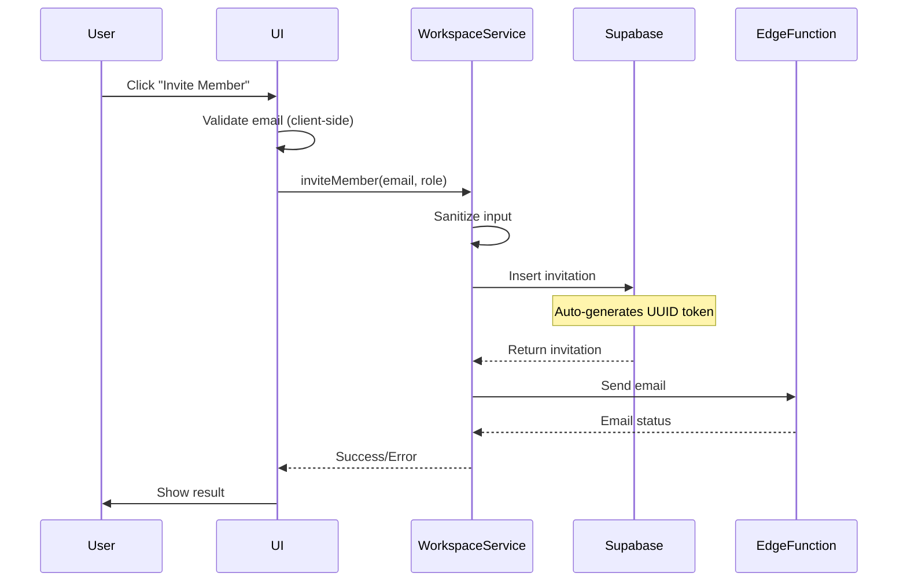

# Workspace Member Management

## Overview

The workspace member management system allows workspace owners and maintainers to invite, manage, and remove team members from their workspaces. This document covers the technical implementation, security considerations, and best practices.

## Architecture

### Key Components

1. **MembersTab Component** (`src/components/features/workspace/settings/MembersTab.tsx`)
   - Main UI for displaying and managing workspace members
   - Implements optimistic UI updates for better UX
   - Handles loading states and error recovery

2. **InviteMemberModal Component** (`src/components/features/workspace/settings/InviteMemberModal.tsx`)
   - Modal dialog for inviting new members
   - Client-side email validation
   - Role selection and upgrade prompts

3. **WorkspaceService** (`src/services/workspace.service.ts`)
   - Core business logic for member operations
   - Email validation and sanitization
   - Database interaction layer

### Database Schema

```sql
-- workspace_invitations table
CREATE TABLE workspace_invitations (
    id UUID PRIMARY KEY DEFAULT uuid_generate_v4(),
    workspace_id UUID NOT NULL REFERENCES workspaces(id) ON DELETE CASCADE,
    email TEXT NOT NULL,
    role TEXT NOT NULL CHECK (role IN ('admin', 'editor', 'viewer')),
    invitation_token UUID NOT NULL DEFAULT uuid_generate_v4() UNIQUE,
    invited_by UUID NOT NULL,
    invited_at TIMESTAMP WITH TIME ZONE DEFAULT NOW(),
    expires_at TIMESTAMP WITH TIME ZONE NOT NULL,
    status TEXT DEFAULT 'pending'
);

-- Unique constraint to prevent duplicate pending invitations
CREATE UNIQUE INDEX unique_pending_invitation
ON workspace_invitations(workspace_id, email)
WHERE status = 'pending';
```

## Security Features

### 1. UUID Generation
- **Server-side only**: All UUIDs are generated by Supabase using `DEFAULT uuid_generate_v4()`
- **No client-side generation**: Removed all client-side UUID generation for security
- **Cryptographic randomness**: Database ensures proper random UUID generation

### 2. Email Validation
- **RFC 5322 compliant**: Comprehensive email validation regex
- **Client-side validation**: Prevents unnecessary API calls
- **Server-side sanitization**: Additional protection against injection attacks

```typescript
const emailRegex = /^[a-zA-Z0-9.!#$%&'*+/=?^_`{|}~-]+@[a-zA-Z0-9](?:[a-zA-Z0-9-]{0,61}[a-zA-Z0-9])?(?:\.[a-zA-Z0-9](?:[a-zA-Z0-9-]{0,61}[a-zA-Z0-9])?)*$/;
```

### 3. Input Sanitization
- Removes potential XSS and SQL injection attempts
- Trims whitespace
- Escapes dangerous characters

## User Experience Optimizations

### 1. Optimistic UI Updates

The system implements optimistic updates for member removal:

```typescript
// 1. Immediately update UI
const previousMembers = members;
setMembers(members.filter(m => m.user_id !== userId));

// 2. Show loading state
const loadingToast = toast({ title: 'Removing member...' });

// 3. Make API call
const result = await WorkspaceService.removeMember(...);

// 4. On error, revert UI
if (!result.success) {
  setMembers(previousMembers);
}
```

**Benefits:**
- Instant visual feedback
- Perceived performance improvement
- Graceful error recovery

### 2. Loading States

All async operations show loading indicators:
- Button disable states during operations
- Loading toasts for longer operations
- Operation-specific loading tracking

```typescript
const [operationInProgress, setOperationInProgress] = useState<string | null>(null);

// Track specific operations
setOperationInProgress(`resend-${invitationId}`);
// ... perform operation
setOperationInProgress(null);
```

### 3. Error Handling

User-friendly error messages without technical jargon:

```typescript
// Instead of: "23505: duplicate key violation"
// Show: "An invitation has already been sent to this email address"

// Instead of: "Network error: 500"
// Show: "Unable to send invitation. Please try again."
```

## Role Mapping

The system uses different role names for UI vs database:

| UI Role | Database Role | Permissions |
|---------|---------------|-------------|
| owner | owner | Full control |
| maintainer | admin | Edit workspace, manage members |
| contributor | viewer | View-only access |

## Invitation Flow



## Testing

### Unit Tests
Located in `src/services/__tests__/workspace-member.test.ts`

**Important**: Tests follow [Bulletproof Testing Guidelines](/docs/testing/BULLETPROOF_TESTING_GUIDELINES.md)
- Pure functions only - NO async/await
- No integration testing - that belongs in E2E
- Maximum 100 lines per test file
- Tests complete in under 5 seconds

**Coverage includes:**
- Email validation (pure function)
- Role mapping logic (pure function)
- Temporary ID generation (pure function)

### Running Tests
```bash
npm test workspace-member
```

### Test Philosophy

Following bulletproof guidelines, we test ONLY:
1. **Pure utility functions** - Email validation, role mapping
2. **Simple calculations** - ID generation, string manipulation
3. **Prop handling** - Component props validation

We DON'T test:
- API integrations (use E2E)
- Database operations (use E2E)
- Async flows (use E2E)
- Supabase interactions (use E2E)

### Example Test (Bulletproof Compliant)
```typescript
// ✅ GOOD - Pure, synchronous, simple
it('should validate email format', () => {
  expect(isValidEmail('user@example.com')).toBe(true);
  expect(isValidEmail('invalid')).toBe(false);
});

// ❌ BAD - Async, integration, complex
it('should invite member', async () => {
  await WorkspaceService.inviteMember(...); // FORBIDDEN
});
```

## Common Operations

### Inviting a Member
```typescript
const result = await WorkspaceService.inviteMember(
  workspaceId,
  currentUserId,
  'user@example.com',
  'contributor'
);
```

### Removing a Member
```typescript
// With optimistic UI update
setMembers(members.filter(m => m.user_id !== userId));
const result = await WorkspaceService.removeMember(
  workspaceId,
  currentUserId,
  targetUserId
);
if (!result.success) {
  // Revert on error
  setMembers(previousMembers);
}
```

### Updating Member Role
```typescript
const result = await WorkspaceService.updateMemberRole(
  workspaceId,
  currentUserId,
  targetUserId,
  'maintainer'
);
```

## Subscription Limits

Member limits based on subscription tier:

| Tier | Max Members |
|------|-------------|
| Free | 1 |
| Pro | 5 |
| Team | 5 |
| Enterprise | 50 |

## Edge Cases and Considerations

### 1. Pending Invitations
- Temporary IDs use format: `pending-invite-{id}` for UI display
- Never persisted to database
- Allows UI to display invitations alongside members

### 2. Email Edge Function Failures
- Invitation is still created if email fails
- User sees warning but operation succeeds
- Can resend invitation later

### 3. Race Conditions
- Optimistic updates prevent UI lag
- Proper rollback on failure
- Loading states prevent double-clicks

## Future Improvements

1. **Bulk Invitations**: Support inviting multiple members at once
2. **Invitation Templates**: Customizable invitation emails
3. **Audit Log**: Track all member management actions
4. **Role Permissions**: More granular permission system
5. **SSO Integration**: Support for enterprise SSO

## Debugging

### Common Issues

1. **"Invitation already sent" error**
   - Check `unique_pending_invitation` constraint
   - Verify previous invitation status

2. **Email not sending**
   - Check Edge Function logs
   - Verify email service configuration

3. **Member not appearing after invite**
   - Check if invitation was accepted
   - Verify RLS policies

### Debug Queries

```sql
-- Check pending invitations
SELECT * FROM workspace_invitations
WHERE workspace_id = 'workspace-id'
AND status = 'pending';

-- Check member status
SELECT * FROM workspace_members
WHERE workspace_id = 'workspace-id';

-- Check for duplicate invitations
SELECT email, COUNT(*)
FROM workspace_invitations
WHERE workspace_id = 'workspace-id'
AND status = 'pending'
GROUP BY email
HAVING COUNT(*) > 1;
```

## References

- [RFC 5322 - Internet Message Format](https://tools.ietf.org/html/rfc5322)
- [Supabase RLS Policies](https://supabase.com/docs/guides/auth/row-level-security)
- [React Optimistic UI Patterns](https://react.dev/reference/react/useOptimistic)