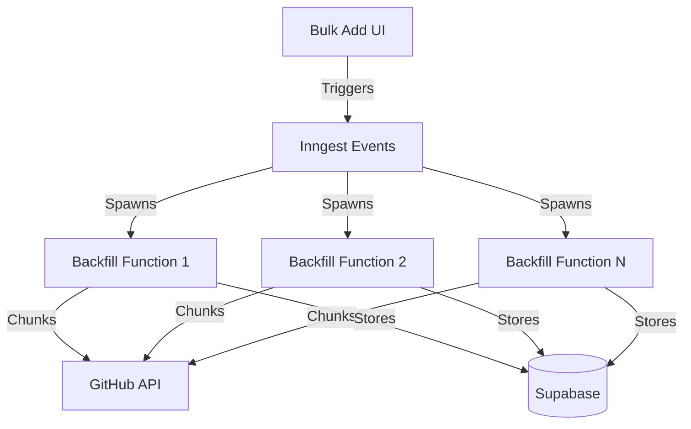

# PRD: Backfill UI Integration for Bulk Repository Addition

## Project Overview

### Objective
Integrate a backfill capability into the bulk-add-repos UI that allows users to automatically fetch the last 200 PRs for each newly added repository, leveraging parallel processing for efficiency.

### Background
- Current bulk-add-repos UI successfully adds repositories to tracking
- Users need initial data to make repositories immediately useful
- Progressive backfill system exists but requires manual triggering
- Need to balance speed with rate limits and system resources

### Success Metrics
- Backfill completes within 10 minutes for typical batch (10-20 repos)
- No GitHub rate limit violations
- Clear progress visibility for users
- System remains responsive during backfill

## Current State Analysis

### Existing Components
1. **Bulk Add UI** (`/src/components/features/debug/bulk-add-repos.tsx`)
   - Handles batch repository addition
   - Progress tracking and error reporting
   - Results summary display

2. **Progressive Backfill** (`/scripts/github-actions/progressive-backfill.js`)
   - Cursor-based pagination
   - Chunk processing with error recovery
   - GitHub GraphQL integration

3. **Inngest Integration**
   - Event-driven job processing
   - Built-in concurrency controls
   - Real-time monitoring dashboard

### Constraints
- GitHub GraphQL: 5,000 points/hour (each PR query ~1 point)
- GitHub Actions: 256 max parallel jobs per workflow
- Inngest: Concurrency limits based on plan
- Target: 200 PRs per repository maximum

## Architecture Design

### Option 1: Inngest-Based (Recommended)



**Advantages:**
- Built-in concurrency management
- Real-time progress monitoring
- Automatic retry on failures
- No infrastructure management
- Better for long-running jobs (up to 2 hours)

**Implementation:**
```typescript
// New Inngest function
export const backfillRepositoryInitial = inngest.createFunction(
  {
    id: "backfill-repository-initial",
    concurrency: {
      limit: 5, // Process 5 repos simultaneously
      key: "event.data.owner" // Concurrency per org
    }
  },
  { event: "repository/backfill.initial" },
  async ({ event, step }) => {
    const { repositoryId, owner, name } = event.data;
    
    // Fetch last 200 PRs in chunks of 25
    for (let i = 0; i < 8; i++) {
      await step.run(`fetch-chunk-${i}`, async () => {
        // Use existing progressive backfill logic
        await processChunk(repositoryId, 25, cursor);
      });
      
      // Brief pause between chunks
      await step.sleep("chunk-pause", "10s");
    }
  }
);
```

### Option 2: GitHub Actions Matrix

```yaml
name: Bulk Repository Backfill

on:
  workflow_dispatch:
    inputs:
      repository_ids:
        description: 'JSON array of repository IDs'
        required: true

jobs:
  setup:
    runs-on: ubuntu-latest
    outputs:
      matrix: ${{ steps.set-matrix.outputs.matrix }}
    steps:
      - id: set-matrix
        run: |
          echo "matrix={\"repository\":${{ inputs.repository_ids }}}" >> $GITHUB_OUTPUT

  backfill:
    needs: setup
    strategy:
      matrix: ${{fromJson(needs.setup.outputs.matrix)}}
      max-parallel: 5
    runs-on: ubuntu-latest
    timeout-minutes: 10
```

**Advantages:**
- Native GitHub integration
- Clear job separation
- Built-in logs and artifacts

**Disadvantages:**
- Requires webhook/API to trigger
- Limited to 10-minute execution per job
- More complex progress tracking

## Implementation Plan

### Phase 1: Core Backfill Function (HIGH Priority)
1. **Create Inngest backfill function**
   - [ ] Implement `backfill-repository-initial` function
   - [ ] Add concurrency controls (5 parallel repos)
   - [ ] Implement 200 PR limit with chunking
   - [ ] Add progress tracking via Inngest steps

2. **Adapt existing backfill logic**
   - [ ] Extract reusable functions from progressive-backfill.js
   - [ ] Create lightweight version for 200 PR limit
   - [ ] Add proper error handling and retries

3. **Database updates**
   - [ ] Add `initial_backfill_status` to repositories table
   - [ ] Create backfill progress tracking view

### Phase 2: UI Integration (HIGH Priority)
1. **Enhance bulk-add UI**
   - [ ] Add "Backfill initial data" checkbox (default: checked)
   - [ ] Show estimated time (repos × 2 minutes)
   - [ ] Add backfill progress indicator

2. **Progress tracking**
   - [ ] Real-time updates via Inngest webhooks
   - [ ] Progress bar per repository
   - [ ] Error state handling

3. **User experience**
   - [ ] Show which repos are being backfilled
   - [ ] Allow cancellation of backfill
   - [ ] Clear completion notifications

### Phase 3: Optimization (MEDIUM Priority)
1. **Performance tuning**
   - [ ] Implement adaptive chunk sizing
   - [ ] Add priority queuing for smaller repos
   - [ ] Optimize database batch inserts

2. **Monitoring**
   - [ ] Add metrics for backfill performance
   - [ ] Track rate limit usage
   - [ ] Alert on consistent failures

## Technical Implementation Details

### 1. UI Component Updates

```typescript
// bulk-add-repos.tsx additions
interface BulkAddState {
  includeBackfill: boolean;
  backfillProgress: Record<string, number>;
  backfillStatus: Record<string, 'pending' | 'processing' | 'completed' | 'failed'>;
}

// New component section
{includeBackfill && result?.added.length > 0 && (
  <Card>
    <CardHeader>
      <CardTitle>Backfill Progress</CardTitle>
    </CardHeader>
    <CardContent>
      {result.added.map(repo => (
        <div key={repo} className="mb-4">
          <div className="flex justify-between mb-1">
            <span className="text-sm">{repo}</span>
            <span className="text-sm">
              {backfillProgress[repo] || 0}/200 PRs
            </span>
          </div>
          <Progress 
            value={(backfillProgress[repo] || 0) / 200 * 100} 
          />
        </div>
      ))}
    </CardContent>
  </Card>
)}
```

### 2. Inngest Event Triggering

```typescript
// After successful repository addition
if (includeBackfill) {
  const backfillEvents = result.added.map(repo => {
    const [owner, name] = repo.split('/');
    return {
      name: "repository/backfill.initial",
      data: {
        repositoryId: getRepoId(owner, name),
        owner,
        name,
        maxPRs: 200,
        userId: currentUser.id
      }
    };
  });
  
  await inngest.send(backfillEvents);
}
```

### 3. Progress Webhook Handler

```typescript
// New Netlify function: backfill-progress.ts
export async function handler(event: any) {
  const { repositoryId, progress, status } = JSON.parse(event.body);
  
  // Update progress in database
  await supabase
    .from('backfill_progress')
    .upsert({
      repository_id: repositoryId,
      progress,
      status,
      updated_at: new Date().toISOString()
    });
    
  // Could also use WebSockets/SSE for real-time updates
  return { statusCode: 200 };
}
```

## Testing Strategy

### Unit Tests
1. Test chunk size calculation for 200 PR limit
2. Test error handling and retry logic
3. Test progress calculation accuracy

### Integration Tests
1. Test Inngest function with mock GitHub API
2. Test database transaction handling
3. Test concurrent repository processing

### End-to-End Tests
1. Add 5 small repositories (<200 PRs each)
2. Add mixed size repositories
3. Test cancellation mid-process
4. Test error recovery scenarios

### Load Testing
```typescript
// Test script for parallel processing
const testRepos = [
  'vuejs/vue',        // ~500 PRs
  'sveltejs/svelte',  // ~2000 PRs
  'preactjs/preact',  // ~1000 PRs
  'alpinejs/alpine',  // ~300 PRs
  'solidjs/solid'     // ~400 PRs
];

// Should complete within 10 minutes
// Monitor rate limit usage
// Verify data integrity
```

## Rollout Plan

### Phase 1: Internal Testing (Week 1)
- Deploy to development environment
- Test with personal repositories
- Monitor Inngest dashboard for issues
- Verify rate limit compliance

### Phase 2: Limited Release (Week 2)
- Enable for admin users only
- Add feature flag: `ENABLE_BACKFILL_UI`
- Gather feedback on UX
- Monitor system performance

### Phase 3: General Availability (Week 3)
- Enable for all users
- Add documentation
- Monitor for issues
- Iterate based on feedback

## Monitoring & Alerts

### Key Metrics
1. **Performance**
   - Average time per repository backfill
   - Success rate percentage
   - Concurrent jobs running

2. **Rate Limits**
   - GitHub API points consumed
   - Rate limit warnings/errors
   - Retry frequency

3. **User Experience**
   - UI responsiveness during backfill
   - Error message clarity
   - Completion notifications

### Alert Conditions
- Backfill taking >5 minutes per repository
- GitHub rate limit <500 points remaining
- >10% failure rate across backfills
- Database connection pool exhaustion

## Future Enhancements

1. **Smart Backfill**
   - Detect repository activity level
   - Adjust PR count based on repo size
   - Priority queue for active repositories

2. **Scheduled Backfill**
   - Allow users to schedule backfills
   - Off-peak processing for large batches
   - Recurring updates for active repos

3. **Advanced Options**
   - Custom PR count selection
   - Date range filtering
   - Specific PR state filtering (open/closed/merged)

## Acceptance Criteria

### Phase 1 ✅ Criteria
- [ ] Inngest function successfully fetches 200 PRs per repo
- [ ] Concurrent processing of up to 5 repositories
- [ ] No GitHub rate limit violations
- [ ] Progress tracking updates in real-time

### Phase 2 ✅ Criteria
- [ ] UI shows clear backfill option
- [ ] Progress bars update smoothly
- [ ] Errors are clearly communicated
- [ ] Users can track individual repo progress

### Phase 3 ✅ Criteria
- [ ] 95% success rate for backfills
- [ ] Average completion time <2 minutes per repo
- [ ] System remains responsive during backfill
- [ ] Clear documentation available

## Risk Mitigation

### Risk: GitHub Rate Limit Exhaustion
**Mitigation:** 
- Implement pre-flight rate limit checks
- Adaptive throttling based on remaining points
- Queue overflow to next hour window

### Risk: Database Performance Impact
**Mitigation:**
- Batch inserts with 100 PR chunks
- Use connection pooling efficiently
- Monitor query performance

### Risk: User Confusion
**Mitigation:**
- Clear progress indicators
- Estimated completion times
- Helpful error messages
- Option to skip backfill